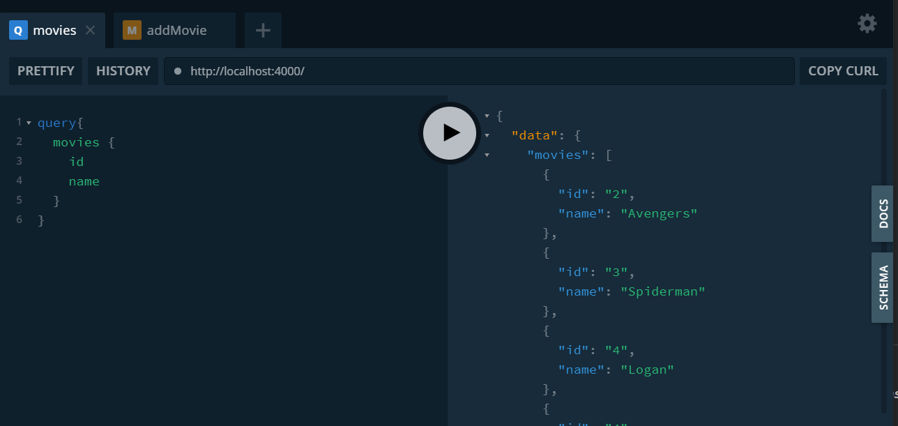

기본 사용법을 익히기 위해 `graphql-yoga`를 사용했다.

## 서버 열기

```js
import { GraphQLServer } from "graphql-yoga";
import resolvers from "./graphql/resolvers";

const server = new GraphQLServer({
  typeDefs: "graphql/schema.graphql",
  resolvers,
});

server.start(() => console.log("Graphql Server Running"));
```

서버를 열면서 스키마 파일을 지정하고, resolver 또한 설정해준다. 포트를 따로 지정하지 않으면 4000번 포트로 서버가 열리고 브라우저로 접속시 깔끔한 ui를 가진 플레이그라운드로 간편하게 api를 테스트 해볼 수 있다.



오른쪽에 보이는 `DOCS`, `SCHEMA`를 누르면 API 설명도 볼 수 있는데 정말 깔끔하게 잘 되어있다.

## 기본 사용 형식

GraphQL은 `Type`을 선언하고 각 Type에 따라 functions을 제공함으로써 작동한다.

아래와 같이 선언한다.

```graphql
type Query {
  me: User
}

type User {
  id: ID
  name: String!
}
```

`!` 을 사용하면 강제성을 부여하게된다.

```js
function Query_me(request) {
  return request.auth.user;
}

function User_name(user) {
  return user.getName();
}
```

GraqhQL 서버를 열고 쿼리를 작성할 때는 아래와 같이 사용한다.

```GRAPHql
{
  me {
    name
  }
}
```

이렇게 `me`와 그 안의 속성 `name`을 명확히 작성해야 제대로 불러온다.

```graphql
{
  "me": {
    "name": "Luke Skywalker"
  }
}
```

## 파라미터로 쿼리하기

파라미터를 주고 그에 맞는 데이터를 쿼리할 수 있다.

'resolver.js'

```js
const resolver = {
  Query : {
    movie = (id) => {
          const filteredMovies = movies.filter(movie => String(id) === movie.id);
        return filteredMovies[0];
    }
  }
}
```

'schema.graphql'

```graphql
type Query : {
  movie(id: Int!) : Movie
}
```

이런 형식으로 쿼리 함수를 resolver에 작성하고 스키마 파일에는 파라미터를 받는 것을 표시해주면 된다.
