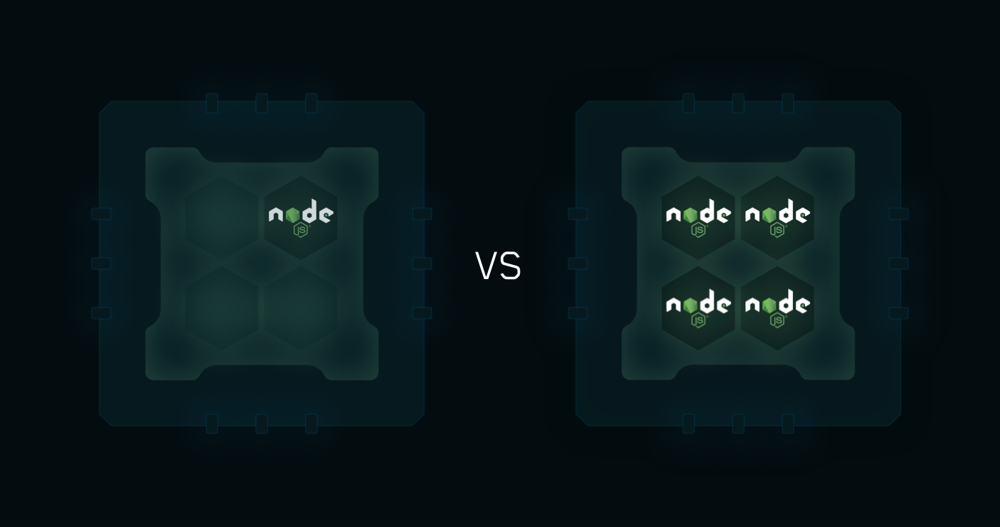

Node.js 서버 튜닝을 진행해야 해서 동작 원리부터 정리해 두기로 했다. 분명히 많이 공부한 내용인데 왜 다시보면 새로운 건지 모르겠다.

Node.js는 비동기 이벤트 드리븐 Javascript 런타임이다.

- 프로그램: 컴퓨터가 실행 가능한 코드 모음
- 프로세스: CPU로부터 자원을 할당받은 독립적인 개체 컴퓨터의 메모리에 적재되어 실행되고 있는 프로그램이다. 스케줄링의 대상이 되는 task이다. 여러 개의 프로세서를 사용하는 것을 멀티프로세싱이라고 한다. 각 프로세스는 최소 한 개의 메인 스레드를 가지고 있다.
- 멀티태스킹: 프로세스가 CPU를 짧은 시간동안 번갈아가며 점유함으로써 여러 프로세스가 동시에 실행되는 것 처럼 보이게 하는 기법. CPU 코어별 경합이 있는 경우를 일컫는다.


각 프로세스는 서로의 변수나 자료구조에 접근할 수 없으며 접근하기 위해서는 프로세스간 통신(inter-process communication)이나 LPC(local inter-process communication)를 사용해야 한다.

- 스레드: 프로세스 내에서 실행되는 여러 흐름의 단위로 가장 작은 실행 단위이다. 프로세스 간 자원 공유가 쉽지 않기 때문에 나타난 개념이다. 스레드는 프로세스 내에서 Stack만 각자 할당받고 나머지 영역(Code, Data, Heap)은 공유한다. 프로세스를 생성하는 것 보다 적은 비용으로 작업을 처리할 수 있어 비용이 감소되는 장점도 있다. 

CPU 입장에서 최소 작업 단위는 스레드이지만 OS 입장에서의 최소 작업 단위는 프로세스이다. 그래서 같은 프로세스는 같은 메모리를 할당받기 때문에 공유할 수 있는 것이다.


- 멀티프로세싱: 두 개 이상의 프로세서나 코어를 활용하는 시스템

- 멀티스레딩: 여러 개의 코어를 가진 CPU에서 여러 개의 스레드를 가지는 프로세스를 실행하면 병렬적으로 실행되는 구조. 하나의 응용 프로그램을 여러 개의 스레드로 구성하여 각 스레드가 하나의 작업을 처리하도록 하는 것이다. 웹 서버가 대표적인 멀티 스레드 응용 프로그램이다. 싱글 스레드의 경우 오류가 발생하면 프로그램이 죽어버리지만 멀티스레드의 경우 한 스레드에서 오류가 발생했더라도 다른 스레드는 정상적으로 작동하여 시스템 멈춤 없이 작업을 계속해서 처리할 수 있다. 하지만 여러 스레드가 공유 자원을 사용하기 때문에 데이터 정합성 이슈가 있을 수 있고 단일 스레드 프로그램보다 디버깅이 어려워진다는 단점이 존재하다. 

- 싱글스레드: 하나의 스레드가 하나의 요청만을 수행하는 모델. 수행중인 요청이 있는 경우 다른 요청은 블로킹되는 경우에는 싱글스레드 블로킹 모델이라고 한다.

이렇게만 보면 멀티스레딩이 더 좋아 보인다. 하지만 효율성 측면에서도 단점이 있는데, 스레드 풀에 스레드가 늘어날 수록 요청이 적은 경우 소모되는 CPU 비용 대비 놀게되는 스레드가 생기기 때문이다. 하지만 멀티스레딩에서는 스레드간 메모리를 공유하여 데이터를 주고 받는 것이 멀티프로세싱보다 간단하며 시스템 자원 소모가 줄어들고 따라서 스레드간 작업량이 작아 문맥교환이 빠르게 발생한다. 그래서 멀티프로세싱보다 멀티스레딩이 작업 효율성이 좋다고 평가된다.

Node.js의 경우 기본적으로 싱글스레드 논블로킹 모델로 구성되어 있다. 그래서 멀티스레딩이 불가능하다. 싱글스레드로 동작하지만 비동기 I/O 작업을 통해 요청들을 서로 블로킹하지 않는다. 여러 요청을 libuv의 스레드 풀에서 비동기로 수행함으로써 싱글스레드지만 논블로킹이 가능하다. 또한 클러스터링을 통해 멀티프로세싱을 활성화할 수 있다. 

적당한 수의 클러스터링을 구현한다면 Node.js 서버의 성능을 개선할 수 있을 것이다. 코어 수 보다 많은 프로세스를 띄우면 CPU 자원을 점유하기 위한 경쟁이 과도해지면서 성능이 더 나빠질 수도 있다. 멀티 코어 컴퓨터에서 이상적인 Node.js 프로세스 수는 `N-1` 이라고 한다. 코어 한 개는 커널 스케줄러나 다른 작업에 사용하기 위함이다. 또한 서버가 Node.js 애플리케이션 외 작업은 거의 실행하지 않도록 해야 CPU자원 경쟁을 방지하여 성능 저하를 막을 수 있다. 

Node.js의 클러스터링은 직접 구현하는 방법도 있지만 pm2를 사용해 코드 수정 없이 간단하게 구현할 수 있다.

## pm2 cluster mode

pm2 클러스터 모드를 사용하면 컴퓨터에 사용가능한 코어 수에 따라 애플리케이션의 프로세스를 여러 개 실행시켜 서버 포트를 공유하게 된다. 



pm2 설정 파일로 설정하는 방법은 아래와 같다.

```js
module.exports = {
  apps : [{
    script    : "api.js",
    instances : "max",
    exec_mode : "cluster"
  }]
}
```

exec_mode를 `cluster`로 하고 instances 값으로 `max` 또는 `0`을 입력하면 컴퓨터의 코어 수 만큼 프로세스를 생성한다. pm2는 각 인스턴스를 로드밸런싱 한다. 이는 PM2의 기본 동작이 아니기 때문에 필요에 따라 설정하면 된다. 기본 동작 모드는 `fork`로 실행하면 하나의 프로세스만 올라온다. instances는 생성하고자 하는 인스턴스의 개수를 넣어도 되고 `max`를 입력해도 된다.
이미 실행중인 프로그램의 프로세스 개수를 늘리거나 줄이고 싶다면 `pm2 scale` 명령어를 사용하면 된다. 아래는 스케일업 코드의 예시이다.

```shell
// 프로세스 늘리기
$ pm2 scale app +4
[PM2] Scaling up application
[PM2] Scaling up application
[PM2] Scaling up application
[PM2] Scaling up application

// 프로세스 줄이기
$ pm2 scale app 4
[PM2] Applying action deleteProcessId on app [0](ids: 0)
[PM2] [app](0) ✓
[PM2] Applying action deleteProcessId on app [1](ids: 1)
[PM2] [app](1) ✓
[PM2] Applying action deleteProcessId on app [2](ids: 2)
[PM2] [app](2) ✓
[PM2] Applying action deleteProcessId on app [3](ids: 3)
[PM2] [app](3) ✓
```


## 참고 
- [프로세스(Process)와 스레드(Thread) 관련 개념 정리](https://velog.io/@dlgosla/CS-%EC%9A%B4%EC%98%81%EC%B2%B4%EC%A0%9COS-%ED%94%84%EB%A1%9C%EC%84%B8%EC%8A%A4Process%EC%99%80-%EC%8A%A4%EB%A0%88%EB%93%9CThread-%EA%B4%80%EB%A0%A8-%EA%B0%9C%EB%85%90-%EC%A0%95%EB%A6%AC)
- [프로세스, 스레드, 멀티태스킹, 멀티프로세싱](https://s7won.tistory.com/10)
- [스레드는 무엇일까?](https://velog.io/@kwontae1313/%EC%8A%A4%EB%A0%88%EB%93%9C%EB%8A%94-%EB%AC%B4%EC%97%87%EC%9D%BC%EA%B9%8C)
- [Node.js 동작원리](https://medium.com/@vdongbin/node-js-%EB%8F%99%EC%9E%91%EC%9B%90%EB%A6%AC-single-thread-event-driven-non-blocking-i-o-event-loop-ce97e58a8e21)
- [pm2 cluster mode](https://pm2.keymetrics.io/docs/usage/cluster-mode/)
- [PM2를 활용한 Node.js 무중단 서비스하기](https://engineering.linecorp.com/ko/blog/pm2-nodejs)
