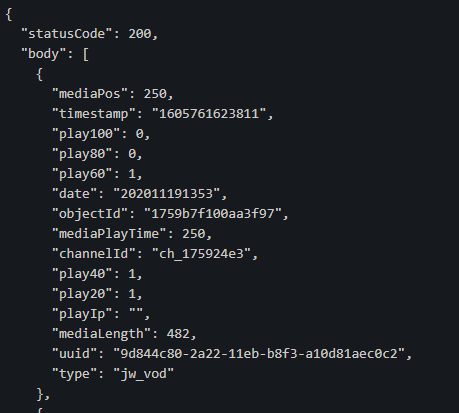

# Dynamodb + Lambda

### 주의할 점

이전에는 event, context, callback 을 사용했지만 세번째 인자 callback은 더이상 잘 사용되지 않는다고 한다. 현재는 `status code`를 포함한 response 구조를 가진 객체를 return 하면 된다.

## Dynamodb로 작업하기

### fetch data

데이터를 가져오는 방법은 두가지가 있다.

1. scan : 전체 테이블 조회
2. query : 조건부 테이블 조회

특정 속성을 사용해 검색하고 싶은 경우 query를 사용하게 된다. 이때 검색에 사용하고자 하는 속성은 `Index`로 설정되어있어야 사용이 가능하다.

## 로직

1. DB에 저장된 데이터들의 UUID를 스캔한다.

```js
const ddbScanData = await ddb.scan(scanParams).promise();
const scanParams = {
  TableName: "midibus-play-statistics",
  ProjectionExpression: "#id",
  ExpressionAttributeNames: {
    "#id": "uuid",
  },
};

function getUuid(data) {
  const uuidArr = {};
  data["Items"].forEach((e) => {
    let tempUuid = e["uuid"]["S"];
    if (!uuidArr[tempUuid]) uuidArr[tempUuid] = true;
  });
  return Object.keys(uuidArr);
}
```

2. 조회한 UUID들의 play data 중 가장 최신의 timestamp를 가지는 데이터를 조회한다.

```js
async function getLatesData(uuids) {
  const result = [];
  uuids.forEach(async (uuid) => {
    console.log("start query", uuid);
    try {
      const params = {
        TableName: "midibus-play-statistics",
        KeyConditionExpression: "#id = :v1",
        ExpressionAttributeValues: {
          ":v1": { S: uuid },
        },
        ExpressionAttributeNames: {
          "#id": "uuid",
        },
        Limit: 1,
        ScanIndexForward: false,
      };
      console.log(params);
      let latestData = await ddb.query(params).promise();
      console.log(latestData);
      result.push(latestData);
    } catch (err) {
      console.error(err);
    }
  });
  return result;
}
```

여기서 오류가 계속 발생했다. 결과값이 계속해서 빈 배열로 나왔다.
끝내 찾아낸 이유는 비동기 처리가 잘못 되었던 것이었다.
쿼리가 잘못 된 줄 알고 계속해서 쿼리문 API만 다시 작성했는데 uuid 하나 넣어서 실행시켜보니 동작했다!😅...

함수가 내가 생각한 대로 동작하지 않았던 이유는 `forEach` 내부의 익명 함수는 동기 함수가 아니기 때문이었다. 때문에 비동기적으로 `return result` 문이 먼저 동작하게 되어 빈 배열이 반환되고 프로그램이 종료하게 된다.

이를 해결하기 위해 할 수 있는 방법은 두가지가 있다.

- 해결법
  1. `forEach` 대신 `for`문이나 `for ...of`를 사용하기 ( 비동기 익명함수 사용하지 않기 )
  2. `map`과 `Promise.all` 사용하기

1의 경우 모든 작업이 순차적으로 이루어진다. 원하는 작업에 순서가 중요하다면 1의 방법으로 하면 되겠다. 하지만 순서가 중요하지 않다면, 각 동작들이 병렬적으로 처리되도록 하는 2번 방식이 더 효율적이다.

현재 작업에서는 순서가 중요하지 않기 때문에 방식 2를 선택했다.

```js
async function getLatestData(uuids) {
  const result = [];
  const promises = uuids.map(async (uuid) => {
    try {
      const params = {
        TableName: "midibus-play-statistics",
        KeyConditionExpression: "#id = :v1",
        ExpressionAttributeValues: {
          ":v1": { S: uuid },
        },
        ExpressionAttributeNames: {
          "#id": "uuid",
        },
        Limit: 1,
        ScanIndexForward: false,
      };
      let latestData = await ddb.query(params).promise();
      latestData = latestData["Items"];
      const _latestData = getRefinedQueryData(...latestData);
      result.push(latestData);
    } catch (err) {
      console.error(err);
    }
  });
  await Promise.all(promises);
  return result;
}
```

쿼리 결과를 다음과 같이 받는다.


data type은 필요하지 않기 때문에 데이터를 간소화 하여 응답하도록 함수를 작성했다.

```js
function getRefinedQueryData(data) {
  const keys = Object.keys(data);
  const result = {};
  keys.forEach((key) => {
    const innerObj = data[key];
    const dataType = Object.keys(innerObj)[0];
    const value = innerObj[dataType];
    //data type 종류 'N' /'S' 두가지
    result[key] = dataType === "S" ? value : parseInt(value);
  });
  return result;
}
```

간소화한 최종 response는 다음과 같다.



3. uuid를 query string으로 받아 한가지 play data 받아오기

API Gateway 통합 요청 설정을 Lambda Proxy로 설정하면 자잘한 매핑 작업 없이 간편하게 쿼리 스트링에 접근할 수 있기 때문에 Proxy 설정을 해줬다.

프록시 응답은 다음과 같은 구조를 가져야 한다. 이와 다른 경우 `Malformed Lambda proxy response` 오류가 발생한다.

```js
const response = {
  statusCode: 200,
  headers: {
    my_header: "my_value",
  },
  body: JSON.stringify(responseBody),
  isBase64Encoded: false,
};
```

## 결과

[https://uafp72mu9c.execute-api.us-east-2.amazonaws.com/dev/play](https://uafp72mu9c.execute-api.us-east-2.amazonaws.com/dev/play):id

보안 설정 해제 시킨 상태로 현재 동작 중

- 참고
  [[Async function]async/await 비동기 처리 :: 마이구미](https://mygumi.tistory.com/328)
