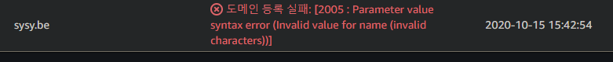

Route53은 AWS의 클라우드 **DNS 웹 서비스**이다. DNS 서비스를 제공하는 다른 서비스들도 많지만 Route53을 사용할 경우 EC2 또는 CloudFront 등 AWS에서 실행되는 인프라에 효과적으로 연결된다.

이번에는 Route53에서 도메인을 사서 github page로 연결시켜보았다. 다른 더 저렴한 `namecheap` 같은 사이트에서 구매해도 되지만 Route53으로 서비스할 것이기 때문에 Route53에서 도메인을 구입하는 것이 절차를 조금 간단하게 할 수 있는 방법이다.

### 도메인 구입


구입을 눌러서 마음에 드는 도메인을 살 수 있다. 나는 가장 저렴한 8$의 `.be` 도메인을 구입했다.

구입시에 모든 등록 정보는 영어로 입력해야 한다.

제대로 등록이 되었다면 얼마 지나지 않아 바로 도메인 등록이 완료된다. 오래 걸릴수도 있다는 알림이 떠있지만 사실 바로 등록이 안되면, 대부분의 경우 뭔가 잘못된 것이다. 도메인 등록에 문제가 생기면 생성이 취소 된다.



이 상태에서 다시 등록을 할 수는 없고 `Billing`으로 가면 환불 처리가 된 것을 볼 수 있다. 시간이 지나면 카드 결제가 취소되지 않을까 라고 생각하며 기다리고 있다.

정상적으로 등록된 도메인은 `Hosted zone()`에서 볼 수 있다.


### 도메인 레코드 관리

등록된 도메인을 클릭하면 레코드를 편집할 수 있다. 기본적으로 2개의 레코드가 존재한다.

레코드 생성을 누르고 '단순 레코드 생성'을 선택한다. 단순 레코드를 정의한다.


- 레코드 이름 : (비워두기)
- 레코드 유형 : A
- 값 : Github 서버 ip 주소

-

```
185.199.108.153
185.199.109.153
185.199.110.153
185.199.111.153
```

이렇게 입력하고 레코드를 생성한다. (저 4가지 중 하나만 입력해도 동작한다고 한다)

레코드를 한가지 더 생성해야 한다. 또다시 레코드 생성을 클릭한다.

- 레코드 이름 : www
- 레코드 유형 : A
- 값 : '이 호스팅 영역의 다른 레코드에 대한 별칭' > 현재 등록하는 도메인 선택

여기까지 하면 Route53의 설정은 완료 된 것이다.

### Github에 custom domain 등록

도메인에 사용하고자 하는 github page repo의 설정 페이지로 간다. `GitHub Pages` 항목에서 도메인을 설정할 수 있다. 현재는 `custom domain` 항목이 비어있을 텐데 여기에 좀 전에 구매한 도메인을 입력하면 완성된다!

### SSL/TLS 인증 - https

보통 SSL 인증을 사용하기 위해서는 인증을 위한 다른 비용이 필요하다. 하지만 AWS 서비스를 사용한다면 무료로 사용할 수 있다. **AWS Certification Manager (ACM)**은 SSL/TLS 인증서 발급 및 관리에 대한 자동화와 인증을 위한 서비스로 무료로 제공된다. 생성한 도메인이 `https`로만 연결이 되도록 하기 위해서는 인증서를 생성해야 할 필요가 있다.

## 참조

[How to deploy github pages with aws route53 registered domain](https://medium.com/@benwiz/how-to-deploy-github-pages-with-aws-route-53-registered-custom-domain-and-force-https-bbea801e5ea3)
