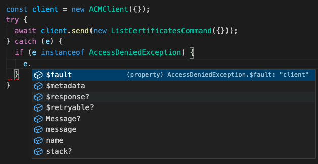

serverless로 Labmda를 컴파일하는데 aws-sdk v3를 사용하라는 warning이 계속 나타나서 이참에 업그레이드를 하기로 했다. AWS에서 sdk-v3로 코드를 바꿔주는 커맨드가 있긴한데 난 그걸로는 부족해서 이참에 리팩토링도 진행했다.
v3로 버전업 되면서 달라진 점이 몇 가지 있는데 장점이 많아 업그레이드 할 시간이 있다면 바꿔보는 게 좋을 것 같다.

## modular package

이전에는 `aws-sdk` 라이브러리 전체를 import해서 사용해야 했다.

```js
import {SNS} from "aws-sdk";
```

이제 필요한 모듈만 import해서 사용할 수 있다.

```js
import  { SNSClient } from "@aws-sdk/client-sns";
```

이렇게 전체 라이브러리가 아닌 modular package를 사용하면 전체 번들러의 크기가 줄어들기 때문에 성능 향상에 도움이 될 수 있다. 애플리케이션에서 aws-sdk를 사용하는 경우엔 크게 도움이 될 것이다. 하지만 AWS Lambda의 경우 여기서 얻는 장점은 크게는 없을 것으로 보인다. 

## Typescript 지원

모든 sdk 라이브러리에 타입 정의가 되어있다. 타입 관련 실수가 줄어들 것이다. IDE에서 타입스크립트를 사용할 경우 자동완성 기능을 사용할 수 있고 타입 에러를 컴파일 전에 알 수 있어 생산성이 높아진다. 타입스크립트 사용은 옵션이지만 AWS는 타입스크립트 사용을 적극 권장하고 있다.

## 에러 핸들링 인스턴스 추가

이제 `instanceof` 키워드로 exception의 종류를 확인할 수 있다. 이전에는 Error 객체의 `name`과 하드코딩된 에러 이름을 비교하여 에러의 종류를 알아내야 했다.

```js
try {
  await client.send(someCommand);
} catch (e) {
  if (e.name === "InvalidSignatureException") {
    // Handle InvalidSignatureException
  } else if (e.name === "ResourceNotFoundException") {
    // Handle ResourceNotFoundException
  } else if (e.name === "FooServiceException") {
    // Handle all other server-side exceptions from Foo service
  } else {
    // Handle errors from SDK
  }
}
```

v3 부터는 클래스를 이용해 에러 객체가 어떤 에러 클래스의 객체인지 확인 할 수 있게 되었다.

```js
import {
  InvalidSignatureException,
  ResourceNotFoundException,
  FooServiceException,
} from "@aws-sdk/client-foo";

try {
  await client.send(someCommand);
} catch (e) {
  if (e instanceof InvalidSignatureException) {
    // Handle InvalidSignatureException
  } else if (e instanceof ResourceNotFoundException) {
    // Handle ResourceNotFoundException
  } else if (e instanceof FooServiceException) {
    // Handle all other server-side exceptions from Foo service
  } else {
    // Other errors
  }
}
```

하드 코딩이 사라졌기 때문에 실수를 할 가능성도 줄었고 에러가 어떤 인스턴스인지 확인이 된 상태에서는 타입스크립트로부터 자동완성 기능도 받을 수 있다.



## 참고
- [Error Handling in Modular AWS SDK for JavaScript (v3)](https://aws.amazon.com/ko/blogs/developer/service-error-handling-modular-aws-sdk-js/)
- [Why and how you should use AWS SDK for JavaScript (v3) on Node.js 18](https://aws.amazon.com/ko/blogs/developer/why-and-how-you-should-use-aws-sdk-for-javascript-v3-on-node-js-18/)
- [First-class TypeScript support in modular AWS SDK for JavaScript](https://aws.amazon.com/ko/blogs/developer/first-class-typescript-support-in-modular-aws-sdk-for-javascript/)
