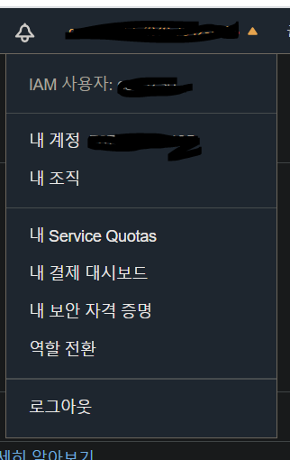
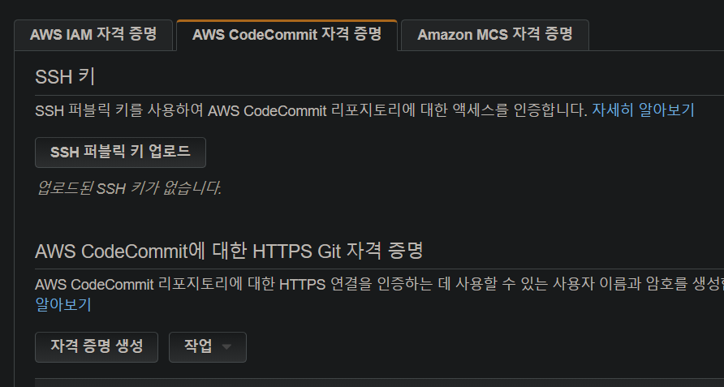

AWS CodeCommit은 클라우드에서 asset을 비공개로 저장하여 관리할 수 있도록 AWS에서 호스팅되는 버전 관리 서비스이다. Git의 표준 기능을 지원하므로 기존 Git 기반 도구와도 원활하게 연동된다.

### CodeCommit이 지원하는 기능들

- AWS가 호스팅하여 종합 관리 서비스를 제공함
- 암호화된 안전한 코드 저장
- 코드 공동 작업
- 다른 AWS 및 타사 서비스와 통합됨

## 시작하기

### 자격증명

우측 상단의 계정을 클릭하면 '내 보안 자격 증명' 이라는 메뉴가 보인다. 클릭시 `IAM` 화면으로 넘어온다.



여기서 두번째 탭에 있는 `AWS CodeCommit 자격 증명`을 선택한다.



아래에 보이는 `AWS CodeCommit에 대한 HTTPS Git 자격증명`의 `자격증명 생성`을 선택한다.
자격증명을 생성하면 사용자 이름과 비밀번호가 나온다. csv 파일로 내보내 관리하는 것이 좋다.

### git으로 코드 clone

코드를 클론할 레파지토리로 이동한다. 없다면 하나 새로 생성한다.


url 복제에서 HTTPS 복제를 누른다. 자동으로 복사가된다.
이제 git을 열고 다른때 사용하는 것과 똑같이 clone 작업을 하면 된다.

```
git clone [codecommit url] [clone path]
```

명령어를 입력하면 username과 password를 입력하라는 창이 뜬다. 아까 자격증명에서 생성했던 유저 정보를 입력하면 된다.

이렇게만 하면 간단하게 코드가 불러와진다.
