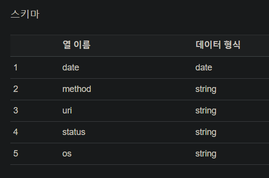
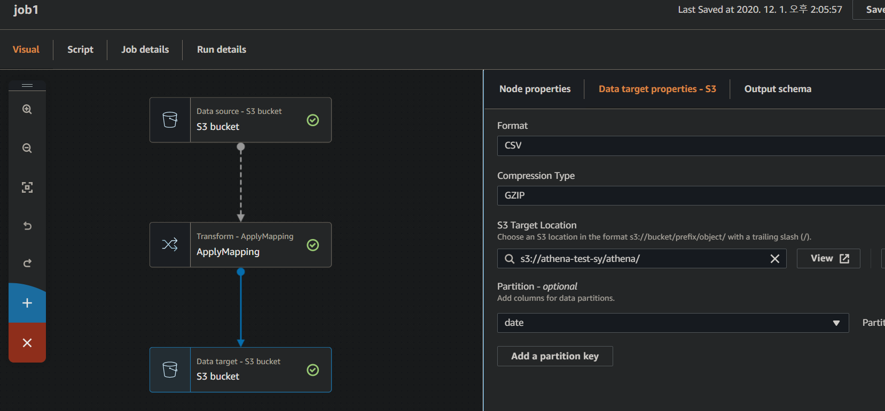
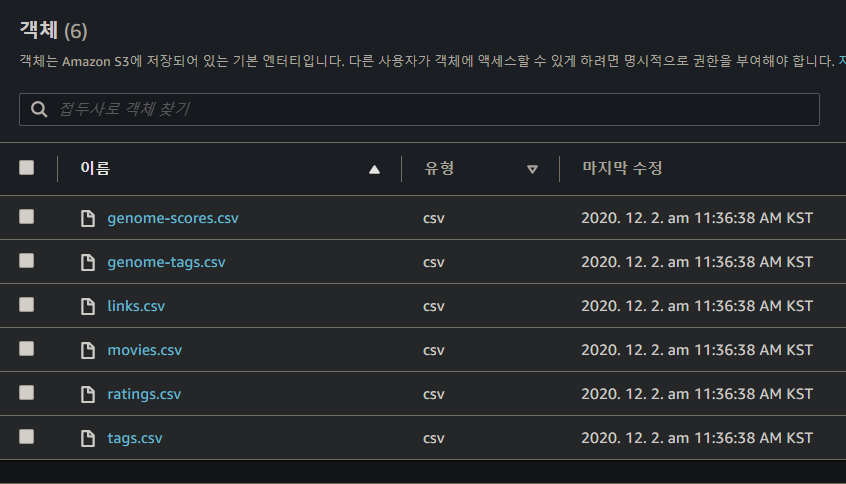
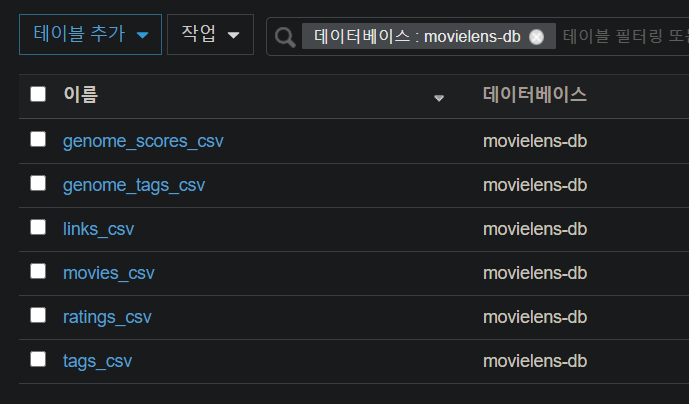
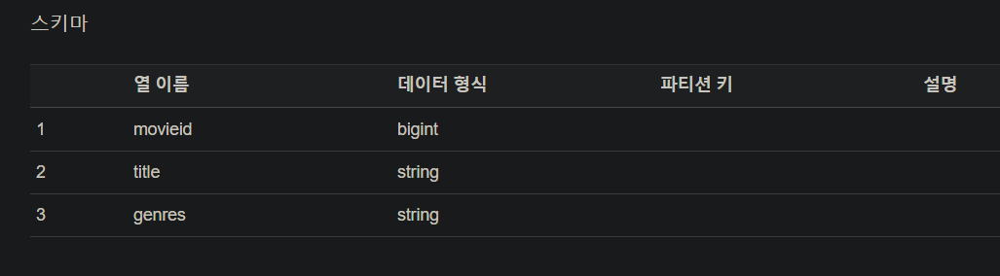
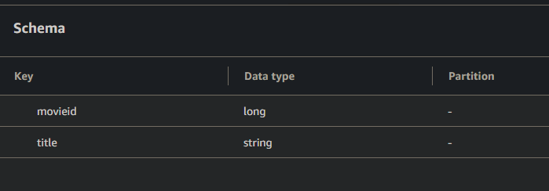

## : 로그 데이터를 Athena - Glue로 분석하기

CloudWatch 로그 데이터를 S3 로 옮기는 방법은 두 가지가 있다.

1. Export log data to S3 directly
2. Using Kinesis Firehose to push log messages from CloudWatch Logs to S3

옵션 1의 경우 S3를 로그를 오랜기간 보관하려는 비용적 이유로 사용한다면 적절하다. Export 작업은 콘솔 또는 CLI로 가능하며 매우 간단한데, 대신 클라우드와치에 들어온 데이터가 Export 가능한 상태가 될 때까지 최대 12시간이 걸릴 수 있다고 한다. 데이터가 매우 실시간으로 들어오는 경우 발생하는 이슈 같은데, 의 작성자가 테스트 한 바로는 15분이 걸렸다고 한다. real-time 분석을 필요로 한다면 옵션 1 보다는 2가 더 적절한 선택지이다.

데이터 내보내기를 했지만 새로 들어오는 데이터만 S3로 보내지는 것 같다. 다시 데이터를 쏘아보기는 번거로워서 그냥 테이블에 저장되어있는 데이터로 Glue를 사용해보기로 했다.

### 과정

- AWS Glue Studio에서 보기 쉽게 시각화 되어있는 job 생성 화면에서 ETL을 수행할 데이터 베이스를 선택한다. 이미 테이블 생성과 데이터 입력은 되어있는 상태였다.

원 테이블 속성 상태는 다음과 같았다.


ETL을 거친 데이터를 저장할 테이블의 스키마는 다음과 같이 설정했다.



- ETL 작업을 Glue studio에서 job으로 생성한다.



각 노드를 눌러서 설정을 간편하게 할 수 있다.


소스코드를 보면 사용자가 설정한 내용이 자동으로 코드화 되어있다. 코드를 작성할 줄 모르는 데이터 분석가도 쉽게 사용할 수 있음을 확인했다.

- 작업을 저장하고 실행한다. -> 오류 발생
  - 첫번째 오류


job 설정시 지정한 Role에 적절한 역할이 모두 지정되지 않아 생긴 오류. 공식 문서를 살펴보면 Glue 서비스가 제대로 동작하기 위해서 생성하는 job에 부여되어야 하는 역할은

1. AmazonS3FullAccess
2. AWSGlueServiceRole

이 두가지가 꼭 필요하다고 한다. 두가지 정책을 모두 추가한 Role을 job에 연결시켜야 한다.
또 하나 주의할 점은 연결한 S3 버킷의 권한 정책이다.

```
{
    "Version": "2008-10-17",
    "Statement": [
        {
            "Effect": "Allow",
            "Principal": {
                "Service": "logs.us-east-2.amazonaws.com"
            },
            "Action": "s3:GetBucketAcl",
            "Resource": "arn:aws:s3:::BUCKET-NAME"
        },
        {
            "Effect": "Allow",
            "Principal": {
                "Service": "logs.us-east-2.amazonaws.com"
            },
            "Action": "s3:PutObject",
            "Resource": "arn:aws:s3:::BUCKET-NAME/RANDOME-STRING/*",
            "Condition": {
                "StringEquals": {
                    "s3:x-amz-acl": "bucket-owner-full-control"
                }
            }
        }
    ]
}
```

나의 경우 정책이 이용될 리젼을 `us-east-2`로 제대로 변경하지 않아서 생긴 문제였다. 공식 문서에 있는 코드를 붙여넣고 수정안된 부분이 없는지 제대로 체크해봐야한다.

- 두번째 오류


말 그대로 `classification` 속성이 없어서 생긴 문제였다. Athena table은 필수가 아닌 속성이지만 Glue에서 ETL 작업을 하고자 하는 경우 `classification` 속성이 필수 속성이다. Glue에서 사용하는 속성은 `csv, parquet, orc, avro, json` 이 있다.


현재는 `분류`가 json, csv 로 나오고 있지만 설정하기 전에는 'Unknown'으로 출력됐다. 속성을 지정해주면 해결되는 오류이다. 검색을 하다보면 테이블 생성을 하면서 속성을 지정하는 방법이 많이 나온다. 그 방법은 다음과 같다.

```
CREATE EXTERNAL TABLE IF NOT EXISTS my_db.my_table (
  `id` int,
  `description` string
)
ROW FORMAT SERDE 'org.apache.hadoop.hive.serde2.lazy.LazySimpleSerDe'
WITH SERDEPROPERTIES (
  'serialization.format' = ',',
  'field.delim' = ',',
  'collection.delim' = 'undefined',
  'mapkey.delim' = 'undefined'
) LOCATION 's3://my_bucket/'
TBLPROPERTIES ('classification'='csv');
```

이미 생성된 테이블이라면 Glue 콘솔 내부에서 속성을 생성하면된다. 'Glue' > '테이블 탭'에서 속성을 추가할 테이블을 선택하고 '작업' - '테이블 편집' 을 누르면 가능하다.

## AWS Glue 크롤러 사용해보기

'MovieLens' 샘플 데이터를 받아 대용량의 데이터 처리를 실습해본다.

_[GS Neotek AWS Glue 사용기](https://www.wisen.co.kr/pages/blog/blog-detail.html?idx=6437) 참고_

1. MovieLens라는 영화 평가 오픈 데이터셋을 다운받는다. [여기](https://grouplens.org/datasets/movielens/latest/)서 폼을 작성해 데이터를 요구할 수 있지만 시간도 걸리고 귀찮다. 그래서 나는 [여기](https://www.kaggle.com/grouplens/movielens-latest-full)서 데이터를 다운로드 받았다.

2. S3 버킷에 다운받은 csv 파일들을 업로드한다.



3. 크롤러 생성을 위한 Glue role을 생성한다. IAM에서 진행한다. ('AWSGlueServiceRole', 'AWSGlueServiceNotebookRole', 'AmazonS3FullAccess')
4. 크롤러를 생성한다. Data Store로 데이터가 저장된 S3 버킷을 선택한다.

   

   

5. 앞서 만든 Role을 선택한다.
   
6. 크롤러 출력 구성에서 `데이터베이스 추가`를 선택한다.
7. 구성을 확인하고 만들기를 완료한다.
8. 생성된 크롤러를 실행한다.


크롤러의 동작시간과 수행결과가 출력된다.



데이터 카탈로그에 새로 생성된 데이터베이스 내부에 테이블들이 생성된 것을 볼 수 있다.



크롤링을 통해 자동으로 csv 파일을 읽고 스키마가 생성되어있다.

9. 간단한 ETL job( 컬럼 하나를 drop한 새로운 테이블 생성)을 등록해 결과를 확인했다.

- DataSource Schema
  

- DataTarget Schema
  

- job 수행 결과


S3에 결과 데이터가 저장되어있다.


CSV로 도출한 결과 데이터는 다음과 같다.

## 결론

다양한 형식의 데이터 파일의 스키마를 인식하는 것, 그리고 UI 시각화가 잘 되어있는 job 생성기 및 job 스크립트 자동 생성 기능 등 편리하고 **간단한** ETL 작업을 위한 다양한 도구를 가지고 있는 서비스였다. Job 트리거 또한 온디맨드 혹은 원하는 때에 발동하도록 설정할 수 있으며 요금 또한 사용한만큼만 부과된다. 다른 aws 서비스에서 데이터 카탈로그에 접근해 내부 데이터를 사용할 수 있는 것 또한 큰 장점으로 보인다.

한 가지 고려해야 할 사항은 요금 처리 단위 가 DPU라는 점이다. **DPU**는 4CPU와 16GB의 메모리를 가진다. 작업에 따라 더 많은 CPU, 더 많은 메모리가 필요할지도 모르지만 Glue 에는 요금 예측 시스템이 없기 때문에 요금 폭탄을 맞을 수도 있다. 또한 고정된 단위에서 비용 효율적으로 사용하기 어렵다.

상황에 맞게 고려하여 장점을 잘 살려 사용하면 좋을 것 같다.
