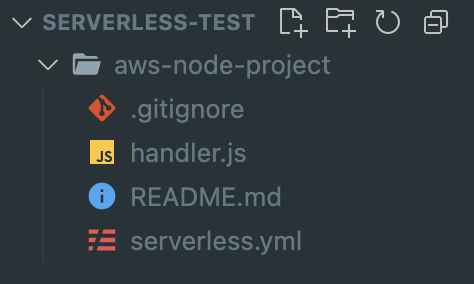
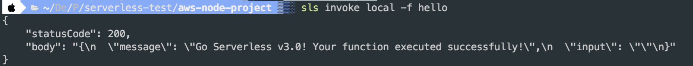

Serverless는 개발 프로세스를 단순화하기 위해 만들어졌다. AWS에서 Lambda를 작성한다면 각 Lambda마다 함수를 작성해야 하고 매번 환경 설정을 해야 한다. 그렇게 작성한 Lambda는 AWS 콘솔에서 다른 서비스와 연결시켜줘야 사용할 수 있다. 이런 과정을 간소화해주는 것이 Serverless Framework다. 간단한 Lambda 개발환경 구축 이외에도 serverless는 CI/CD 설정 및 배포 모니터링 기능을 제공한다.

Serverless는 Node.js로 만들어진 오픈 소스 웹 프레임워크다. 2015년에 AWS Lambda를 개발하기 위해 만들어진 첫번째 프레임워크이며 현재는 Microsoft Azure의 Azure Functions, Google Cloud의 Google Cloud Functions등 다른 플랫폼도 지원한다. 플랫폼 선택에 따라 각 플랫폼에서 지원하는 다양한 언어(Node.js, Typescript, Python, Go, Java 등)를 모두 지원한다. AWS에서 나온 'SAM'과 비슷한 서비스인데 나도 SAM을 사용하려다가 더 큰 커뮤니티가 형성되어있고 다양한 플러그인이 존재하는 serverless를 선택하기로 했다.

- [serverless framework vs aws sam](https://www.techmagic.co/blog/serverless-framework-vs-aws-sam/)

## 사용법

### 설치

Nodes.js가 이미 설치되어있고 컴퓨터에 aws credential이 설정되어있다는 가정하에 진행한다.

```
yarn global add serverless
```

설치를 완료하면 `serverless`, `sls` 명령어를 사용할 수 있다. `sls`는 그냥 축약어로 두 명령어는 같다고 보면 된다.

#### 🚨 serverless 권한 부여

진행 과정에서 serverless의 권한을 설정하라고 할 수 있다. serverless가 AWS에 배포 할 수 있도록 권한을 줘야한다. AWS credential을 생성해 액세스키와 비밀 액세스키로 접근 권한을 줄 수 있다. 혹은 아래 명령어로 설정이 가능하다.

```
serverless config credentials --provider aws --key {액세스 키 ID} --secret {비밀 액세스 키}
```

### 프로젝트 생성

```
serverless
```

명령어를 입력하면 템플릿을 선택할 수 있다.


Node.js Starter를 선택하고 프로젝트 명을 입력하면 프로젝트 이름의 폴더가 만들어진다. 생성 과정에서 serverless에 로그인 할 거냐고 물어보는데 계정이 있다면 로그인 해두는게 좋다. 배포한 프로젝트들을 serverless 콘솔에서 확인할 수 있기 때문이다.



생성된 프로젝트로 들어가면 위와 같은 구조가 보인다. 이 중 `serverless.yaml` 파일에 AWS deploy에 관련된 모든 정보가 들어간다.

```yaml
service: aws-node-project

frameworkVersion: "3"

provider:
  name: aws
  runtime: nodejs14.x
  region: ap-northest-2
  profile: dev

plugins:
  - serverless-plugin-typescript

functions:
  hello:
    handler: handler.hello
  dynamoHandler:
    handler: handler.dynamoHandler
    role: arn:aws:iam::xxxxxxxxxxx
    events:
      - stream:
        type: dynamodb
        arn: arn:aws:dynamodb:xxxxxxx
        batchSize: 1000
        maximumRetryAttempts: 10
        startingPosition: LATEST
        batchWindow: 30

resources: # CloudFormation template syntax
  Resources:
    usersTable:
      Type: AWS::DynamoDB::Table
      Properties:
        TableName: usersTable
        AttributeDefinitions:
          - AttributeName: email
            AttributeType: S
        KeySchema:
          - AttributeName: email
            KeyType: HASH
        ProvisionedThroughput:
          ReadCapacityUnits: 1
          WriteCapacityUnits: 1
```

기본 생성 파일에 몇 가지를 더 추가해봤다. DynamoDB Stream을 처리하는 Lambda를 설정한 파일이다. 콘솔에서 설정하던 설정들이 코드 몇 줄이면 끝나고 관련 리소스 설정을 한 번에 볼 수 있어서 좋다.

- provider: 배포 환경에 관련된 설정이다. runtime 이외에도 `region`, `profile` 등을 여기서 정의
- functions: 배포할 함수들을 정의. (`hello`라는 함수에서 handler 파일의 hello를 handler로 쓰겠다는 의미) role 같이 필요한 설정이 정의되지 않을 경우 serverless가 자동 생성함
- plugins: 사용할 플러그인. 플러그인에 따라 입력 순서가 중요할 수 있기 때문에 주의 필요.
- resources: Lambda에 사용되는 infrastructure 리소스의 정의. 이미 존재하는 리소스를 사용하는 경우 arn을 사용하면 되고 없는 경우 리소스 정의를 통해 자동 생성 가능.

이 외에도 `plugin`, `resources`가 있다. 필요에 따라 문서를 참고해 작성하면 되겠다.

> [serverless.yml 가이드](https://www.serverless.com/framework/docs/providers/aws/guide/serverless.yml)

#### template으로 생성

```
sls create -h
```

커맨드를 입력하면 사용 가능한 템플릿 리스트를 확인할 수 있다.

```
sls create -t aws-nodejs-typescript
```

이렇게 템플릿을 사용해 serverless 프로젝트를 만들 수 있다.

## 배포 및 실행

### 배포

```
sls deploy
```

명령어로 배포한다. serverless는 `servereless.yaml`의 내용에 따라 AWS CloudFormation stack을 생성해 AWS 자원을 만들어준다. 배포에 문제가 없었다면 리소스 url이 콘솔창에 출력된다.

### 실행

```
sls invoke -f hello
```

Lambda를 실행하는 명령어다. `-f` 옵션으로 실행할 Lambda function의 이름을 넣는다. 설정파일에서 `functions`에 정의한 함수 이름을 넣으면된다. `--log` 옵션을 넣으면 로그까지 볼 수 있다.

#### 로컬 실행

```
sls invoke local -f hello
```

이렇게 로컬에서도 실행 할 수 있다. 앞서 만든 `hello` 함수를 실행하면 아래와 같은 메세지를 볼 수 있다.



## 후기

Lambda를 그동안 콘솔에서 개발했는데 버전관리도 힘들고 Typescript도 지원하지 않아서 작업환경을 바꿔야겠다는 생각을 하게됐다. 제공되는 기능이 정말 많아 앞으로 많이 사용하게 될 것 같다.

## 참고

- [Serverless Guide](https://www.serverless.com/framework/docs/providers/aws/guide/serverless.yml)
- [Serverless 프레임워크 사용해서 배포하기](https://velog.io/@jeffyoun/Serverless-%ED%94%84%EB%A0%88%EC%9E%84%EC%9B%8C%ED%81%AC-%EC%82%AC%EC%9A%A9%ED%95%B4%EC%84%9C-%EB%B0%B0%ED%8F%AC%ED%95%98%EA%B8%B0)
