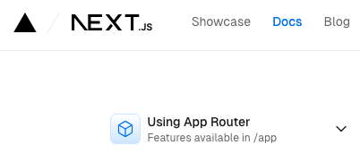

Next.js란 풀스택 애플리케이션을 만들 수 있게 해주는 React 프레임워크이다. React를 사용해 프론트를 개발한 뒤 Next.js의 추가 기능을 사용해 더욱 간편하게 개발을 하거나 최적화를 할 수 있다. Next.js는 자동으로 React에 필요한 번들링, 컴파일링 등의 작업들을 수행해준다. 따라서 사용자는 개발에만 집중할 수 있는 환경이 만들어진다.

## 주요 특징

### 파일 시스템 기반 라우팅
실제로 사용하면서 가장 편리하다고 느꼈던 기능이다. 파일 시스템 기반의 라우팅으로 nested routing을 구현하는 것이 굉장히 쉬웠다.

### Client-side와 Server-side 렌더링을 모두 사용
두 가지 컴포넌트를 모두 사용함으로써 Static, dynamic 렌더링을 최적화 한다.

### Data fetching
서버 컴포넌트에서 data fetching을 간편하게 구현할 수 있다. `fetch` API를 확장한 기능으로 memoization이나 Data caching 등을 사용할 수 있다.

### Styling
선호하는 스타일링 툴을 사용할 수 있다. css modules, Tailwind CSS, CSS-inJS 등 다양하다.

### 최적화
이미지, 폰트, script 최적화 등 웹 애플리케이션의 최적화를 해준다. UX를 높이는데 도움이 된다.

## App Router vs Page Router

Next.js에는 두 가지 라우터가 있다. App router와 Page router로 App router가 좀 더 최근에 나온 방식이다. Next.js에서 제공하는 최신의 기능들을 사용할 수 있다. 서버 컴포넌트 기능의 경우 App router에서만 사용이 가능하다. Page router는 이전에 Next.js에서 사용하던 라우터로 server-rendered React 애플리케이션을 개발할 수 있다. 이전에 만들어진 Next.js는 Page router로 만들어져 있고 이전에 쓰어진 글들도 Page router 기반으로 작성된게 많다.

두 가지가 다른 점이 많아 공식 문서도 따로 기술되어있다. 왼쪽 상당에 어떤 라우터가 선택되어 있는지 잘 확인하도록 하자.



## Installation

2024년 1월 8일 기준 공식 문서를 보고 작성한다.
Node.js 18.17 이상이 필요하므로 참고하자.

### 자동 설치
공식 문서는 `create-next-app`을 사용해 프로젝트를 생성할 것을 권장한다.

```
npx create-next-app@latest
```

명령어를 입력하면 아래와 같은 프롬프트가 출력되는데 원하는대로 프로젝트 기본 설정을 진행하면 된다.

```
What is your project named? my-app
Would you like to use TypeScript? No / Yes
Would you like to use ESLint? No / Yes
Would you like to use Tailwind CSS? No / Yes
Would you like to use `src/` directory? No / Yes
Would you like to use App Router? (recommended) No / Yes
Would you like to customize the default import alias (@/*)? No / Yes
What import alias would you like configured? @/*
```

입력된 내용을 바탕으로 Next.js 기본 프로젝트가 생성될 것이다.

## Usage

* App router를 사용하는 것으로 사용 방법을 정리한다.

App router에서 가장 기본이되는 폴더는 `app/` 이다. `app/` 디렉토리를 생성 후 `layout.tsx` 파일과 `page.tsx` 파일을 추가하자. `page.tsx` 파일이 애플리케이션의 `/` 경로에 렌더링 될 것이다.

### layout.tsx

`layout.tsx` 파일에는 root layout이 작성되어야 한다. `<html>`과 `<body>`태그가 필수이다.

```tsx
export default function RootLayout({
  children,
}: {
  children: React.ReactNode
}) {
  return (
    <html lang="en">
      <body>{children}</body>
    </html>
  )
}
```

### page.tsx

`page.tsx`에는 페이지 내용을 추가하면 된다.

```tsx
export default function Page() {
  return <h1>Hello, Next.js!</h1>
}
```

## 실행

1. `yarn run dev`를 실행한다.
2. `http://localhost:3000`에 접속하면 애플리케이션을 볼 수 있다.
3. `app/page.tsx` 파일을 수정하면 수정 사항이 실시간으로 반영된다.

## 후기

실제로 업무에 필요한 간단한 페이지를 제작해봤는데 라우팅에 시간을 쏟을 일이 하나도 필요 없어서 참 편리하다고 느꼈다. 각종 최적화도 알아서 해줘서 그런지 애플리케이션 성능도 더 좋았다.
vercel을 사용해 배포하면 페이지 성능 측정 대시보드와 도메인 연결 등 애플리케이션 관리도 매끄럽게 되지만 개인 프로젝트가 아닌 경우 유료로 이용해야 한다.

## 참고

- [Next.js 공식 문서](https://nextjs.org/docs)
