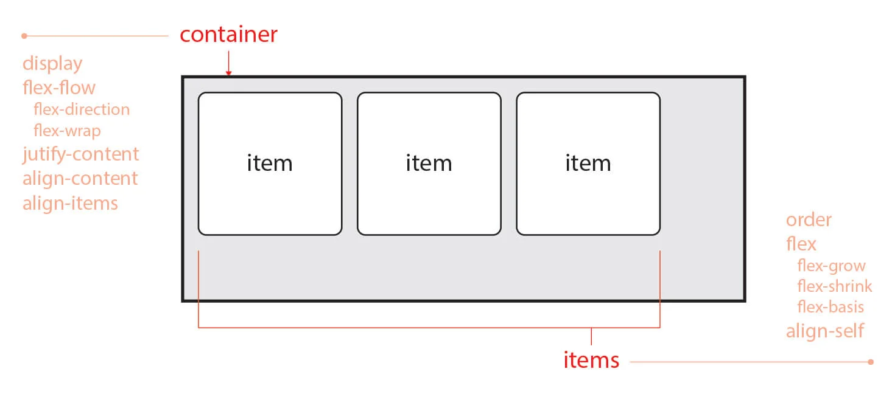
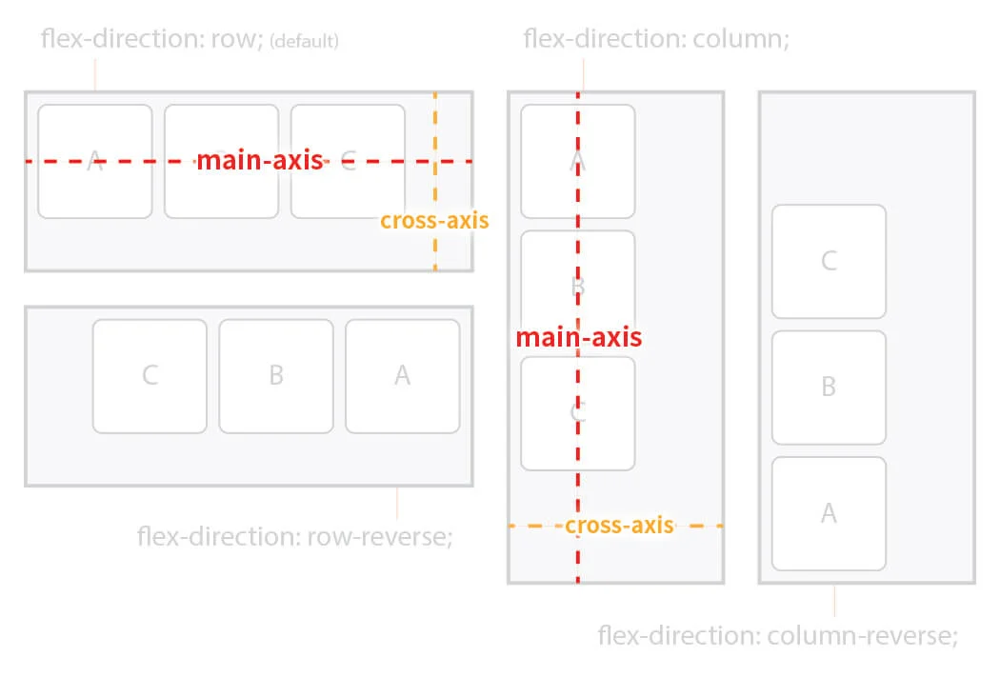
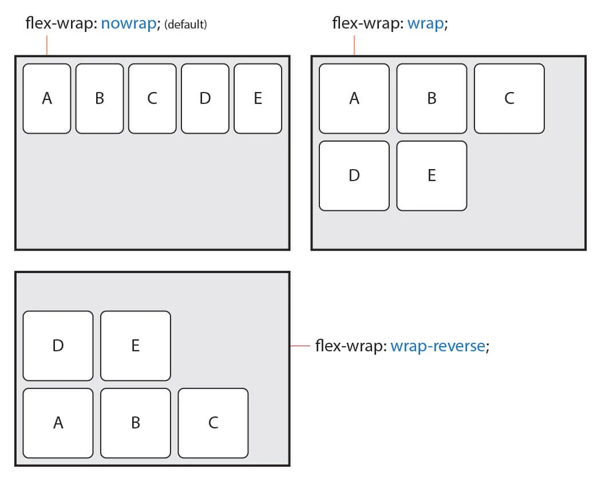
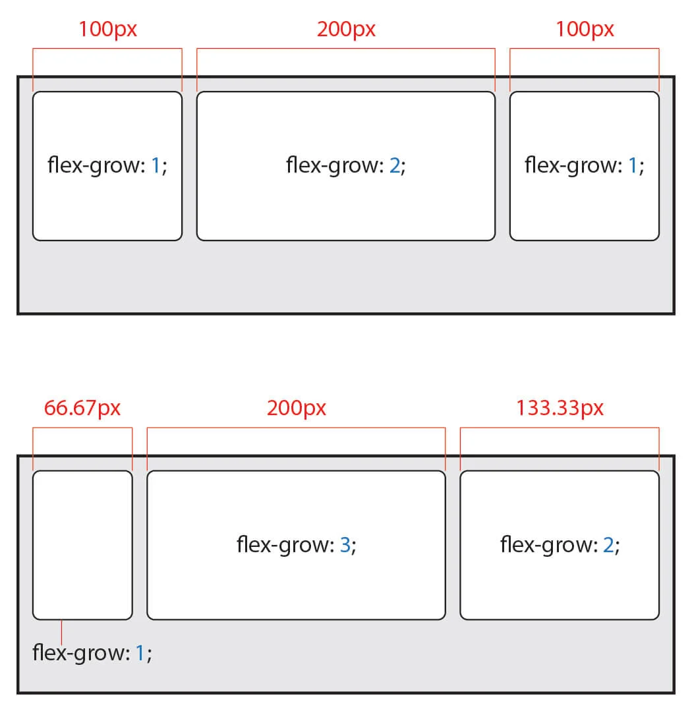
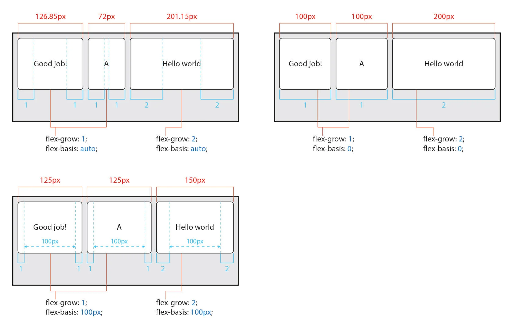

:rotating-light:[CSS Flex(Flexible Box)완벽 가이드](https://heropy.blog/2018/11/24/css-flexible-box/)정리 내용입니다.

`flex`는 html요소의 수평 배열을 아주아주 간단하게 구현해주는 속성이다. 이전에는 `float`를 사용하거나 `inline-block`으로 바꿔서 사용하는 등 조금 억지스러운 방식으로 구현했다면, `flex`는 매우 간편하고 자연스럽게 수평 구조를 만들어준다.

flex는 `container`와 `item`들로 구성되어있다. 이 구조를 잘 이해하고 있어야 자유자재로 레이아웃을 짤 수 있다.



컨테이너와 아이템 요소에 사용하는 속성이 다르기 때문에 주의해야 한다.

## flex container 속성

### `display`

요소를 flex container로 정의한다.

- `flex`: block 특성의 flex container 정의
- `inline-flex` : inline 특성의 flex container 정의 (컨테이너 내부 요소는 flex의 특성을 가지지만 외부 컨테이너가 inline 특성을 가지게 된다)

### `flex-flow`

단축 속성이다.

```
flex-flow: flex-direction flex-wrap;
```

이렇게 `flex-direction`과 `flex-wrap` 두 속성을 한꺼번에 지정할 수 있다.

### flex-direction

item들이 정렬될 주 축을 설정한다.

- `row`: 수평축으로 표시 (default)
- `row-reverse` : `row`의 반대 축으로 표시
- `column`: 수직축으로 표시
- `column-reverse` : `column`의 반대 축으로 표시

주 축(`main-axis`)이 있다면, 교차축(`cross-axis`)도 존재한다. 주 축이 수평축이라면 교차축은 수직축이 된다. 반대도 마찬가지이다. 따라서 이 두개 념은 상대적이다.

축의 시작점(`flex-start`)와 끝점(`flex-end`)을 지칭한다. 이 역시 상대적인 개념이다.


### flex-wrap

items가 여러 줄이 되도록 할 것인지, 한 줄에 표시할 것인지 설정하는 속성이다.

기본적으로 items는 한 줄로 표시되며 줄바꿈이 되지 않는다. 줄 바꿈이 되도록 하려면 `wrap`으로 지정해야한다.


컨테이너 내부의 아이템들의 너비는, container bases 이다. `wrap` 속성이 지정되어있지 않은 경우 아이템의 너비가 container의 크기에 따라 변화한다. `wrap` 속성을 주면 아이템에 지정된 원래 크기를 유지하면서 컨테이너 크기가 모자란 경우 줄바꿈이 발생한다.

### justify-content

주 축의 정렬 방법을 설정한다.


### align-content

교차 축의 정렬 방법을 설정한다. `flex-wrap : wrap` 속성을 사용해 item이 여러 줄로 정렬되어있고 컨테이너에 여백이 있는 경우에만 사용할 수 있다.


### align-items

교차축의 item 정렬 방법을 설정한다. item이 여러 줄일 경우 `align-content` 속성이 우선하기 때문에 `align-items`를 사용하려면 `align-content`는 기본값이 되어있어야 한다.


## flex items 속성

### order

item에 숫자를 설정해 css로 html 요소의 순서를 설정한다.
`0`이 default 값이고 음수, 양수 오름차순 순으로 배치된다.

### flex 너비 설정

`flex`는 단축 속성이다. 아래 세가지 속성을 차례대로 나열해 한꺼번에 설정할 수 있다.

- `flex-grow` : 증가 너비 비율 설정 (default 값은 `0`)
- `flex-shrink` : 감소 너비 비율 설정
- `flex-basis` : item의 기본 너비 설정(auto)


가변하지 않는 부분은 너비를 고정값으로 설정하고 가변하는 부분은 `flex-grow:1` 속성을 추가하여 윈도우 창의 늘어나는 크기에 맞게 변화하는 레이아웃을 만들 수 있다.
같은 원리로 동작하는 `flex-shrink` 속성을 사용해 창이 줄어듦에 따라 감소되는 비율을 설정할 수 있다.

`flex-basis`는 item이 내부 content의 크기가 기반이 되는 `auto` 속성을 가지는데 `auto`가 아닌 단위를 사용해 다른 `값`을 지정하면 해당 값을 기반으로 `flex-grow`, `flex-shrink`가 발생한다.
기본 값은 `auto` 지만 `flex` 단축 속성을 이용해 정의한 경우 생략한 `flex-basis`는 `0`이 된다는 점을 주의해야한다.



### align-self

일부 item만의 정렬 방법을 설정한다. `align-items` 속성보다 우선된다.
