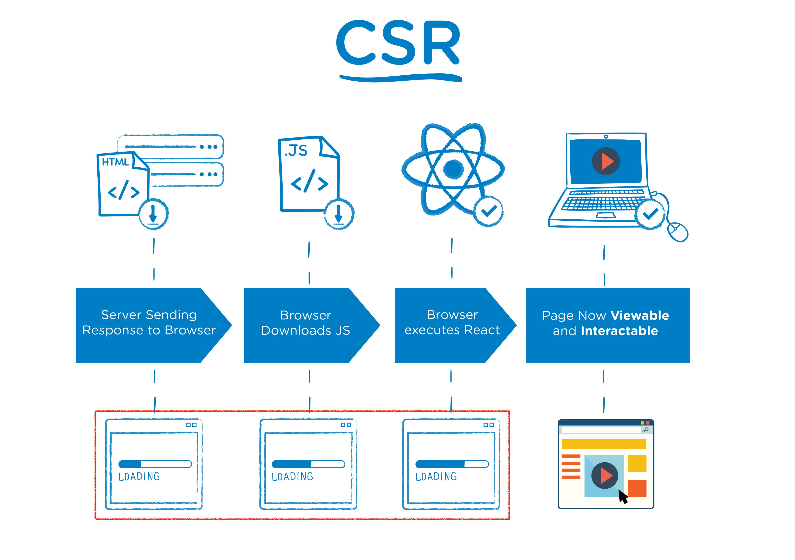
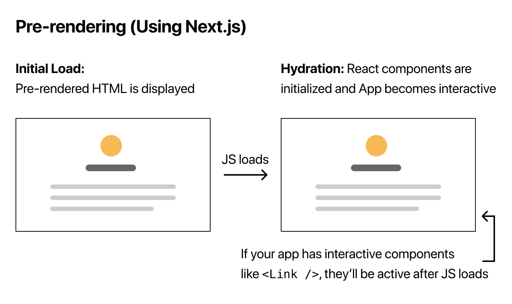

## SPA (Single Page Application)

현재의 페이지를 동적으로 작성함으로써 사용자와 소통하는 웹 애플리케이션이다. 연속되는 페이지 간 UX를 향상시킨다.

전통적인 Page LifeCycle은

1. Client에서 Server로 최초의 요청을 보낸다.
2. Server는 응답을 보내고 Client에서 화면이 보인다.
3. Client에서 상호작용을 위한 요청을 Server에 보낸다.
4. Server가 응답한다.
5. 페이지가 Reload 된다.

이 경우 Client로 부터 새로운 요청이 올 때마다 Reload가 발생하여 비용적으로 손해를 보게 된다.

SPA의 경우 정적 리소스를 최초에 한 번 다운로드 한 뒤로 변경이 있을 때 페이지 전체 Reload가 아닌 변경된 부분에 한해서 갱신된다.

## CSR (Client Side Rendering)

CSR의 동작 순서는 다음과 같다.

1. 서버에서 브라우저로 응답을 보낸다.
2. 브라우저에서 JS를 다운로드 받는다.
3. 브라우저가 React를 실행한다.
4. 페이지가 보이고 상호작용이 가능해진다.

SPA에서 채택한 방식이다.
SEO가 어렵다고 하지만 구글 크롬의 경우 브라우저 내에 JS 엔진이 있기 때문에 CSR을 사용해도 SEO에 문제가 없다고 한다. 하지만 대부분의 다른 브라우저에는 JS 엔진이 없고 사용자들이 크롬만 사용하는 것이 아니기 때문에 SSR을 많이 사용한다고 한다.

### 장점

- 컴포넌트 단위로 UI를 구성하여 재사용에 용이하고 중복을 줄일 수 있다.
- 페이지 전환이 부드럽다.
- 변경된 사항만 Server에 요청하기 때문에 비용 측면에서 효율적이다.

### 단점

- 초기 페이지 로딩이 오래걸린다.
- SEO가 어렵다.

## SSR (Server Side Rendering)

서버에서 사용자에게 보여줄 페이지를 모두 구성하여 보내는 방식이다. JSP/Servlet 아키텍처에서 이 방식을 사용했다.

SSR의 동작 순서는 다음과 같다.

1. 서버는 렌더링할 준비가 된 HTML을 브라우저에 보낸다.
2. 브라우저는 페이지를 렌더링하고, 이때부터 유저가 페이지를 볼 수 있다.
3. 브라우저가 JS를 다운로드 받는다.
4. 브라우저가 React를 실행한다.
5. 페이지 상호작용이 가능해진다.

### 장점

- CSR에 비해 렌더링 속도가 빨라 사용자가 기다리는 로딩 시간이 짧다
- SEO 최적화가 쉽다.

### 단점

- CSR에 비해 서버 부하가 많다.
- 페이지 전환이 부드럽지 못하다. (화면이 깜빡인다고 느낄 수 있다.)

## NextJS

[NextJS](https://nextjs.org/)는 SSR, SEO 부터 TypeScript까지 생산에 필요한 많은 기능들을 제공하는 React Framework.
Vercel이라는 프론트엔드 팀에서 만들었다.

작동 방식은 다음과 같다.

1. 사용자의 최초 요청시 SSR 방식으로 렌더링 될 HTML을 보낸다.
2. 브라우저에서 JS를 다운로드 받고 React를 실행한다.
3. 유저와 상호작용 하는 컴포넌트의 경우 JS가 완전히 로드 된 후에 활성화 된다.

### Plain React.js의 경우

## 참고

- [NextJS 그게 뭔데](https://velog.io/@skypedanny/NextJS-%EA%B7%B8%EA%B2%8C-%EB%AD%94%EB%8D%B0)
- [Naver D2 - SSR 도입 편](https://d2.naver.com/helloworld/7804182)
- [Nest.js tutorial](https://nextjs.org/learn/basics/data-fetching/pre-rendering)
