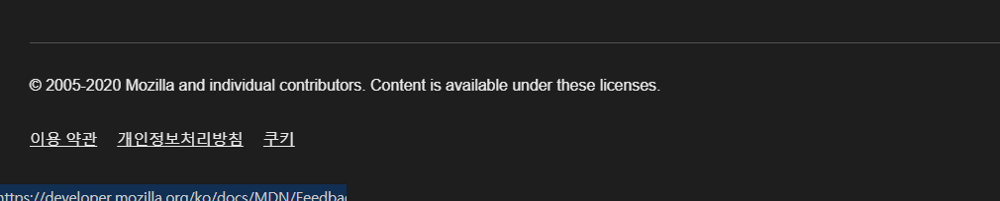
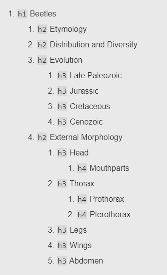
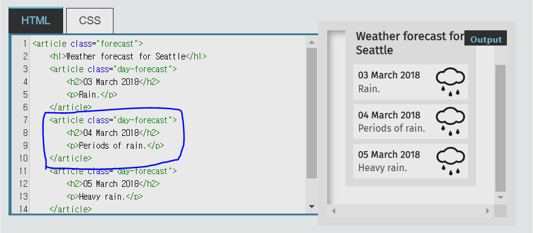
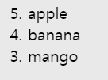
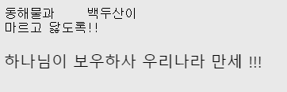
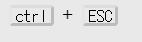

## `<head>` 태그 구성요소
w
head 태그에는 웹페이지에 대한 정보를 담는다. 페이지 인코딩 방식이나 css 파일 링크, 페이지의 제목 등 다양한 데이터를 포함한다.

### `<meta>`

meta 태그는 웹페이지에 대한 메타데이터를 나타내는 태그이다. 메타데이터란 `데이터를 설명하는 데이터`이다. 문서 작성자나 문서 요약과 같은 정보를 담고 있다.

```html
<meta charset="UTF-8" />
```

주로 인코딩 방식을 나타내기 위해 사용된다.

### `<link>`

[MDN-link](https://developer.mozilla.org/ko/docs/Web/HTML/Element/link)
link는 외부 리소스를 불러올 때 사용한다. 주로 `stylesheet`를 연결할 때 가장 많이 사용하지만, 다른 속성을 이용해 그 외의 resource들도 불러 올 수 있다.

```html
<link rel="stylesheet" href="./css/style.css" />
```

### `<title>`

웹 페이지의 제목을 설정하는 요소이다.

```html
<title>테스트 페이지</title>
```

## `<body>` 태그 구성 요소 - block

### `<header>`

사이트 상단에 위치하는 요소들의 컨테이너로 주로 사용한다. 다른 태그의 하위에 들어갈 수 없다. 상단에 위치하는 네비게이션 같은 요소가 주로 들어가게 된다.


### `<footer>`

사이드 하단에 위치하는 페이지 제작자의 정보나 연락처 또는 회사 로고등의 데이터가 주로 들어간다.



### `<h1>`

h1부터 h6 까지 다른 글자 크기를 가지며 컨텐츠의 제목을 나타낼 때 사용한다. 주의할 점은 MDN의 레퍼런스를 따르면 폰트의 구조를 줄이기 위해 낮은 단계를 사용하지 말라고 명시되어있다.
HTML은 구조를 나타내기 위한 언어이기 때문에 실제로 표현되는 부분은 CSS로 조정하는 것이 본연의 목적에도 맞는 구현 방법이라고 할 수 있다.

또한 각각의 우선도에 맞게 사용하기를 권장하고 있는데, 예를들면 `h1` 태그를 남발하기 보다는 이는 전체 문서의 대제목으로 하나를 지정하고, 소제목들은 `h2` 태그를 사용해서 나타내는 것을 말한다.



### `<main>`

`<body>`의 주요 콘텐츠를 나타낸다. 이 태그는 문서 당 고유하게 하나만 사용해야 한다. IE는 지원하지 않는다. `block` 요소이다.

### `<article>`

독립적으로 구분되거나, 재사용이 가능한 영역을 설정한다. 매거진, 기사, 블로그 포스팅이 여기에 속할 수 있다. 일반적으로 `<h1>-<h6>` 가 하나정도 포함된다.



위 그림에서 볼 수 있듯 파란색으로 묶은 부분은 독립적으로 다른 곳에서도 같은 형식으로 사용 될 수 있다. 이런 성격을 가지는 내용의 경우 `<article>`의 사용을 고려해보는 것이 좋다.

### `<section>`

block 요소이다. 문서에서 일반적인 영역을 설정한다. 어떠한 구역을 나눈다는 역할적인 측면에서 `<div>`와 비슷하지만 `<section>`의 경우 `<h1>-<h6>`를 사용해 구역에 이름을 지어 구분한다.

_section_ > _article_ > _div_ 순으로 좀 더 강한 의미를 가지고 있다고 생각하면 된다.

### `<aside>`

웹사이트의 사이드에 나타나는 주로 주요 contents와는 관계 없는 배너 광고나 기타 링크를 나타낸다.

### `<nav>`

block 요소이다. `navigation`의 약자로 다른 페이지의 링크를 제공하는 영역을 나타낸다. 메뉴나 홈, 목차, 색인 등이 주로 포함된다.

_주로 영역을 표시하는 태그들은 `block` 요소이다_

### `<address>`

연락처 정보를 나타낼 때 사용한다.

```html
<p>Contact the author of this page:</p>

<address>
  <a href="mailto:jim@rock.com">jim@rock.com</a><br />
  <a href="tel:+13115552368">(311) 555-2368</a>
</address>
```

address 태그 내부에 있는 `<a>` 태그를 클릭하면 곧바로 연락 할 수 있는 창이 뜬다. 전화번호의 경우 휴대폰에서 누르면 곧바로 연락처 앱이 뜨게 된다.

### `<div>`

아무것도 나타내지 않는 컨텐츠 영역을 나타낸다. 의미를 가지지 않기 때문에 아무렇게나 사용할 수 있지만, 설정하는 구역이 가지는 의미에 따라 다른 의미있는 구역 구분 태그를 사용하는 것이 좋다.

## 문자 콘텐츠

### 리스트 태그

ol, ul은 block 요소이며 li 엘리먼트는 list-item 이다. 하지만 li는 항상 ol, ul 의 자식 엘리먼트로 들어가야 하기 때문에 block 요소라고 생각하여도 무방하다.

- `<ul>` : unordered list 태그. 순서가 필요하지 않은 리스트에 사용
- `<ol>` : ordered list 태그. 순서가 필요한 리스트에 사용
- `<li>` : `<ul>` 또는 `<ol>` 과 항상 함께 사용된다.

```html
<ul>
  <li>apple</li>
  <li>banana</li>
  <li>mango</li>
</ul>
```


`<ul>` 태그의 `list-style` 기본 속성은 `bullet`이기 때문에 이를 없애기 위해서는 css 속성을 바꾸면 된다.

```css
li {
  list-style: none;
}
```

다른 리스트 구분자도 많으니 찾아보고 사용하면 되겠다.

```html
<ol>
  <li>apple</li>
  <li>banana</li>
  <li>mango</li>
</ol>
```


`<ol>` 태그에는 속성을 추가 할 수 있다. 태그를 시작할 때 `type` 속성을 지정함으로써 시작 번호를 지정할 수 있다.

```html
<ol type="a">
  <li>apple</li>
  <li>banana</li>
  <li>mango</li>
</ol>
```

- `type` : 리스트 순서의 type을 지정할 수 있다. `a`는 영어 소문자, `A`는 영어 대문자 `i`는 로마자 소문자 등 여러가지가 있다. 
- `reversed` : 리스트 순서를 역순으로 표시한다. 이때 번호만 역순으로 출력되는 것이지 엘리먼트 자체 순서가 바뀌는 것은 아니다.
- `start` : 리스트 순서의 시작 번호를 설정한다.

```html
<ol start="5" reversed>
  <li>apple</li>
  <li>banana</li>
  <li>mango</li>
</ol>
```



`<ol>` 태그 하위의 `<li>` 태그에는 `value`를 지정할 수 있다. value를 지정한 엘리먼트는 지정된 value 부터 번호를 시작하며 그 뒤에 나오는 li 태그들은 번호가 재정의 된다.

```html
<ol>
  <li value="7">apple</li>
  <li value="99">banana</li>
  <li>mango</li>
</ol>
```


### dl, dt, dd

용어와 정의의 쌍(key-value)을 나타낼 때 사용한다.
`<dl>`은 `<dt>, <dd>` 요소만을 포함한다.

`<dfn>` 은 용어 하나를 정의할 때 사용하는 태그이다. `definition`의 약어이다.

하지만 `<dl>`의 경우 스타일링을 하는데 어느정도 제약이 있다. 따라서 이를 대신하여 `<li>`와 `<dfn>` 을 사용해 비슷하게 동작 하도록 할 수 있다.

## 문단 설정 요소

### <p>

하나의 문단을 설정할 때 사용한다. (paragraph) block 요소이다. 웹페이지에서 다음 문단 즉, 다음 `<p>`로 넘어갈 수 있는 단축키가 지정되어 있어서 자주 사용된다.

### <hr/>

문단의 분리를 위해 사용한다. 빈 태그이며 block 요소이다. 수평선을 만들어 내는데 이 표현적 관점에 맞춰 사용하면 안된다. `주제에 의한 문단의 분리` 라는 의미적 관점으로 사용해야 한다.
`<hr>` 태그로 나타나는 수평선을 없애고 싶을 경우 css 에서 속성을 변경하면 된다.

```css
hr {
  border: none;
}
```

### <pre>

서식이 미리 지정된 텍스트를 설정한다. 텍스트의 공백과 줄바꿈을 유지하여 표시할 수 있다. 기본적으로 Monospace 글꼴 계열로 표시된다.
`Monospace` 글꼴이란 글자 간 간격이 모두 같아 가독성이 높은 글꼴계열을 말한다.

html 문서에서는 띄어쓰기를 한 번 이상 해도 하나로 인식하여 출력한다. 이를 사용자가 문서에 입력한 그대로 출력할 때 사용하는 태그가 `<pre>`태그이다.

```html
<pre>
동해물과     백두산이
마르고 닳도록!!
</pre>
<p>하나님이 보우하사 우리나라 만세 !!!</p>
```



`<pre>` 태그 내의 내용은 띄어쓰기와 줄바꿈이 입력한 내용과 같게 출력된다. 이 때 에디터 내에서 가독성을 위해 tab 이 들어간 것도 모두 그대로 출력되므로 그런 공백들은 모두 지워야 한다.

### `<blockquote>`

인용문을 나타낼 때 사용한다. `cite` 속성으로 자료를 인용한 페이지의 url을 입력하면 된다.

## body 태그 구성요소 - inline

### `<a>`

다른 url로 사용자를 보낼 때 연결 할 수 있는 하이퍼링크를 설정하는 태그이다.

- href : 링크의 url (html5 이전에는 필수 속성, 이후 선택 속성으로 변경됨) 선택 속성으로 바꼈지만 href를 지정하지 않으면 다른 url로 보낼 수 없으므로 `<a>` 태그가 제 역할을 할 수 없다.
- rel : 현재 문서와 링크 url의 관계
- target : 링크 url의 표시 위치. 기본 속성은 `_self`로 지정되어있다. 새로운 탭에서 링크가 열리게 하려면 `_blank` 속성을 지정해야 한다.
- type : 링크 url의 MIME type
- download : download 속성을 지정하면 해당 엘리먼트는 다운로드 받는 개체가 된다.

```html
<a href="https://google.com" target="_blank">Google</a>
<a href="./README.md" download">README.md</a>
```

`href` 속성에 이미지 파일을 넣으면 이미지 파일이 출력된다. 또 `download` 속성을 주면 이미지를 다운받을 수 있다.

`<a>` 태그를 사용해 버튼을 만들고 싶은 경우 `<a>`태그는 inline 요소이기 때문에 css에서 `display: block` 으로 속성을 변경하여 사용하면 된다.

`href` 속성으로 html element의 `id`값을 주면 같은 페이지 내에 있는 해당 요소로 페이지 스크롤이 이동된다. 목차에서 유용하게 사용된다.

```html
<ul>
  <li><a href="#title1">제목 1</a></li>
  <li><a href="#title2">제목 2</a></li>
</ul>
<h2 id="title1">제목1</h2>
<h2 id="title2">제목2</h2>
```

### `<abbr>`

약어를 지칭할 때 사용한다. 보통 `title` 속성을 사용해 전체 글자나 설명을 제공한다.

```html
Using <abbr title="Hyper Text Markup Language">HTML</abbr> is fun.
```


다음과 같이 텍스트에 밑줄이 생기고 마우스를 올리면 `title`로 지정한 약어의 뜻이 표시된다.

### `<b>`

문체가 다른 글자의 범위를 설정한다. 글자가 `bold`로 표시된다. 특별한 의미를 가지지는 않으며 읽는 흐름에 도움을 주는 용도로만 사용한다. bold 속성만을 위해 이 태그를 사용하는 것은 옳지 못하며 마지막 수단으로 사용할 것이 권고 된다.

### `<mark>`

형광펜을 칠 하듯 하이라이팅을 위해 사용한다. 사용자의 관심을 끌기 위해 사용한다. 배경이 노란색으로 표시된다. css로도 표현할 수는 있지만 검색 엔진이 이 태그를 인식해 강조하는 의미로 사용되고 있음을 인식할 수 있다.

### `<em>`

단순히 의미의 강조를 표시한다. 중첩이 가능하며 중첩될 수록 그 의미가 강해진다. Italic체로 표시된다.

### `<strong>`

의미의 중요성을 나타내기 위해 사용한다. `<em>`과의 차이점은, `strong` 태그는 문맥상에서 의미의 중요성을 나타내는 것이고 `em` 태그는 강조를 하기 위해 사용하는 것이다. 텍스트가 bold 체로 표시된다.

### `<i>`

`<em>`, `<strong>` 등에서 표현할 수 없는 경우 사용한다. `<b>`태그가 비슷한 용도의 텍스트에 사용되는 것과 비슷하게 `<i>`태그는 특수기호나 아이콘 등을 일반 텍스트와 구분하기 위해 사용한다.

### `<dfn>`

용어의 정의를 나타낼 때 사용한다. 딱히 다르게 표현되는 것은 없다.

### `<cite>`

창작물에 대한 참조를 설정한다. Italic 체로 표시된다. 책, 논문, 영화 등의 제목을 나타낼때 사용한다.

### `<q>`

짧은 인용문을 나타낼때 사용한다. 긴 인용문의 경우 `<blockquote>`를 사용한다.

### `<code>`

코드 블럭이 생성된다.

### `<kbd>`

keyboard 키를 나타낼 때 사용한다.

```html
<kbd>ctrl</kbd> + <kbd>ESC</kbd>
```

```css
kbd {
  padding: 0 3px;
  border-radius: 3px;
  border-top: 2px solid rgb(240, 240, 240);
  border-bottom: 2px solid rgb(205, 205, 205);
  border-right: 2px solid rgb(240, 240, 240);
  border-left: 2px solid rgb(250, 250, 250);
}
```


다양한 css 속성을 줘서 진짜 키보드 키 처럼 보이게 할 수 있다.

### `<time>`

`datetime` 속성을 사용해 시간을 표현할 수 있다. `datetime` 속성은 요소의 시간 또는 날짜 값을 필요로 한다. 지정할 수 있는 날짜 속성은 [MDN](https://developer.mozilla.org/ko/docs/Web/HTML/Element/time)을 참고한다.

### `<span>`

`<div>`태그와 유사하다. inline 요소로 본질적으로 아무것도 나타내지 않는 영역을 설정한다. 텍스트 요소들을 다루는데 특화되어있다.

### <br/>

줄바꿈을 나타낸다. `/`는 생략해도 된다.

### <del>

삭제된 요소를 나타낸다. 텍스트 중간에 가로선이 나타난다. 꼭 삭제되었음을 보여야 하는 경우에만 사용한다.

### <ins>

추가된 요소를 나타낸다. 텍스트에 밑줄이 표시된다.

```html
<p>“You're late!”</p>
<del>
  <p>“I apologize for the delay.”</p>
</del>
<ins cite="../howtobeawizard.html" datetime="2018-05">
  <p>“A wizard is never late …”</p>
</ins>
```


## 멀티미디어 요소

### 

이미지를 삽입할 때 사용한다.

### <audio>

오디오 컨텐츠 삽입에 사용한다. `src`로 파일의 위치를 지정하여 사용한다. `autoplay` 속성을 추가하면 파일이 준비되는대로 바로 재생된다. `controls` 속성은 audio 속성의 제어 메뉴를 표시한다.

### <video>

동영상 컨텐츠를 삽입한다. `<audio>`와 비슷하다. `poster`속성으로 썸네일 이미지 url을 지정할 수 있다.

### <figure>, <figcaption>

이미지나 도표 등의 영역을 지정한다. `<figcaption>`은 삽입한 이미지의 밑에 표시되는 figure의 캡션 요소이다.

### <iframe>

다른 html 페이지를 현재 페이지에 삽입할때 사용한다. youtube등의 동영상을 불러올 때 등에도 다양하게 사용할 수 있다. 중첩된 페이지 컨텍스트를 표시한다.

```html
<iframe
  id="Example2"
  title="iframe Example 2"
  width="400"
  height="300"
  style="border:none"
  src="https://maps.google.com/maps?f=q&source=s_q&q=buenos+aires&sll=37.0625,-95.677068&sspn=38.638819,80.859375&t=h&hnear=Buenos+Aires,+Argentina&z=11&ll=-34.603723,-58.381593&output=embed"
>
</iframe>
```

iframe을 사용할 경우 보안적 이슈가 생길 수 있고 정상적으로 페이지가 출력되지 않는 경우도 있다. `sandbox` 속성을 사용해 보안 문제를 완화 시킬 수는 있지만 이 속성을 주면 엘리먼트에 자바스크립트 코드가 적용되지 않을 수도 있는 등의 제약이 생길 수도 있으니 주의해야 한다.

### canvas

canvas API를 사용해 그래픽이나 애니메이션을 렌더링 한다. (Javascript 30 에서 다루었음)

### <script>, <noscript>

자바스크립트 코드를 문서에 포함할 때 사용한다. 만약 브라우저가 스크립트를 지원하지 않는 경우 출력될 html을 `<noscript>`를 사용해 표시할 수 있다.

외부 JS 코드를 불러올 때는 `src` 속성을 사용하면 된다. 이때 `<header>`에서 js 코드를 읽으면 전체 document를 읽기 전에 html element를 선택하려고 할 때 오류가 발생할 수 있다. 이런 경우 `defer`속성을 주면 문서를 모두 읽은 후에 js 코드를 실행하기 때문에 오류를 방지할 수 있다. 또는 js 코드를 아예 `<body>`태그 외부에 입력해 읽혀지는 순서를 나중으로 강제할 수도 있다.

## 표 컨텐츠

### <table>

표를 나타내는 태그. 이 태그 내부에 아래 요소들

### <tr>

행. table row

### <td>

열. table data

### <th>

제목 칸. table header

```html
<table>
  <caption>
    Alien football stars
  </caption>
  <tr>
    <th scope="col">Player</th>
    <th scope="col">Gloobles</th>
    <th scope="col">Za'taak</th>
  </tr>
  <tr>
    <th scope="row">TR-7</th>
    <td>7</td>
    <td>4,569</td>
  </tr>
  <tr>
    <th scope="row">Khiresh Odo</th>
    <td>7</td>
    <td>7,223</td>
  </tr>
  <tr>
    <th scope="row">Mia Oolong</th>
    <td>9</td>
    <td>6,219</td>
  </tr>
</table>
```


실제 사용 예제를 보면 더 이해가 빠르다.
`<table>` 태그를 사용해 표를 생성하면 기본적으로 테두리가 표시되지 않는데 선을 표시하기 위해서 css 속성을 추가해야 한다.

```css
table {
  border-collapse: collapse;
}
td {
  border: 1px solid black;
  padding: 10px;
}
th {
  border: 1px solid black;
  padding: 10px;
  background: yellowgreen;
}
```

이때 `border-collapse` 속성은, 셀 간의 간격을 없애는 속성이다.

## <form>

클라이언트가 data를 서버단에 http request로 보내기 위해 사용하는 태그

form 내부에는 주로 다음과 같은 태그들이 사용된다.

- `<input>` : 사용자의 입력을 받는 태그
- `<button>` : 버튼을 표시하는 태그
- `<label>` : `<input>` 요소 뿐만 아니라 옆에 표시된 글자를 눌러도 input 요소 선택이 가능하도록 한다.
- `<select>` : 옵션의 선택 메뉴를 제공한다.

### <input>

`<input>` 태그는 `type` 속성을 지정해 다양한 값을 받을 수 있다.
[Mozila 참조](https://developer.mozilla.org/en-US/docs/Web/HTML/Element/input)

### <label>

`label`의 지정은 `input` 요소의 `id` 속성을 `for`를 통해 참조하거나, `label` 태그로 감싸는 두가지 방법으로 구현한다.

```html
<input type="checkbox" id="user-agreement" />
<label for="user-agreement">체크 박스?</label>
```

```html
<label><input type="checkbox" />체크박스</label>
```

### <select>

선택 옵션들을 표시한다.

- `<option>` : 선택지 각 하나를 나타낸다. (`selected` 속성 사용 가능)
- `<optgroup>` : 선택지를 그룹지어 나타낸다.
- `<datalist>` : 자동완성 기능을 제공한다.

### <datalist>

`input` 태그의 `list` 속성과 `datalist`의 `id`값을 연결해 사용한다.

```html
<input type="text" list="fruits" />

<datalist id="fruits">
  <option>Apple</option>
  <option>Orange</option>
  <option>Banana</option>
  <option>Mango</option>
  <option>Fineapple</option>
</datalist>
```


## <progress>

작업의 완료 진행률을 표시한다. `inline-block` 속성을 가진다.

```html
<progress value="70" max="100">70 %</progress>
```

## <tabindex>

`Tab`키를 이용해 순차적으로 포커스 탐색할 요소의 순서를 지정한다.
이미지나 오디오 등 '대화형 콘텐츠'는 기본적으로 코드 순서대로 `tabindex` 요소를 가진다. 비대화형 콘텐츠에도 해당 속성을 추가해 탭 탐색에 추가되도록 할 수 있다.
`tabindex=숫자` 을 사용해 추가할 수 있고, 기본적으로 대화형 컨텐츠의 속성값은 `0`이다. 양의 정수 값 순서대로 탐색되지만 논리적 흐름을 방해하기 때문에 좋은 설정 방법은 아니다.
양수 값을 가질 때만 탐색 대상이 되므로, 대화형 콘텐츠에 `음수`값으로 설정하여 탭 순서에서 제외시킬 수도 있다.
