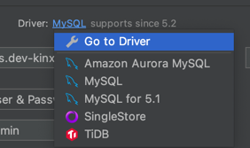
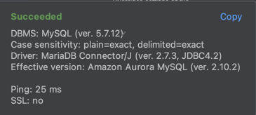

DataGrip이 그렇게 좋다고해서 사용해보려고 설치했는데 연결이 잘 안돼서 좀 헤맷다.

데이터 소스 리스트를 보면 MySQL이 보인다. 선택하고 DB 정보를 입력하고 `Test Connection`을 누르면 연결이 잘 되는지 확인할 수 있는데 계속 접속 에러가 났다.

한참 헤맷는데 생각보다 간단하게 해결할 수 있었다.

`General` > `Driver` 설정에서 'MySQL'을 누르면 위와 같이 다른 옵션들을 볼 수 있는데, 여기서 Amazon Aurora MySQL을 선택하면 된다.
그럼 아래쪽에 이런 경고가 뜰 수도 있다.

경고 메세지가 시키는대로 다시 드라이버를 바꾸면 안된다. 무시하고 `Test Connection`을 누르면 정상적으로 연결되는 것을 볼 수 있다!

