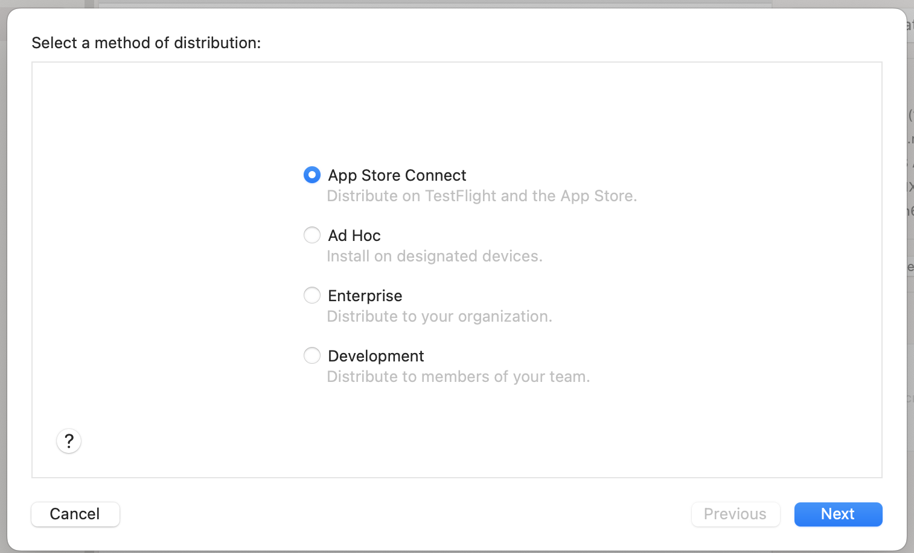

React Native로 개발한 앱을 여러번의 수정을 거쳐 빌드를 마치고 앱 스토어 심사를 기다리고 있다. 순탄하게 흘러갔던 과정이 단 하나도 없었던 것 같아 기록을 남겨놓으려고 한다.

## 빌드

### iOS

iOS는 XCode 사용법이 익숙치 않아 초반에 어려움을 느꼈으나 한 번만 세팅만 잘 맞춰놓으면 그 뒤로 문제가 발생한 적은 없었던 것 같다. 


'Product > Scheme' 설정에서 `Build Configuration`을 Release로 맞추고 'Product > Archive'를 눌러 실행하면 production 버전의 빌드가 시작된다.

정상적으로 빌드가 완료되면 Archive 히스토리와 함께 새로운 창이 뜬다. 


배포할 버전을 선택하고 `Distribute App` 버튼을 누르면 배포가 진행된다. 



앱 배포 및 `TestFlight` 기능을 사용하기 위해 `App Store Connect`를 선택했다. 다음 옵션도 대부분 App Store Connect에 관리를 위임하도록 선택했다.

Next 버튼을 계속 클릭하면 빌드가 진행된다. 정상적으로 작업이 끝낸 뒤 App Store Connect에 로그인 하면 TestFlight에서도 업로드 된 버전을 확인 할 수 있고 앱 심사 요청시에도 빌드 파일 리스트에서 확인 할 수 있다. 배포 작업이 끝난 뒤에도 곧바로 빌드 파일이 App Store Connect에 올라오는 것은 아니고 확인해보면 업로드 중 이라고 뜰 때가 있다. 잠시 기다리면 금방 완료된다.

### Android

Gradle Sync 오류가 발생해 빌드에 굉장히 애를 먹었다. 프로젝트 폴더를 Android Studio로 실행하고 jdk도 다시 설치하고 CodePush 설정도 다시하고 이것저것 수정해서 빌드에 성공했다.

안드로이드 배포를 위해서 `keytool`을 사용해 업로드 키를 생성해아 한다. OS별로 생성 방법이 다르다.
JDK bin이 저장된 폴더에서 sudo 모드로 keytool을 실행하여 keystore 파일을 생성해야 한다. 키 파일 이름과 alias는 임의로 지정된 값으로 수정해도 된다. 키 생성시 입력한 패스워드는 추후 사용되니 꼭 기억하고 있어야 한다.

#### macOS

```shell
$ /usr/libxec/java_home # JDK bin 경로 출력
$ cd [JDK bin 경로] # JDK bin 저장 경로로 이동
$ sudo keytool -genkey -v -keystore my-upload-key.keystore -alias my-key-alias -keyalg RSA -keysize 2048 -validity 10000
```

#### Windows

```shell
keytool -genkeypair -v -storetype PKCS12 -keystore my-upload-key.keystore -alias my-key-alias -keyalg RSA -keysize 2048 -validity 10000
```

생성한 키 파일을 프로젝트에 등록해야 한다. `my-upload-key.keystore` 파일을 프로젝트 내부의 `android/app` 경로에 위치시킨다. 그리고 `android/gradle.properties` 파일에 아래 코드를 추가한다.

```text
MYAPP_UPLOAD_STORE_FILE=my-upload-key.keystore
MYAPP_UPLOAD_KEY_ALIAS=my-key-alias
MYAPP_UPLOAD_STORE_PASSWORD=*****
MYAPP_UPLOAD_KEY_PASSWORD=*****
```

Password 값에 키 생성시 입력했던 패스워드 값을 입력하면 된다.

`gradle.properties` 파일 수정을 마쳤다면 이제 키 파일을 signing 작업을 config 파일에 추가해야 한다. `android/app/build.gradle` 파일에서 아래 부분을 찾아 수정한다.

```gradle
...
android {
    ...
    defaultConfig { ... }
    signingConfigs {
        release {
            if (project.hasProperty('MYAPP_UPLOAD_STORE_FILE')) {
                storeFile file(MYAPP_UPLOAD_STORE_FILE)
                storePassword MYAPP_UPLOAD_STORE_PASSWORD
                keyAlias MYAPP_UPLOAD_KEY_ALIAS
                keyPassword MYAPP_UPLOAD_KEY_PASSWORD
            }
        }
    }
    buildTypes {
        release {
            ...
            signingConfig signingConfigs.release
        }
    }
}
...
```

이렇게 하면 설정은 끝났고 번들 파일만 생성하면 된다. 프로젝트 루트 위치에서 아래 명령어를 실행하면 된다.

```shell
cd android
./gradlew bundleRelease
```

`bundleRelease` 명령어는 앱을 실행시키는데 필요한 모든 JavaScript 파일을 AAB(Android App Bundle) 파일로 번들링한다. 작업이 순조롭게 진행된다면 `android/app/build/outputs/bundle/release/app-release.aab` 경로에 번들 파일이 생성된다.
계속 번들링 중 에러가 발생해 위 설정 과정에서 문제가 있었던 게 아닌가 꼼꼼히 살펴봤는데 CodePush 설정 문제였다. 그 외에도 앱 출시 버전 문제 등 여러가지 이슈가 있었으나 여차저차 번들링을 마쳤다.. 😓

## 배포 후 심사 처리

### iOS

여러 번의 리젝션이 있었다. Apple은 Google 보다 훨씬 까다로웠다..

#### 권한 요청 시 명확한 문구 사용 (Guideline 5.1.1 - Legal - Privacy - Data Collection and Storage)

권한을 필요로 하는 명확한 이유를 안내 문구에 나타내야 한다. 기존 문구는 'xx에서 마이크 접근 권한이 필요합니다.'였는데, 위 가이드라인에 위배되어 거절을 받았다. '실시간 음성 송출을 위해 마이크 접근 권한이 필요합니다.'라고 수정해서 재심사를 요청했다.

#### 회원 탈퇴 프로세스 필요 (Guideline 5.1.1(v) - Data Collection and Storage)

앱 내부 회원가입 프로세스는 없고 로그인 폼 우측 하단에 회원가입 텍스트를 누르면 웹 콘솔의 회원가입 페이지로 이동하는 플로우를 만들어 놓았었는데 외부로 이동시켜서 회원가입을 유도하는 경우에도 사용자가 앱 내부에서 자신의 계정을 삭제 할 수 있도록 해야한다고 한다. 이 내용은 Google Playstore에서도 똑같이 언급하며 앱 심사에서 거절당한 내용이다. 결국 회원가입 버튼을 없애고 로그인 없이도 이용할 수 있도록 수정했다.

#### 비즈니스 모델 설명 자료 필요 (Guideline 2.1 - Information Needed)

Apple에서 앱의 목적성 이해를 위해 추가 자료를 요청받았다. 네 가지 추가 질문이 와서 앱 심사 회신으로 답을 보냈다. 영어와 한국어 두 가지 버전으로 회신했다.

1. Who are the users that will use the paid subscriptions and services in the app?
2. Where can users purchase the subscriptions and services that can be accessed in the app?
3. What specific types of previously purchased subscriptions and services can a user access in the app?
4. What paid content, subscriptions, or features are unlocked within your app that do not use in-app purchase?


#### 인 앱 결제 프로세스 필요 (Guideline 3.1.1 - Business - Payments - In-App Purchase)

내가 배포한 앱은 유료 디지털 서비스의 모바일 추가 기능 제공용 앱이었는데 이렇게 앱 외부에서 결제되는 유료 서비스의 multi platform 서비스의 경우 앱 내부에도 in-app purchase 프로세스가 구현되어야 한다는 리뷰를 받았다. 

포럼 글([Apple developer form - Subscription-only app?](https://developer.apple.com/forums/thread/133857))을 확인해봐도 모든 앱은 결제가 되지 않은 상태에서도 유용한 기능이 하나는 있어야 한다고 한다. 물론 사소한 기능 하나를 추가한다고 심사를 통과할 것이라는 확신은 없다. 케이스 바이 케이스 일 것 같다. 🥲...

#### 앱 외부 결제 유도 링크 삭제 필요 (Guideline 3.1.1 - Business - Payments - In-App Purchase)

앱 메타데이터로 제출한 소개글에 앱이 기반으로 하는 웹 서비스 콘솔 링크를 넣어놓았는데 이것 또한 앱 스토어 정책에 위반된다고 한다. 서비스 자체가 유료 서비스이고 앱 외부의 결제가 필요한 매커니즘으로 이어지는 URL을 제공해서는 안된다.

> To resolve this issue, please remove features, account registration links, and any other links to your site that could indirectly provide access to external purchase mechanisms.

링크를 삭제하는 것으로 해결이 가능하다.

### Android

#### 데이터 보안 양식 잘못됨 (SPLIT_BUNDLE 3: 정책 선언)

문제 세부정보를 보면 `데이터 보안 섹션: 기기 또는 기타 ID 데이터 유형 - 기기 또는 기타 ID(일반적인 예: 광고 ID, Android ID, IMEI, BSSID, MAC 주소)` 이런 내용이 있었다. 내가 따로 데이터를 수집하도록 설정한 것은 없었는데 CodePush가 데이터를 수집하는 게 아닐까하는 생각이 들었다. 디바이스 식별자와 비정상적 종료, 에러 로그 등의 데이터를 수집되는 데이터에 추가시켜 재심사 요청 후 드디어 통과했다.


## 참고
- [Android - Publishing to Google Play Store](https://reactnative.dev/docs/signed-apk-android)
