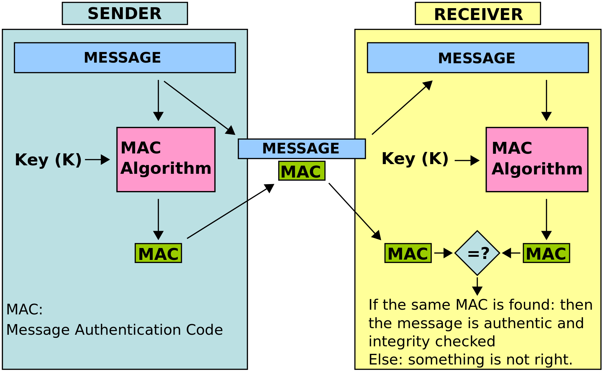

## 암호화 해시 함수

해시 함수의 일종으로, 해시 값으로부터 원래의 입력값과의 관계를 찾기 어려운 성질을 가지는 경우를 의미한다.

### 성질

- 역상 저항성: 주어진 해시 값에 대해, 그 해시 값을 생성하는 입력값을 찾는 것이 계산상 어렵다. (일방향함수와 연관되어 있다.)
- 제 2 역상 저항성: 입력 값에 대해, 그 입력의 해시 값을 바꾸지 않으면서 입력을 변경하는 것이 계산상 어렵다.
- 충돌 저항성: 해시 충돌에 대해 안전해야 한다. 같은 해시 값을 생성하는 두 개의 입력값을 찾는 것이 계산상 어려워야 한다.

### 종류

- MD5
- SHA1/2/3
- BLAKE2

## 메시지 인증 코드 (MAC, Message authentication code)

- 메시지 인증에 쓰이는 작은 크기의 정보이다. 비밀 키를 입력받고, 메시지를 인증한다. MAC은 메시지의 데이터 인증과 더불어 무결성을 보호한다.
- 원문에 해당하는 MAC 값은 하나밖에 없으며 원문이 변조되면 MAC 값 또한 바뀌게 된다.
- MAC 값 또한 변조될 수 있기 때문에 MAC 값도 암호화하여 전송한다.
- 크게 HMAC과 CMAC이 존재한다. MAC을 만들 때 Hash 함수를 사용하면 HMAC (Hash), Block 함수를 사용하면 CMAC (Cipher-based)가 된다.

### 사용 예

### 종류

- 암호화 해시 함수
- MAC 함수
  - CBC-MAC
  - HMAC
  - DAA
  - OMAC/CMAC

## 참고

- [메시지 인증 코드 (MAC, Message Authentication Code)](https://skogkatt.tistory.com/36)

-
