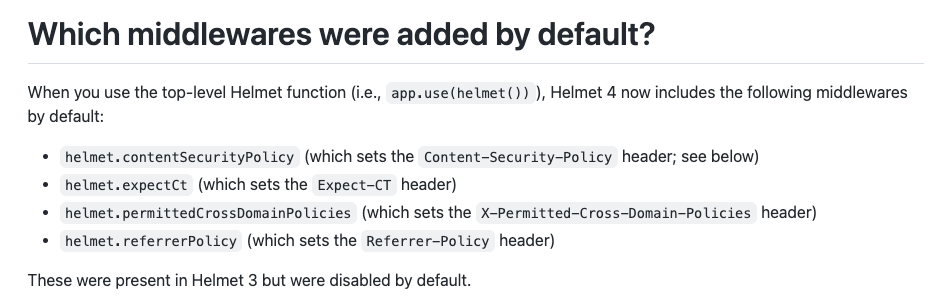

helmet.js는 Express 앱에 보안을 위한 HTTP 헤더를 추가해 앱을 보호해주는 라이브러리다. 모듈 업데이트가 한참 적용되지 않은 프로젝트를 넘겨받아 업데이트를 진행했는데 버전 3 에서 버전 5로 버전이 확 뛰었다. helmet 버전 4에 추가된 미들웨어들이 앱 동작에 에러를 일으켰다. public asset 접근에 이슈가 있는건 개발하면서 확인해 설정을 변경해두었는데 레퍼러 관련 기능은 테스트를 스킵했고 결과적으로 이것때문에 배포 후 오류가 발생했다. 😰

## Helmet 4 upgrade guide

- [가이드 문서](https://github.com/helmetjs/helmet/wiki/Helmet-4-upgrade-guide)



버전 4 업그레이드 가이드 문서를 보면 추가된 미들웨어를 확인할 수 있다. 따로 설정하지 않으면 default 값으로 엄격한 보안 정책이 설정되기 때문에 앱에서 필요한 정책을 확인하여 수동 설정 작업이 필요하다.

이번에 문제가 생긴 부분은 `referrerPolicy` 정책이다. `Referrer-Policy` 헤더를 설정하는 미들웨어가 추가되면서 default 값으로 `no-referrer` 헤더가 세팅되었다. 앱에서는 레퍼러 정보를 넘겨줘야 했고 정보가 넘어가지 않아 접근제한 오류가 발생해 서비스 장애가 발생했다.

## 해결법

필요에 맞게 보안 정책을 설정해두면 된다.

```js
app.use(
  helmet({
    frameguard: false,
    contentSecurityPolicy: false,
    crossOriginEmbedderPolicy: false,
    crossOriginResourcePolicy: false,
    referrerPolicy: false,
  })
);
```

모듈 버전이 크게 올라갈 땐 문서를 꼭꼭 확인해야겠다.. 테스트 코드도 빨리 다 작성해야겠고.. 배포 전엔 조심 또 조심 해야겠다.
