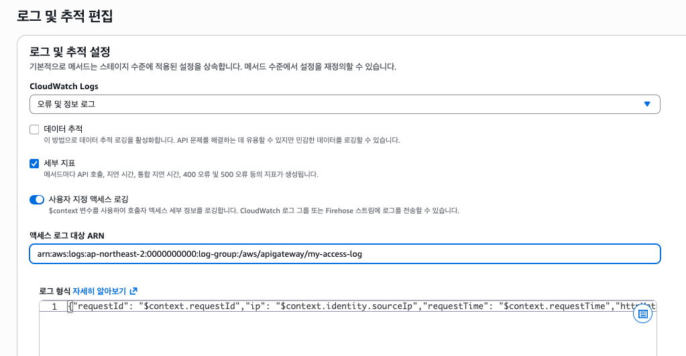
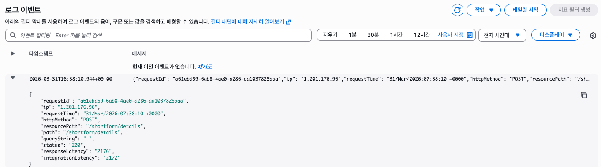
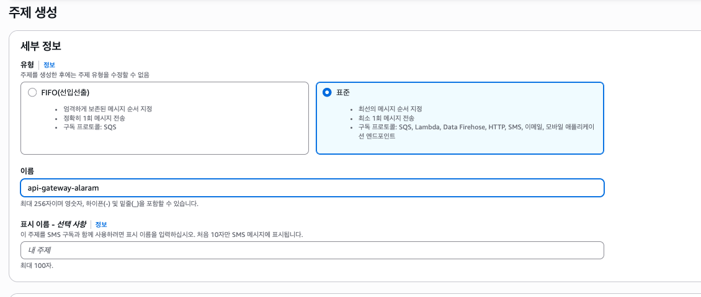
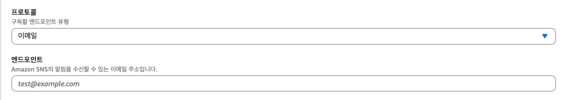
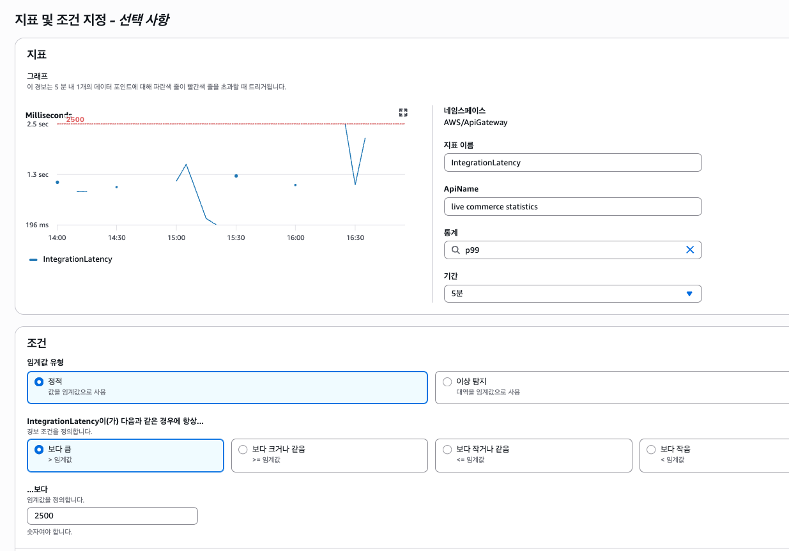
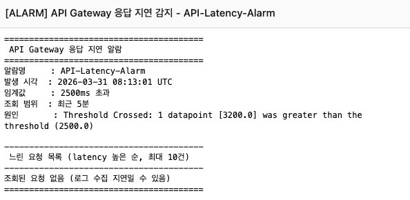

# api gateway alarm

API Gateway에 threshold를 생성해 늦게 처리된 요청에 한해 요청 정보를 이메일로 전송하도록 했다.
구성은,

> API Gateway > Cloudwatch Alarm > Lambda > SNS

이렇게 했다.

## API Gateway 액세스 로깅 활성화

API Gateway의 기본 로그를 사용해서는 필요한 요청 데이터를 뽑아내기가 어렵다. 사용자 지정 액세스 로그를 활성화 해 JSON으로 로그를 생성하면 Lambda에서 데이터에 쉽게 접근할 수 있다. 먼저 액세스 로그를 전달받을 Cloudwatch 로그 그룹을 생성하고 arn을 복사해두자. 그리고 알람을 생성할 API의 스테이지로 와서 로그 설정 편집을 누르고 `사용자 지정 액세스 로깅`을 활성화 한다.



액세스 로그 대상 arn에 아까 생성한 로그 그룹의 arn을 입력한다. 로그 형식은 한 줄로 작성해야 하는데 아래와 같이 작성했다. 

```
{"requestId": "$context.requestId","ip": "$context.identity.sourceIp","requestTime": "$context.requestTime","httpMethod": "$context.httpMethod","resourcePath": "$context.resourcePath","path": "$context.path","queryString": "$context.queryStringParameters","status": "$context.status","responseLatency": "$context.responseLatency","integrationLatency": "$context.integrationLatency"}
```

[AWS Document](https://docs.aws.amazon.com/apigateway/latest/developerguide/set-up-logging.html)에서 사용가능한 옵션과 텍스트 포맷을 더 확인할 수 있다.

연결이 잘 되면 API 요청이 들어올 때 마다 생성된 로그 그룹에 JSON 형식의 로그가 전달된다.



위에 작성한 로그 형식과 동일한 JSON이 보인다.

## SNS 주제 & 구독 생성



순서가 중요하지 않기 때문에 표준 주제로 생성한다. 주제를 생성했다면 내부에 구독을 생성해준다.



프로토콜은 이메일로 선택해 알람을 전달받을 이메일 주소를 입력한다.

## 액세스 로그를 읽어 SNS 전송하는 Lambda 작성

Lambda 함수를 생성한다. 

```js
import {
    CloudWatchLogsClient,
    StartQueryCommand,
    GetQueryResultsCommand,
} from "@aws-sdk/client-cloudwatch-logs";

import { SNSClient, PublishCommand } from "@aws-sdk/client-sns";

const logsClient = new CloudWatchLogsClient({ region: process.env.AWS_REGION });
const snsClient = new SNSClient({ region: process.env.AWS_REGION });

// ── 환경변수로 관리 ──────────────────────────────────────
const CONFIG = {
  logGroupName: process.env.LOG_GROUP_NAME,       // /aws/apigateway/your-api
  latencyThreshold: Number(process.env.LATENCY_THRESHOLD) || 2500,
  lookbackMinutes: Number(process.env.LOOKBACK_MINUTES) || 5,
  snsTopicArn: process.env.SNS_TOPIC_ARN,         // arn:aws:sns:ap-northeast-2:123456789:latency-alert
  maxResults: 10,
};

// ── 메인 핸들러 ──────────────────────────────────────────
export const handler = async (event) => {
  console.log("Event:", JSON.stringify(event, null, 2));

  try {
    const alarmInfo = parseSnsEvent(event);
    const now = new Date();
    const slowRequests = await querySlowRequests(now);

    await sendAlertEmail(alarmInfo, slowRequests, now);

    return { statusCode: 200, body: "Alert sent successfully" };
  } catch (err) {
    console.error("Error:", err);
    throw err;
  }
};

// ── SNS 이벤트 파싱 ──────────────────────────────────────
function parseSnsEvent(event) {
  const raw = event?.Records?.[0]?.Sns?.Message;
  if (!raw) throw new Error("SNS message not found");

  try {
    return JSON.parse(raw);
  } catch {
    return { AlarmName: "Unknown", NewStateReason: raw };
  }
}

// ── CloudWatch Logs Insights 쿼리 ────────────────────────
async function querySlowRequests(now) {
  const endTime = Math.floor(now.getTime() / 1000);
  const startTime = endTime - CONFIG.lookbackMinutes * 60;

  const query = `
    fields @timestamp, httpMethod, path, queryString,
           responseLatency, integrationLatency, ip, requestId, status
    | filter responseLatency > ${CONFIG.latencyThreshold}
    | sort responseLatency desc
    | limit ${CONFIG.maxResults}
  `;

  // 쿼리 시작
  const { queryId } = await logsClient.send(
    new StartQueryCommand({
      logGroupName: CONFIG.logGroupName,
      startTime,
      endTime,
      queryString: query,
    })
  );

  // 쿼리 완료 대기 (최대 15초)
  return await pollQueryResults(queryId);
}

async function pollQueryResults(queryId, maxAttempts = 15) {
  for (let i = 0; i < maxAttempts; i++) {
    await sleep(1000);

    const result = await logsClient.send(
      new GetQueryResultsCommand({ queryId })
    );

    if (result.status === "Complete") {
      return result.results.map((row) =>
        Object.fromEntries(row.map(({ field, value }) => [field, value]))
      );
    }

    if (result.status === "Failed" || result.status === "Cancelled") {
      throw new Error(`Query ${result.status}: ${queryId}`);
    }

    console.log(`Polling... attempt ${i + 1}, status: ${result.status}`);
  }

  throw new Error("Query timed out");
}

// ── SNS 이메일 발송 ──────────────────────────────────────
async function sendAlertEmail(alarmInfo, slowRequests, now) {
  const subject = `[ALARM] API Gateway 응답 지연 감지 - ${alarmInfo.AlarmName ?? ""}`;
  const message = buildEmailText(alarmInfo, slowRequests, now);

  await snsClient.send(
    new PublishCommand({
      TopicArn: CONFIG.snsTopicArn,
      Subject: subject,
      Message: message,
    })
  );

  console.log("SNS message published to:", CONFIG.snsTopicArn);
}

// ── 이메일 텍스트 빌더 (SNS는 plain text) ────────────────
function buildEmailText(alarmInfo, requests, now) {
  const timeStr = now.toISOString().replace("T", " ").slice(0, 19) + " UTC";

  const lines = [
    `========================================`,
    ` API Gateway 응답 지연 알람`,
    `========================================`,
    `알람명     : ${alarmInfo.AlarmName ?? "-"}`,
    `발생 시각  : ${timeStr}`,
    `임계값     : ${CONFIG.latencyThreshold}ms 초과`,
    `조회 범위  : 최근 ${CONFIG.lookbackMinutes}분`,
    `원인       : ${alarmInfo.NewStateReason ?? "-"}`,
    ``,
    `----------------------------------------`,
    ` 느린 요청 목록 (latency 높은 순, 최대 ${CONFIG.maxResults}건)`,
    `----------------------------------------`,
  ];

  if (requests.length === 0) {
    lines.push("조회된 요청 없음 (로그 수집 지연일 수 있음)");
  } else {
    requests.forEach((r, i) => {
      lines.push(
        `[${i + 1}]`,
        `  Method     : ${r.httpMethod ?? "-"}`,
        `  Path       : ${r.path ?? "-"}`,
        `  Query      : ${r.queryString ?? "-"}`,
        `  Latency    : ${r.responseLatency ?? "-"} ms`,
        `  Integration: ${r.integrationLatency ?? "-"} ms`,
        `  Status     : ${r.status ?? "-"}`,
        `  Client IP  : ${r.ip ?? "-"}`,
        `  Request ID : ${r.requestId ?? "-"}`,
        ``
      );
    });
  }

  lines.push(`========================================`);
  return lines.join("\n");
}

// ── 유틸 ─────────────────────────────────────────────────
function esc(str) {
  return String(str ?? "")
    .replace(/&/g, "&amp;")
    .replace(/</g, "&lt;")
    .replace(/>/g, "&gt;")
    .replace(/"/g, "&quot;");
}

function sleep(ms) {
  return new Promise((resolve) => setTimeout(resolve, ms));
}
```

Lambda 구성 메뉴에서 환경변수만 추가하면 된다. 

LOG_GROUP_NAME: 아까 생성한 액세스 로그 cloudwatch 로그 그룹 name
SNS_TOPIC_ARN: 아까 생성한 sns topic arn

Lambda에 필요한 Cloudwatch, SNS 정책도 Lambda 역할에 추가한다. 

```shell
{
  "Effect": "Allow",
  "Action": [
    "logs:StartQuery",
    "logs:GetQueryResults",
    "sns:Publish"
  ],
  "Resource": "*"
}
```

## Cloudwatch 경보 생성

Cloudwatch 경보 메뉴에서 알람을 생성할 수 있다. 나는 API Gateway의 IntegrationLatency 값의 p99를 선택했다. 


2단계 작업 구성으로 넘어오면 Lambda 작업을 선택할 수 있다. 위에서 생성한 Lambda를 선택하고 경보를 생성하면 끝이다.


## 테스트

Lambda 테스트로 SNS 이벤트를 전달하면 기능을 테스트 할 수 있다.

```
{
  "Records": [
    {
      "Sns": {
        "Message": "{\"AlarmName\":\"API-Latency-Alarm\",\"NewStateValue\":\"ALARM\",\"NewStateReason\":\"Threshold Crossed: 1 datapoint [3200.0] was greater than the threshold (2500.0)\",\"StateChangeTime\":\"2026-03-31T10:00:00.000Z\"}"
      }
    }
  ]
}
```



전달된 메일이다. 조회된 로그는 없다.
