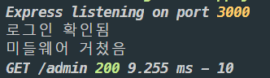

# Routing

Node.js의 `module.exports`는 전역 변수이다. 이 변수를 사용해 Express 프로젝트 또한 모듈화로 깔끔하게 관리할 수 있다.
(`exports`라는 전역 변수도 존재하는데 `module.exports`와는 다른 개념이니 혼동해서는 안된다)

**Routing**이라는 용어 자체의 넓은 의미는 '어떤 네트워크 안에서 통신 데이터를 보낼 때 최적의 경로를 선택하는 과정'이다. Express에는 routing을 도와주는 `Router`객체가 존재한다.

> Routing : 어플리케이션 서버에서 경로를 제어하는 동작

예를 들어 관리자가 사용할 페이지의 url의 경우 `/admin`, `/admin/setting`, `/admin/products` 등으로 url을 지정하는게 일반적이다. 그리고 routing을 사용해 `/admin`으로 시작하는 모든 http 요청을 `admin.js` 가 담당하도록 특정짓는 것이 Router 객체의 기능이다. 라우터를 모듈별로 관리하면 코드가 훨씬 깔끔해지고 관리가 쉬워진다.

## Router 객체 사용법

```js
const express = require("express");
const router = express.Router();
```

Router는 express의 내장 객체 이기 때문에 `express`모듈을 불러와 사용한다.

`admin`에 관련된 url 처리를 모두 담당할 `admin.js` 파일을 생성한다.

```js
router.get("/", (req, res) => {
  res.send("admin 이후 url");
});

router.get("/products", (req, res) => {
  res.send("admin products");
});

module.exports = router;
```

그리고 `use()`메서드로 `app.js`에서 미들웨어를 지정한다.

```js
const admin = require("./routes/admin");
app.use("/admin", admin);
```

이렇게 하면 `/admin`으로 시작하는 모든 요청들은 `admin.js`에 선언한 라우터로 넘어가고 `app.js`파일은 깔끔하게 관리된다.

## Morgan

`morgan`은 사용자가 요청한 url이 무엇인지 트래킹 해주는 모듈이다. 개발시 사용하면 편리하다.

```
$ npm i morgan
```

`app.js`에서도 `morgan`을 미들웨어로 설정해준다.

```js
app.use(logger("dev"));
```

`dev` 옵션은 출력되는 로그 정보를 색깔로 보기 쉽게 표시하는 옵션이다.


## Middleware

미들웨어는 요청된 페이지로 가기전 한 번 거쳐가는 중간 단계라고 생각하면 된다. 예를 들어, 로그인한 회원만 볼 수 있는 페이지가 있을 때 페이지를 실행하기 전에 항상 로그인 한 상태인지 확인하는 과정이 필요한데, 이 부분이 모든 페이지에 들어간다면 가독성도 떨어지고 코드양이 늘어나며 비효율적이다. _노드로 처음 진행했던 프로젝트 코드가 그랬다:sob:_

따라서 여기서는 '로그인한 상태인가?' 를 확인해주는 작업을 middleware로 지정하면 된다.

### middleware 적용법

먼저 로그인 확인 로직을 담고있는 함수를 생성한다.

```js
function checkLogin(req, res, next) {
  console.log("로그인 확인됨");
  next();
}
```

`next()`는 middleware를 호출한 객체로 돌아가 원래 작업을 계속하도록 한다.

그리고 이 함수가 사전에 실행되어야 하는 express 객체에 middleware로 지정해주면 된다.

```js
router.get("/", checkLogin, (req, res) => {
  console.log("미들웨어 거쳤음");
  res.send("admin page");
});
```

이제 `/admin`으로 접속하면 콘솔창에 다음과 같이 출력된다.


`미들웨어 → 원래 url` 순서로 출력되었다.

미들웨어는 여러개를 호출할 수 있다. 차례대로 지정해주면 된다.

```js
function checkLogin2(req, res, next) {
  console.log("로그인 확인2");
  next();
}

router.get("/", checkLogin, checkLogin2, (req, res) => {
  console.log("미들웨어 거쳤음");
  res.send("admin page");
});
```


지정된 순서대로 미들웨어를 거쳐가고 있다!

## Reference

[위키백과-라우팅](https://ko.wikipedia.org/wiki/%EB%9D%BC%EC%9A%B0%ED%8C%85)
[Nodejs guide](https://expressjs.com/en/guide/routing.html)
