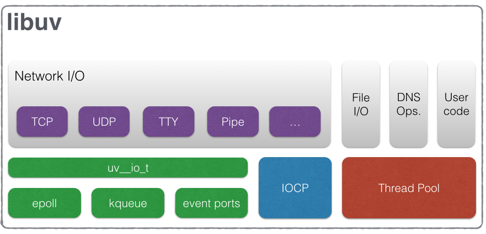
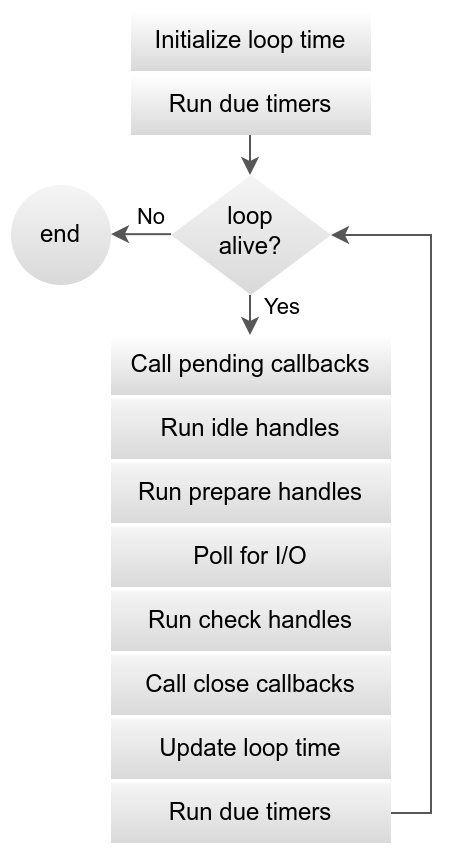

Node.js를 공부하면 항상 보이는 libuv와 event loop는 대략적으로는 뭔지 알아도 내부 원리를 제대로 파본적이 없어 그런지 매번 와닿지 않고 그렇구나.. 하고 넘어가고 또 잊혀지기를 반복했다.
이제는 제대로 알아볼 때가 온 것 같아 내용을 정리해두려한다.

## Node.js 런타임

JS 자체는 언어 스펙으로써만 존재한다. 

```js
setTimeout(() => console.log('hello'), 1000)
``` 

이 코드는 코드 조각일 뿐이다. 실제로 실행해 결과를 보려면 코드가 실행되는 환경이 필요하다. 이러한 환경이 바로 '런타임'이다. 

브라우저에서 사용되던 JS 런타임이 V8엔진과 Web API가 합쳐진 크롬 런타임이다. 그리고 라이언달이 서버 프로그래밍을 위해 만든 것이 Node.js, 즉 서버용 JS 런타임인 것이다. (이후 Deno와 Bun도 출시되어 유일한 JS 서버 런타임이라고는 할 수 없다.)

Node.js 런타임은 세 가지로 구성된다.
- V8 (JS 엔진): js 문법 실행, 메모리 관리(gc)
- Node Core API: fs, http, process 등 표준 API 명시
- libuv: 이벤트 루프, 비동기 I/O, OS와 통신

이 중 libuv를 자세히 알아보자.

## libuv



libuv는 Node.js에 포함되어 있는 C로 작성된 크로스 플랫폼 저수준 라이브러리이다. 개발자가 이를 직접 쓸 일은 없고 Node의 내부 엔진이 사용한다. libuv를 한 문장으로 표현하면, 'OS마다 다른 비동기 I/O 방식을 하나의 공통 인터페이스로 감싸 제공하는 라이브러리'이다. 

## 왜 사용하는 걸까?

Node.js는 비동기 이벤트 기반의 런타임이다. 라이언달은 OS 자체에 내장된 비동기 기능들을 그대로 쓰고 싶었다. 그런데 다양한 OS에서 실행시키기 위해서는 각 OS에 맞는 방식을 구현해야 하는데 인터페이스 없이 직접 대응한다면 재앙일 것이다. 

| OS      | 비동기 I/O 방식 |
| ------- | ---------- |
| Linux   | epoll      |
| macOS   | kqueue     |
| Windows | IOCP       |

이렇게 OS와 대화하는 것을 중간에서 도와주는 것이 libuv이다. Node가 libuv에 요청을 보내면 OS에 맡게 libuv가 처리해주는 것이다. 

libuv는 Node를 위해 작성된 라이브러리지만 Node에만 특정되어 사용되는 것은 아니다. 개발된 이후 다른 프로젝트에서도 사용하고 있다.

## libuv의 역할

역할은 크게 네 가지가 있다.



1. Event Loop 제공
    이벤트 루프는 libuv 내부에 위치한다. 이벤트가 오면 알려주는 역할을 하며 타이머, I/O 콜백, 각 이벤트의 체크 단계 등을 관리한다.
2. OS 비동기 I/O 추상화
    Node.js 자체는 OS 별 차이에 대해 전혀 알지 못한다. OS 별로 다르게 처리되는 비동기 동작들은 모두 libuv가 위임받아 수행한다.
3. thread pool 관리
   libuv 내부에 스레드풀이 하나 돌고 있다. 하지만 이는 Node.js의 정체성이 아닌 비동기화가 불가능한 어쩔수 없는 작업들만 이곳에서 처리한다.
4. 이벤트를 콜백으로 되돌리기
    스레드풀 또는 OS에서 작업이 끝나면, libuv가 결과를 이벤트 루프 큐에 넣어 JS 콜백이 실행된다.

## 비동기가 불가능한 작업

파일 I/O 작업은 네트워크 I/O와 달리 모든 운영체제에서 일관되게 사용할 수 있는 이벤트 기반의 비동기 매커니즘이 존재하지 않는다. 일부 OS에는 존재하기도 하지만 libuv가 범용적으로 의존하기에 적합하지 않다. 그렇기 때문에 현재로써는 libuv는 파일 I/O 작업을 이벤트 루프에서 처리하지 않고 글로벌 스레드 풀의 워커 스레드에서 실행한 뒤, 작업이 완료되면 결과를 이벤트 루프로 되돌리는 방법을 선택했다.
그렇지만 이 과정에서도 이벤트 루프 자체가 블로킹되는 것이 아니라, 블로킹은 워커 스레드 내부에서 발생한다.

이 때문에 Node.js에서 대용량 파일 처리는 fs.readFile보다 스트림 기반의 API 사용이 권장된다.

libuv는 공식 문서에서 글로벌 스레드 풀에서 실행하는 작업을 아래 세 가지로 설명한다.

- 파일 시스템 작업
- DNS 함수 실행
- uv_queue_work() 작업

## libuv thread pool

스레드풀은 이벤트 루프의 보조역할로써 존재한다. 병렬 처리 성능을 향상시키기 위한 것이 아닌 어쩔 수 없는 선택이었던 것을 이해하는 것이 Node.js를 이해하는데 있어서 중요하다. UV_THREADPOOL_SIZE 기본값은 4로 설정되어있는데 이 값이 너무 작아서 의아한 적이 있을 것이다. 기본 배경을 모르면 이해가 되지 않을 숫자다.

libuv 스레드풀이 처리하는 대표 작업들의 특징은 

1. CPU를 계속해서 쓰지 않고 
2. 대부분 I/O 대기 상태인 경우가 많다

따라서 수십 개의 스레드를 띄워봤자 의미가 없는 작업들이다. 또한 스레드를 늘리면 비용이 증가한다. 컨텍스트 스위칭도 발생할 것이며 메모리 사용 증가로 이어진다. 필요 이상의 스레드를 만드는 것은 Nodejs 철학에 어긋난다. 이러한 이유로 기본값은 4로 작게 잡은 것으로 유추해볼 수 있다.

libuv가 처음 나왔을 시기는 2009년 즈음으로 2-4 코어가 일반적이었고 디스크 I/O가 지금보다 느렸다. 4개 스레드면 현실 하드웨어 성능 기반의 타협값으로 보기에 타당한 값이다.

대량의 파일 I/O나 이미지 처리를 하는 경우 이 값을 늘리는 것은 허용된다. 하지만 CPU 집약적인 작업은 스레드풀의 수를 늘린다고 해결되는 문제가 아니다. 
스레드 풀 수를 늘리는 것은 보통 4에서 8로 늘리는 것은 효과를 본다고들 한다. 하지만 32 이상으로는 권장되지 않는다. 

```shell
UV_THREADPOOL_SIZE=8 node server.js
```

### 스레드풀이 꽉 차면 어떻게 될까

스레드풀이 꽉 차면.. 어떻게 될까? 이 문제는 알아치리기가 쉽지 않다. 프로그램이 한번에 망가지는 것이 아니라 서서히 고장나기 때문이다. 스레드풀 사이즈가 4라면, 동시에 실행할 수 있는 작업은 최대 4개가 될 것이다. 네 개가 아직 끝나지 않았는데 다섯번째 작업이 들어오면 실행하지 못하고 큐에서 대기하게 된다.
하지만 이벤트 루프는 실행을 멈추지 않는다. 동작이 막힌 것은 스레드풀 작업이기 때문이다. HTTP 요청은 계속해서 받을 것이고 로그 출력이나 setTimeout 도 잘 실행될 것이다. 하지만 스레드풀에서 실행되는 특정 작업들은 점점 늦어진다. 동작이 바로 바로 실행되지 못하고 큐에 대기하는 시간이 길어지게 되기 때문이다.

API 응답은 오는데 CPU 사용량은 정상적이고, 메모리도 정상인데 가끔 느리다면 스레드풀 이슈를 의심해볼 만 하다. 특히 특정 API만 지연이 된다면 더더욱 의심해볼 만 하다. 또는 전체 지연이 기하급수적으로 증가하는 상황이 올 수도 있다. 

이런 문제가 발생해도 Node 서버는 절대 멈추지 않으며 이벤트 루프 블로킹도 없다. 에러도 나타나지 않을 것이다. 일부 기능만 지연되기 때문에 알아차리기 어렵다. 

### 해결 방법

스레드풀을 사용하는 함수보다 스트림 함수를 지향하는 것으로 위험을 방지할 수 있다. fs.readFile 대신 fs.createReadStream을 사용하는 것이다. 또한 위에서 설명했든 UV_THREADPOOL_SIZE를 조정하는 것도 방법이 될 수 있다. 하지만 트레이드오프가 있으니 사이즈를 늘리는 것이 항상 최선의 선택은 아닐 것이다. CPU가 많이 소모되는 작업은 워커 스레드에 등록하는 것도 좋은 방법이다. 


## 참고
- [libuv Github](https://github.com/libuv/libuv)
- [libuv Documentation](https://docs.libuv.org/en/v1.x/)
