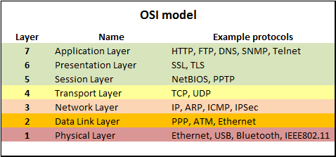

## IP

인터넷에 연결되어있는 장치들을 식별할 수 있는 주소
_IP : Internet Porocol_
예) 192.168.0.1

## 도메인(domain)

IP는 사람이 이해하고 기억하기 어렵기 때문에 이를 위해 각 IP에 이름(=도메인)을 부여하여 알아보기 쉽게 함

- naver.com - 220.95.233.172
- daum.net - 114.108.157.19

### 도메인의 구성요소

daum.co.kr

- daum : 컴퓨터의 이름
- co : 국가 형태의 최상위 도메인
- kr : 대한민국의 NIC에서 관리하는 도메인

## 호스트

네트워크에 연결되어 있는 컴퓨터들을 부르는 말

## 포워딩

도메인으로 접근한 사용자를 다른 도메인으로 보내는 행위

## 네임서버

도메인에 해당하는 IP를 알려주는 서비스

- DNS : Domain Name System

<iframe width="560" height="315"
src="https://www.youtube.com/embed/2ZUxoi7YNgs"
frameborder="0"
allow="accelerometer; autoplay; encrypted-media; gyroscope; picture-in-picture"
allowfullscreen></iframe>
  
### 브라우저가 IP를 찾아내는 순서

1. domain 입력
2. local cache를 검색
3. hosts 파일을 검색
4. domain name server 검색

따라서 local에서 `hosts` 파일의 ip-domain 정보를 바꿔놓으면 다른 사이트로 이동시킬 수 있다.

## HTTPS와 SSL 인증서

HTTP : HyperText Transfer Protocol. HTML을 전송하기 위한 통신 규약이다. Hypertext란, 문서와 문서가 링크로 연결되어있는 연결 체계이다. Hypertext에서 가장 중요한 체계가 바로 HTML이다. HTTP는 암호화되지 않는 방법으로 데이터를 전송하기 때문에 서버와 클라이언트 사이의 메세지를 가로채는 것이 매우 쉽다.
HTTP**S**의 `S`는 Over **Secure** Socket Layer의 약자로 보안이 강화된 HTTP이다.

`SSL`과 `HTTPS`는 같다면 같고 다르다면 다른 개념이다. 그 이유는 HTTPS가 SSL 위에서 작동하는 방식이기 때문이다.

HTTP는 L7의 프로토콜이며 SSL은 그보다 한 단계 밑인 L6에서 동작한다. 따라서 SSL 프로토콜 위에서 동작하는 HTTP가 'HTTPS'인 셈이다. _(SSL==TLS이다. TLS가 이후에 바뀐 이름이지만 SSL이라는 이름이 더 통용된다.)_

## Reference

[생활코딩-서버](https://opentutorials.org/)
