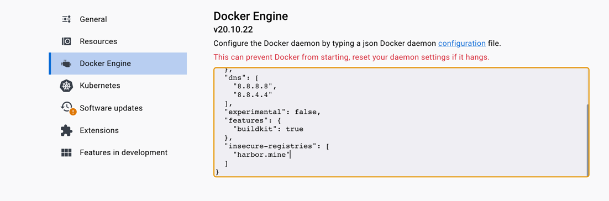
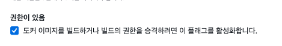

회사에서는 open registry가 아닌 내부 관리 레지스트리를 쓰는 경우가 있다. 그런 사설 인증서가 붙은 레지스트리 서버를 도커에서 사용하기 위해서는, insecure registry에 레지스트리 도메인을 따로 추가해야 한다. 



예를 들어 desktop docker에서는 Docker Engine 세팅에 `insecure-registries`에 도메인을 추가하고 도커를 재시작해 설정할 수 있다.
나는 CI 환경을 구성하기 위해 AWS Codebuild를 사용해 harbor로 이미지를 push 해야 했는데 매끄럽지 않았다. 권한 모드를 활성화 하지 않아서 클로드 코드와 삽질을 정말 많이 했다.. 무조건 이것부터 활성화할 것을 당부한다.

## 빌드 에러 원인 파악

빌드를 실행했을 때 레지스트리 인증서 문제인지 파악하는 방법은 에러 메세지를 보는 방법이 있다. 

```shell
  Error response from daemon: Get "https://my-domain.com/v2/":                                                                                                                                                                                                      
  tls: failed to verify certificate: x509: certificate signed by unknown authority
```

이런 x509 에러는 레지스트리 인증서 에러라고 한다. 코드 빌드 뿐만이 아니라 로컬에서도 docker login에서 위의 에러로 막힌다면 insecure registry 문제를 의심해봐야 한다.

## 권한 모드 활성화

도커 환경 설정을 바꾸려면 권한 모드를 활성화 해야한다. 

`Codebuild > 빌드 프로젝트 > 프로젝트 편집`에서 **환경** 섹션의 추가 구성 부분에 **권한이 있음** 옵션이 있다. 이 체크 박스를 활성화하면 빌드 권한이 승격된다.



이 옵션은 도커를 컨테이너 안에서 돌릴 수 있게 해주는 옵션이다. 코드 빌드도 내부적으로는 컨테이너에서 실행되는데 이 안에서 도커를 또 실행할 때 사용하는 옵션이다.

```shell
CodeBuild container
  └── docker daemon (필요)
        └── docker build 실행
```

## buildspec.yml 작성

```yaml
version: 0.2

env:
  variables:
    AWS_DEFAULT_REGION: "ap-northeast-2"

phases:
  install:
    commands:
      - mkdir -p /etc/docker
      - |
        echo '{"insecure-registries": ["my-domain.com"]}' > /etc/docker/daemon.json
      - kill $(cat /var/run/docker.pid) && sleep 2
      - nohup /usr/local/bin/dockerd --host=unix:///var/run/docker.sock --host=tcp://127.0.0.1:2375 --storage-driver=overlay2 &
      - timeout 15 sh -c "until docker info; do echo .; sleep 1; done"
```

insecure registry를 등록하기 위해서는 `/etc/docker/daemon.json`에 내용을 등록해 도커를 재시작해야 한다. ([참고](https://docs.aws.amazon.com/ko_kr/codebuild/latest/userguide/change-project.html))
`/etc/docker/daemon.json` 파일이 없다고 나와 mkdir로 먼저 폴더를 생성했고, 실행중인 도커를 중지한 다음 다시 실행하는 커맨드를 `install` 스테이지에 작성했다. 다른 과정보다 이전에 작성되어야 하는 것이지 꼭 install 페이즈일 필요는 없다. pre_install로 처리해도 괜찮다. Codebuild 기본 이미지는 privileged 모드에서도 dockerd를 자동으로 시작해서 기존 도커를 종료하지 않으면 설정을 읽지 않은 도커가 실행되고 있어서 insecure registries 정보를 계속해서 읽어오지 못했다. `kill` 커맨드를 실행한 뒤 도커를 새로 시작하는 명령어를 실행했더니 정상적으로 구동되었다. 

## 빌드 실행

정상적으로 등록이 됐다면 codebuild 빌드 로그에 다음과 같이 나온다.

```shell
 Insecure Registries:
  harbor.infra.kinxcdn.com
  ::1/128
  127.0.0.0/8
```

