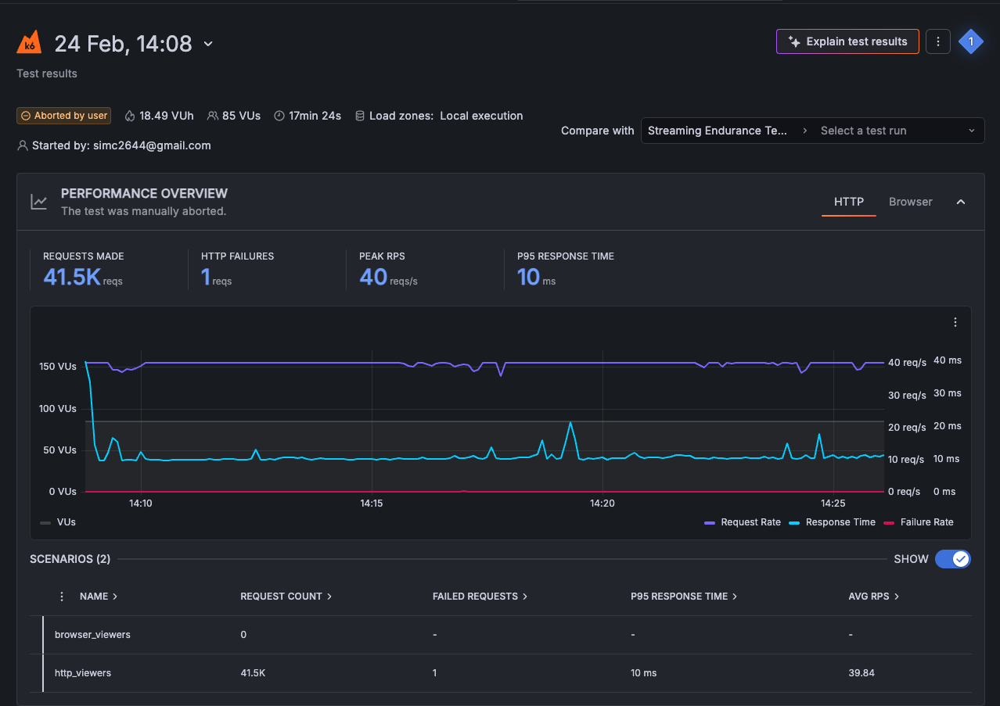
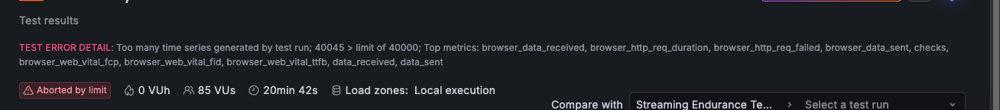

라이브 스트리밍 클라이언트를 여러 대 띄워놓고 재생환경을 테스트하기 위해 k6를 사용해봤다. 

## 설치

테스트를 위해 테스트용 EC2 인스턴스를 띄웠다.

[설치 URL](https://grafana.com/docs/k6/latest/set-up/install-k6/)에서 다양한 OS에 맞는 설치 커맨드를 볼 수 있다. 나는 로컬 MacOS에서 brew로 설치 및 테스트를 마치고 EC2는 ubuntu로 실행했다.

### Ubuntu 설치 명령어
```shell
sudo gpg -k
sudo gpg --no-default-keyring --keyring /usr/share/keyrings/k6-archive-keyring.gpg --keyserver hkp://keyserver.ubuntu.com:80 --recv-keys C5AD17C747E3415A3642D57D77C6C491D6AC1D69
echo "deb [signed-by=/usr/share/keyrings/k6-archive-keyring.gpg] https://dl.k6.io/deb stable main" | sudo tee /etc/apt/sources.list.d/k6.list
sudo apt-get update
sudo apt-get install k6
```

## 테스트 코드 작성하기

k6 테스트 코드는 굉장히 직관적이고 간단하다. 테스트 코드 파일은 js나 ts로 작성하면 된다.

```js
// my-first-test.js

import http from 'k6/http';
import { sleep } from 'k6';

export const options = {
    iterations: 10,
};

export default function () {
    http.get('https://quickpizza.grafana.com');
    
    sleep(1);
}
```

`k6/http`에서 불러온 http 모듈로 http 요청을 보낼 수 있다. sleep 함수는 요청 사이에 delay를 줄 때 사용한다. `options` 객체로 세부 테스트 요청 시나리오를 작성할 수 있다. `iterations`는 이름 그대로 몇 개의 요청을 보낼지 설정하는 프로퍼티이다. default function을 export 시키면 이 함수가 테스트 스크립트의 엔트리 지점이 된다. 이 함수가 `iterations`에 설정한 숫자만큼 실행될 것이다. 위 함수는 `http.get`에 인수로 넘긴 url로 get 요청을 보내고 1초 delay를 거친 뒤 다시 요청을 보내 총 10번 실행될 것이다.

k6 테스트 코드는 TS로도 작성이 가능하니 type safe한 코드를 작성하고 싶다면 가이드를 참고하면 좋을 것 같다. ([TypeScript guide](https://grafana.com/docs/k6/latest/using-k6/javascript-typescript-compatibility-mode/#typescript-support))

## 첫번째 테스트

```js
import { browser } from 'k6/browser';
import http from 'k6/http';
import { sleep } from 'k6';

export const options = {
  cloud: {
    projectID: '111111',  // from k6 cloud dashboard
    name: 'Streaming Endurance Test - 100 viewers 30min',
  },
  scenarios: {
    // 20 real browser viewers
    browser_viewers: {
      executor: 'constant-vus',
      vus: 5,
      duration: '30m',
      exec: 'browserViewers',
      options: {
        browser: {
          type: 'chromium',
                args: ['--no-sandbox', '--disable-setuid-sandbox'],
        },
      },
    },
    // 80 HTTP simulated viewers
    http_viewers: {
      executor: 'constant-vus',
            exec: 'httpViewers',
      vus: 80,
      duration: '30m',
    },
  },
};

// browser scenario
export async function browserViewers() {
  const page = await browser.newPage();

  try {
      await page.goto('https://test.player.com', {
          waitUntil: 'domcontentloaded',
          timeout: 600000,
      });

      // stay on page simulating watching
      await page.waitForTimeout(25 * 60 * 1000); // 25 min
  } catch(err) {
      console.error(`Browser error: ${err}`);

  } finally {
      await page.close();
  }
}

// http scenario
export function httpViewers() {
    // replace with your actual HLS/DASH playlist URL
    http.get('https://test/playlist.m3u8');
    sleep(2); // fetch new segment every 2 seconds like a real player
}
```

나는 라이브 스트리밍 페이지 경험을 테스트해야 했다. 실제 브라우저를 여러 개 띄워 확인하고 싶었지만 browser viewer를 아주 많이 띄우는데는 너무 큰 EC2 성능이 필요해서 m3u8로 지속적인 요청을 보내 스트림 파일 자체에 부하를 주고 브라우저 유저는 20개를 띄웠다가 그마저도 메모리 아웃이 발생해 일단 5로 줄였다.

테스트 코드를 작성하고 `Testing > Performanc > Settings` 에서 API Token을 확인해 설정했다. 

```shell
export K6_CLOUD_TOKEN=[API TOKEN]
```

실행 명령어도 간단하다. 나는 결과를 콘솔에서 보기 위해 out option을 사용했다.

```shell
$ k6 run --out cloud test.js
```

설정이 잘 되었다면 콘솔에 바로 테스트 결과가 실시간으로 나타난다. 



총 몇 개의 request를 보냈고 성공/실패 회수가 나오며 가장 많은 요청을 처리했을 때의 피크 요청 수와 응답 시간 등의 데이터가 그래프와 함께 나온다.

테스트 결과로 파악할 수 있는 점은 

- 85명의 동시 접속자( 브라우저 5 + HTTP request 80)가 30분만 스트리밍을 시청했을 때 서버가 정상 동작함
- hls 플레이리스트 응답속도는 평균 9ms로 빠른 response를 받았음
- 대략 100명의  동시 접속에는 문제가 없을 것으로 예상 가능

하지만 이 테스트의 문제는 실제 영상이 버퍼링 없이 재생되었는지 확인이 불가능하며, 플레이어 페이지가 완전히 렌더링 될 때 까지 기다리지 않았다는 것과 브라우저 Virtual User는 고작 5대를 띄웠기 때문에 브라우저 경험 인증이 되었다고 말하기 어렵다는 점이다. 또한 threshold (임계값)을 설정하지 않아 테스트 결과의 성공과 실패를 구분짓는 기준이 없다.

그래프 우측 상단에는 `Explain test results` 버튼이 있다. Grafana AI에 테스트 결과를 요청하면 분석해준다. AI 성능 테스트를 위해 눌러봤더니 위 테스트 코드에 대한 개선점은 아래와 같이 줬다.

| 이슈 | 설명                                                                     |
|--|------------------------------------------------------------------------|
| threshold 없음| 성공/실패를 구분할 기준이 없음                                                      |
|Web Core Vitals 데이터 부족| LCP, CLS, INP, FID 데이터가 수집되지 않음. 브라우저 세션에서 실제 사용자 인터랙션(마우스 클릭, 스크롤 등)이 없어서 발생. video 엘리먼트 로드 확인 및 인터랙션 추가 권장 |
| 높은 URL 카디널리티| browser_http_req_duration 등에서 7,121개 이상의 고유 URL 태그값이 감지됨. tags: { name: '...' } 설정으로 URL 그룹화 권장|

개선점을 보완해 새로 작성한 테스트 코드는 다음과 같다.

### 테스트 코드 v2

```js
import { browser } from 'k6/browser';
import http from 'k6/http';
import { sleep, check } from 'k6';

export const options = {
    cloud: {
        projectID: '111111',
        name: 'Streaming Endurance Test - 100 viewers 30min v2',
    },
    //  Added thresholds to enforce pass/fail
    thresholds: {
        'browser_http_req_duration': ['p(95)<600'],
        'http_req_duration': ['p(95)<100'],
        'http_req_failed': ['rate<0.01'],          // less than 1% error rate
        'browser_http_req_failed': ['rate<0.01'],
        'browser_web_vital_fcp': ['p(75)<2000'],   // First Contentful Paint
        'browser_web_vital_lcp': ['p(75)<4000'],   // Largest Contentful Paint
        'browser_web_vital_ttfb': ['p(75)<800'],   // Time to First Byte
    },
    scenarios: {
        browser_viewers: {
            executor: 'constant-vus',
            vus: 5,
            duration: '30m',
            exec: 'browserViewers',
            options: {
                browser: {
                    type: 'chromium',
                    args:  '--no-sandbox --disable-setuid-sandbox --disable-dev-shm-usage --disable-gpu --no-zygote'
                },
            },
        },
        http_viewers: {
            executor: 'constant-vus',
            exec: 'httpViewers',
            vus: 80,
            duration: '30m',
        },
    },
};

export async function browserViewers() {
    const page = await browser.newPage();

    try {
        // URL grouping to fix high cardinality issue
        const res = await page.goto('test.com', {
            waitUntil: 'domcontentloaded',
            timeout: 60000,
        });

        // Added checks for browser response
        check(res, {
            'page loaded successfully': (r) => r && r.status() === 200,
        });

        // Wait for video player to actually render (triggers LCP/CLS/INP)
        await page.waitForSelector('video', { timeout: 15000 })
            .catch(() => console.warn('video element not found'));

        // Simulate real user interactions to trigger INP/FID metrics
        await page.mouse.move(300, 300);   // move mouse (triggers INP)
        await page.mouse.click(300, 300);  // click (triggers FID)
        sleep(2);

        // scroll to trigger CLS measurement
        await page.evaluate(() => window.scrollTo(0, 100));
        sleep(1);
        await page.evaluate(() => window.scrollTo(0, 0));

        // watch for remaining duration
        await page.waitForTimeout(24 * 60 * 1000); // 24 min

    } catch (e) {
        console.error(`Browser error: ${e}`);
    } finally {
        await page.close();
    }
}

export function httpViewers() {
    // URL grouping with name tag to fix cardinality issue
    const res = http.get(
        'test.m3u8',
        {
            tags: { name: 'hls-playlist' },  // 👈 groups all requests under one name
        }
    );

    // Added checks for HTTP responses
    check(res, {
        'playlist status 200': (r) => r.status === 200,
        'playlist has content': (r) => r.body && r.body.length > 0,
        'response time ok': (r) => r.timings.duration < 500,
    });

    sleep(2);
}
```

레포트에서 나온대로 threshold를 추가해 성공과 실패를 구분할 기준점을 추가했다. 페이지가 로드되면 video 태그가 생성될 때 까지 기다리고, 이는 15초의 타임아웃을 설정했다.

이렇게 구성한 뒤 잘 되나 싶더니 총 30분으로 설정한 테스트가 20분째 되었을 때 에러가 발생하며 종료됐다.



m3u8 url로 요청을 보내고 있어서 나는 에러였다. k6는 요청을 보내는 모든 Url을 DB에 별개 row로 추가하는데 m3u8은 ts 파일을 받게 된다. 이를 차례대로 요청하면 다음과 같다.

```shell
segment_001.ts  →  row 1
segment_002.ts  →  row 2
segment_003.ts  →  row 3
...
segment_40045.ts →  row 40045  ❌ LIMIT REACHED
```
k6는 40,000 row limit이 있는데 그걸 넘어서 발생한 에러였다. 이 에러는 url을 그룹화 해서 해결할 수 있다. 나의 경우 모든 .ts 파일은 'video-segment' 라는 그룹으로 묶어버리는 거다.

그렇게 해서 다시 수정한 테스트 내용은 다음과 같다.

- 100명의 동시 시청자를 두 가지 방식으로 시뮬레이션
- 시나리오 1. 브라우저 뷰어 15명: 페이지에 접속하고 8분간 유지하게 했다. 비디오 플레이어가 로드될 때까지 기다리고, 마우스 클릭, 스크롤 이동 등의 작업을 지시했다. FCP, LCP, TTFB 등 사용자 실제 경험 지표를 측정하도록 했다.
- 시나리오 2. http 뷰어 80명: 브라우저 없이 HLS 플레이리스트만 2초마다 요청한다. 

## 테스트 결과 및 결론

테스트를 마치고 결과를 csv 파일로 다운로드 받아 claude에 분석 레포트 작성을 요청했다. 테스트 결과를 요약하면,

- HLS 서버 응답: 평균 10.9ms, 에러율 0% — 서버 인프라 자체는 완벽
- TTFB: 638ms로 양호, 네트워크 레이어 문제 없음
- HLS Chunklist(실제 영상): 500~700ms로 LL-HLS 특성상 정상 범위

테스트 목적이었던 Hls 서버 성능은 다행히 문제가 없어보였다. 하지만 문제점을 발견했는데, 
1. 최초 플레이어 로드시 초기화 API 응답이 실시간 데이터 반영을 위해 캐싱이 안되어있다는 점이었는데 평균 응답 속도가 3200ms로 나왓다. 최초 조회가 있어야 플레이어를 화면에 그릴 수 있기 때문에 3초간 유저는 까만 화면을 보게된다는 뜻이다.
2. 시청수 표시를 위한 통계 조회 API는 api gateway에 요청하는데 평균 2238ms가 기록되었다. 조회수 데이터는 사용자의 본목적인 라이브 스트리밍 시청과 연관이 없으므로 fire-and-forget 구조로 전환이 필요해 보인다.
3. js 번들 로딩이 오래 걸린다. cdn이 적용되어있지 않은 것 같아 확인이 필요하다.

일단은 10분으로 테스트한 결과로 개선할 부분들을 찾아봤다. 테스트 시간이 너무 짧아 다음번에는 한시간을 돌려볼 생각이다.

## 용어 정리

- TTFB: time to first byte. 서버에 요청을 보낸 후 첫 번재 데이터가 도착하는 시간
- FCB: first contentful paint. 화면에 무언가 컴포넌트가 처음 보이는 시간
- LCP: largest contentful paint. 페이지에서 가장 큰 요소가 렌더링되는 시간. 언제 화면이 다 보이는가
- CLS: cumulative layout shift: 페이지 로딩 중 요소들이 움직이는 정도. 로딩 중 화면이 얼마나 덜컹거리는가 (ex: 플레이어 로딩 중 상품 목록이 나타나 레이아웃 밀림 -> CLS 증가)

