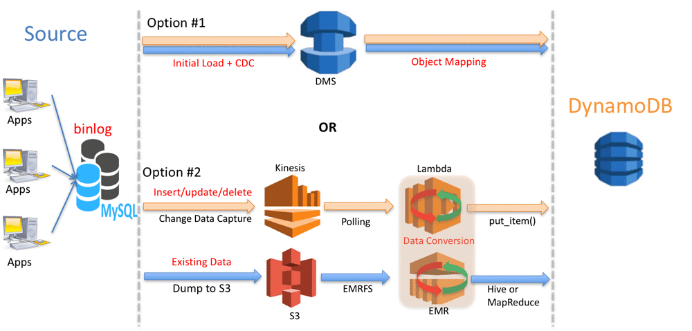

# DynammoDB 요금 정책

요금 정책에는 두 가지가 있다.

1. 온디맨드 용량 모드 요금
   - 해당 APP이 테이블에서 수행하는 데이터 READ/WRITE에 대해 요금이 부과된다. 워크로드의 확장/축소를 DB가 알아서 처리하기 때문에 읽기 및 쓰기 처리량을 지정할 필요가 없다.
   - APP의 트래픽 처리량을 예측하기 힘든 경우 적합
2. 프로비저닝 용량 모드 요금
   - 초당 읽기 및 쓰기 수를 지정해 사용하는 정책이다. 자동 조정을 사용하면 지정한 사용률에 따라 테이블의 용량을 자동 조정하여 APP의 성능은 보장하고 비용은 절감할 수 있다.
   - 트래픽이 예측 가능하거나 트래픽이 일관되거나 점진적 변화가 일어나는 앱에 적합하다.

# RDMS에서 DynamoDB로 마이그레이션

[Near zero downtime migration from mysql to dynamodb](https://aws.amazon.com/ko/blogs/korea/near-zero-downtime-migration-from-mysql-to-dynamodb/)

방법은 크게 두가지가 있다.

1. AWS DMS 사용 : AWS DMS는 DynamoDB를 타겟으로 마이그레이션을 지원하는 서비스이다.
2. Amazone EMR, Kinesis 및 AWS Lambda 이용 : 보다 큰 유연성이 요구될 때는 다음의 AWS 서비스를 이용한 마이그레이션을 고려할 수 있다.

MySQL -> DynamoDB 로의 마이그레이션이며 큰 데이터변환이 일어나지 않기 때문에 AWS DMS를 사용하는게 좋겠다.

# AWS DMS 사
