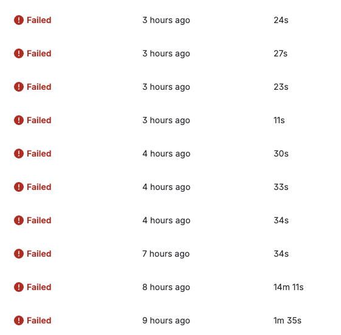
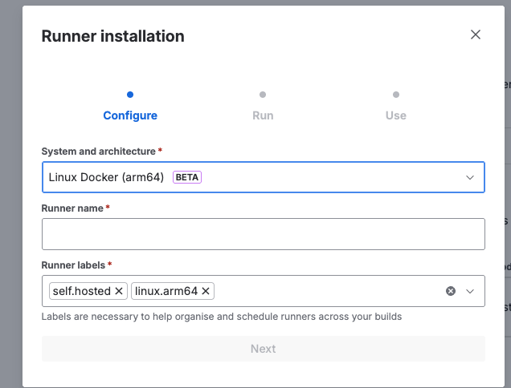
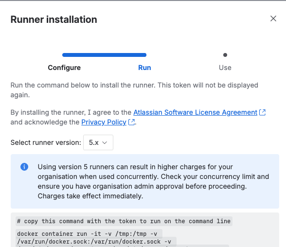
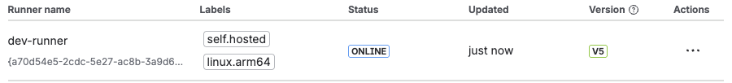

## 환경
- Next.js 14 (standalone output)
- Yarn 4.12.0 (Berry)
- Bitbucket Pipelines (x86_64 CI)
- AWS ECR + EC2 t4g.small (ARM64, Graviton2)

## 시도 1. peer dependency 에러 

`yarn install --immutable` 실행 시 fetch 과정에서 에러가 났다. 에러 메세지는 다음과 같았다.

```shell
YN0060: eslint 8.56.0 doesn't satisfy ^8.57.0
YN0002: doesn't provide vite
exit code: 1
```

peerDependency를 수정하여 에러를 해결했다. ([yarn peer dependency 에러 바로잡기](https://so0choi.github.io/blog/frontend/next-js-bitbucket-ecr/))

## 시도 2. `--immutable` Fetch step 무음 실패

```shell
➤ YN0000: ┌ Fetch step
exit code: 1  ← 출력 없이 종료
```

원인으로 추정했던 것은 

1. `supportedArchitectures` 미설정으로 macOS에서 생성된 lockfile이 Linux에서 잘 동작하지 않는 것일까?
-> .yarnrc.yml에 추가했지만 해결되지 않았다.
2. `.dockerignore`에 `.yarn/install-state.gz` 누락 때문일까?
-> 여전히 해결되지 않았다.



무수한 삽질 끝에 파악한 원인은 `--immutable` 자체가 macOS와 Linux간의 플랫폼 특화 패키지가 다르기 때문에 fetch 단계에서 조용히 종료된 것으로 추정된다.
앞서 수정한 내용들을 유지하고 `--immutable`을 삭제했더니 fetch가 정상적으로 실행되었다.

## 시도 3. exec format error

이 에러는 원인이 명확하다. ECS 구동할 때도 많이 봤던 에러 메세지다..
Bitbucket CI는 x86_64 환경인데 여기서 빌드한 이미지를 EC2 t4g.small(ARM64)에서 실행하려해서 발생하는 에러 메세지이다.

bitbucket은 기본적으로 크로스플랫폼 빌드를 제공하지 않는다고 한다. 그 대신 자체 머신에서 빌드되도록 하는 Build Runner 기능을 제공한다. ([Building multi-architecture docker images with Bitbucket Pipelines](https://support.atlassian.com/bitbucket-cloud/kb/building-multi-architecture-docker-images-with-bitbucket-pipelines/))

Rpository Settings > pipelines > Runners로 와서 러너를 생성하자.



EC2가 Arm64이기 때문에 Linux Docker arm64를 선택했다. Runner name은 적당히 작성하면 다음과 같은 커맨드가 나타난다.



그대로 복사해 가지고 있는 인프라로 가서 붙여넣으면 된다. 서버에 이미 도커가 설치되어있다는 가정하에 붙여넣은 것이고 설치하기 전이라면 설치를 진행한 뒤에 붙여넣으면 된다.



정상적으로 runner 컨테이너를 실행시키면 status가 online으로 나타난다.

여기까지 진행한 bitbucket-pipelines.yml은 다음과 같다.

```yml
definitions:
  services:
    docker:
      image: docker:dind

pipelines:
  branches:
    dev:
      - step:
          name: Build & Push to ECR (dev)
          image: atlassian/default-image:5
          deployment: dev
          runs-on:
            - self.hosted
            - linux.arm64
          services:
            - docker
          caches:
            - docker
            - node

          script:
            - curl "https://awscli.amazonaws.com/awscli-exe-linux-aarch64.zip" -o "awscliv2.zip"
            - unzip awscliv2.zip
            - ./aws/install
            - aws --version

            # Docker 빌드 (BuildKit 활성화)
            - docker build
                --platform linux/arm64
                -t my-image .

            # ECR 로그인
            - aws ecr get-login-password --region $AWS_REGION | docker login --username AWS --password-stdin $AWS_ACCOUNT_ID.dkr.ecr.$AWS_REGION.amazonaws.com

            # 태그 & 푸시
            - docker tag my-image/frontend:latest $AWS_ACCOUNT_ID.dkr.ecr.$AWS_REGION.amazonaws.com/$ECR_REPOSITORY:latest
            - docker push $AWS_ACCOUNT_ID.dkr.ecr.$AWS_REGION.amazonaws.com/$ECR_REPOSITORY:latest
```


## 참고
- [Bitbucket Pipeline 에서 Multi Architecture Docker Images Build 환경 구성하기](https://medium.com/@dudwls96/bitbucket-pipeline-%EC%97%90%EC%84%9C-multi-architecture-docker-images-build-%ED%99%98%EA%B2%BD-%EA%B5%AC%EC%84%B1%ED%95%98%EA%B8%B0-9ed80515dbc1)
