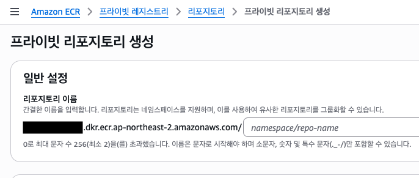
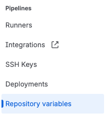
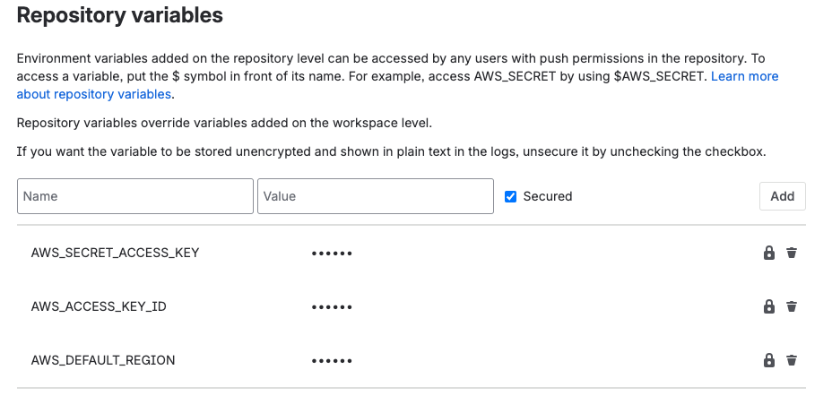
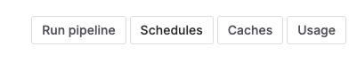
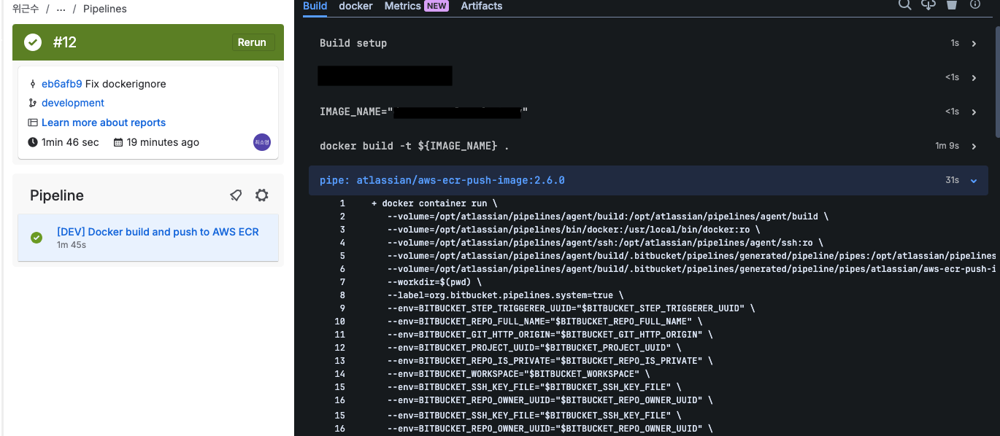

Bitbucket pipeline으로 ECR 자동 배포를 구성하는 방법이다.
애플리케이션 코드와 Dockerfile은 모두 작성되어있어야 한다.
 
## ECR 레포지토리 생성



AWS 콘솔에서 ECR 레포지토리를 생성한다. 레포지토리 이름과 region 명을 기억하자.

## Repository variable 생성




Bitbucket 레포지토리로 돌아와 `Settings` > `Pipiline` > `Repository variables`를 눌러 빌드에 사용할 환경변수들을 입력한다.



- AWS_ACCESS_KEY_ID
- AWS_SECRET_ACCESS_KEY
- AWS_DEFAULT_REGION

위 세 가지 환경변수가 `atlassian/aws-ecr-push-image:2.6.0` 이미지에서 사용하는 변수들이다.

## bitbucket-pipelines.yml 파일 작성하기

빌드를 위한 pipeline 스펙을 작성하면 된다. 커밋에 파일을 묶어 push 후 bitbucket 콘솔에서 빌드 상황을 모니터링 할 수 있다.

```yml
pipelines:
  branches:
    develop:
      - step:
          name: "[DEV] Docker build and push to AWS ECR"
          services:
            - docker
          script:
            - IMAGE_NAME="my-image"

            # 1) Docker build
            - docker build -t ${IMAGE_NAME} .

            # 2) Push to ECR using Bitbucket Pipe
            - pipe: atlassian/aws-ecr-push-image:2.6.0
              variables:
                AWS_ACCESS_KEY_ID: $AWS_ACCESS_KEY_ID
                AWS_SECRET_ACCESS_KEY: $AWS_SECRET_ACCESS_KEY
                AWS_DEFAULT_REGION: $AWS_DEFAULT_REGION
                IMAGE_NAME: $IMAGE_NAME

definitions:
  services:
    docker:
      memory: 3072
```

prod와 dev로 환경에 따라 다른 변수를 직접 넣어도 된다.
bitbucket에서 브랜치에 따라 다른 환경변수를 설정할 수 있다.
웬만하면 하드코딩 하는 것 보다는 bitbucket 콘솔에 추가하는 것이 보안상으로 적절할 듯 하다.

`IMAGE_NAME`에는 ECR repo 이름과 동일한 값을 쓰는 걸 추천한다.
Bitbucket Pipe가 `ACCOUNT_ID.dkr.ecr.REGION.amazonaws.com/IMAGE_NAME` 형태로 자동 태깅해서 푸시해 주기 때문이다.

## 파이프라인 실행



콘솔의 Pipelines으로 와서 `Run pipeline` 버튼을 눌러 파이프라인을 실행시킬 수 있다. 규칙을 설정하면 특정 브랜치에 커밋이 올라오면 자동으로 빌드가 시작되도록 할 수도 있다.
빌드를 시작할 브랜치와 `bitbucket-pipelines.yml` 파일에 작성한 `branches`들이 보인다. 적절히 선택해 버튼을 눌러 시작하면 된다.



실행 콘솔이 나타나며 로그가 출력된다.
문제가 있는 경우 에러가 발생한 파일이 출력되니 에러 메세지만 잘 읽으면 해결 가능한다.

## IAM 에러 발생시 참고

파이프라인에서 사용하는 IAM 유저에는 ECR에 push 할 수 있는 최소 권한이 필요한데, 만약 진행 중 IAM 에러가 발생한다면 아래 정책 중 빠진 것이 없는지 확인이 필요하다.

- AmazonEC2ContainerRegistryPowerUser (AWS 관리형 정책)
  또는
- ecr:GetAuthorizationToken
- ecr:BatchCheckLayerAvailability
- ecr:CompleteLayerUpload
- ecr:InitiateLayerUpload
- ecr:PutImage
- ecr:UploadLayerPart

## ECR 업데이트 확인

빌드가 성공적으로 끝난 후 ECR 콘솔로 돌아와 확인해 보면,


latest 이미지가 push 된 것을 볼 수 있다!

<hr />

ChatGPT는 docker만 올라간 이미지에 aws cli를 설치할 것을 추천했고
aws cli만 설치된 이미지에 ecr 로그인 및 push 커맨드를 직접 실행하는 방법도 있다.
나는 가장 간단하게 구성하고 싶어서 ecr push가 붙어있는 이미지를 사용했다.

## 참고
- [Atlassian > aws-ecr-push-image](https://bitbucket.org/atlassian/aws-ecr-push-image)
- [Bitbucket Pipeline을 이용해 AWS ECR에 이미지 push 하기](https://yonikim.tistory.com/24)
- [Push Docker Image to AWS ECR - Bitbucket Pipeline](https://dev.to/ahn4/push-docker-image-to-aws-ecr-bitbucket-pipeline-2fin)
