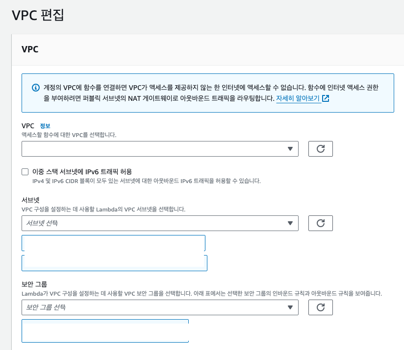
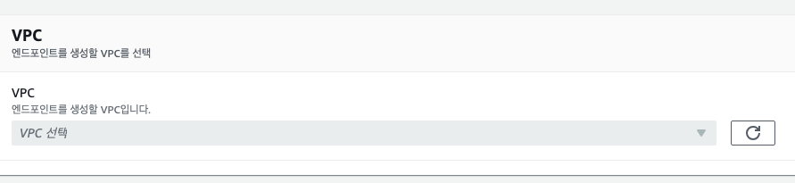

Elasticache를 사용하려는데 같은 VPC 내부에서만 접근이 가능해서 Lambda를 VPC 내부에 위치시켰다. 그랬더니 DynamoDB로 직접 접근이 되지 않고 무한히 Timeout만 발생했다. 당연히 안되겠지. 

[DynamoDB VPC 엔드포인트 사용](https://docs.aws.amazon.com/ko_kr/amazondynamodb/latest/developerguide/vpc-endpoints-dynamodb.html#vpc-endpoints-dynamodb-tutorial.launch-ec2-instance)을 보고 문제를 해결할 수 있었다. 다만 문서에서는 CLI 명령으로 VPC 엔드포인트를 만들어 입력하기 조금 귀찮아서 나는 콘솔 조작으로 생성했다.

VPC 엔드포인트를 생성하는 방법 이외에도 인터넷 게이트웨이와 VPC를 연결해 통신하는 방법도 있으나 보안이 좀 더 좋은 쪽은 역시 VPC 내부를 이용하는 방식이다.
VPC 엔드포인트를 사용하면 프라이빗 IP 주소를 사용해 DynamoDB에 액세스 할 수 있으며 VPC와 AWS 서비스 간 트래픽이 Amazon 네트워크를 벗어나지 않는다.
DynamoDB에 대한 VPC 엔드포인트 생성은 리전 내 DynamoDB로의 요청이 모두 프라이빗 DynamoDB 종단점으로 라우팅된다. 서비스 내부 코드를 수정할 필요 없이 알아서 연결이 되어 쉽게 도입할 수 있다.

## DynamoDB VPC 엔드포인트 생성하기

먼저 Lambda를 추가하고자 하는 VPC의 id를 알아둬야 한다. (*vpc-00000000* 형식)

Labmda 구성 탭에 VPC 메뉴에서 VPC 설정이 가능하다.

해당 vpc id를 제대로 선택하고 저장하면 Lambda VPC 설정은 끝이다.

VPC메뉴로 이동하면 **엔드포인트** 메뉴가 있다. 들어와보면 Elasticache 등 이미 만들어진 엔드포인트가 있을 수도 있다. 여기서 엔드포인트 생성 버튼을 누르면 된다.

그럼 이런 창이 뜨는데 이름은 선택 사항이고 서비스 범주를 **AWS 서비스**로 선택, 서비스에서 *com.amazonaws.ap-northeast-2.dynamodb*를 선택하면 된다.

그 아래에 VPC 설정 인풋이 있는데, 여기서 아까 봐뒀던 VPC id를 선택하면 된다.

서브넷, 보안그룹 등을 적절히 설정 후 저장하면 DynamoDB 엔드포인트가 생성된다.
문서에서는 라우팅 테이블도 id로 설정하던데 콘솔에서는 엔드포인트 생성과정에 따로 설정하는 부분이 없어서 생성한 엔드포인트를 클릭 후 `라우팅 테이블 > 라우팅 테이블 관리` 에서 추가시킬 수 있었다. 

이제 VPC 안에서도 DyanmoDB로 접근이 가능하다.
