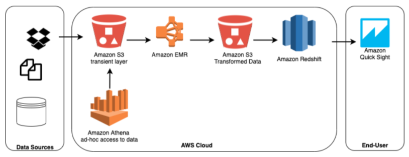
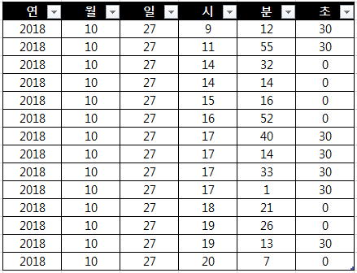

표준 SQL을 사용하여 AWS S3에 저장된 데이터를 쉽게 바로 분석할 수 있는 대화형 쿼리 분석 서비스

## 특징

- 사용하기 쉽다. (아테나가 S3 저장소를 가리키도록 하고 -> 스키마를 정의하고 -> 표준 SQL로 쿼리 한다)
- 서버리스 서비스이다 - 인프라를 관리할 필요가 없다. 99.999999999%의 객체 내구성을 보장한다.
- 자동으로 쿼리를 병렬 실행하므로 많은 data set과 복잡한 쿼리가 있더라도 결과를 빠르게 도출해낸다.
- AWS Glue와 통합되어 사용할 수 있다.
- 편리한 가상화를 위해 Amazon QuickSight와 통합된다.

## 사례

- Streaming Analytics

Firehose는 데이터를 column 단위의 파일 형식으로 변환시키고 다양한 집계를 수행한다. 데이터가 S3에 그러한 형식으로 저장되고 나면 Athena에서는 데이터들을 표준 SQL로 쿼리하고 이 결과는 Amazon QuickSight에서 시각화된다.
하지만 이런식으로 구조를 짠 경우 데이터가 더 많아지면 비용이 급격히 올라갈 수 있다.
파티셔닝 또는 데이터 압축과 같은 데이터 처리를 해주는게 좋겠다.

- ad-hoc 분석

ad-hoc 사업자에게 데이터 분석은 무엇보다 중요한 사안이다. Data warehouse를 통하면 SQL을 통해 직접 접근할 수는 있지만, 서로 다른 곳에 위치하는 데이터 혹은 엄청난 크기의 데이터에 접근하여 이를 분석하기에는 시간과 연산 작업에 걸리는 작업량이 엄청날 것이다. 이런 경우 위 구조도 처럼 Row data를 S3에 저장하여 사용 목적에 따라 ETLF 플로우를 생성하고 이를 Athena 로 분석함으로써 시간을 절약할 수 있다.

- 언제 써야할까?
  Amazon S3에 저장된 비정형, 반정형 및 정형 데이터 분석시 유용하다. 예를 들어 CSV, JSON 또는 컬럼 방식 데이터 형식이 해당된다.

### ad-hoc란

통신 및 네트워킹 능력을 갖춘 두개 이상의 장비로 구성된 네트워크

**참고**
[Data Architecture for AWS:6 Examples to Learn From](<https://www.upsolv> er.com/blog/data-architecture-aws-athena-examples)

## 요금

- 실행한 쿼리에 대한 비용만 지불. 스캔한 바이트 수에 대해 비용이 부과되며, DDL문과 실패한 쿼리문에 대한 비용은 청구되지 않는다. (5$ / 1TB 처리)
- S3에서 직접 데이터를 쿼리하는데 추가로 드는 비용은 없음. 데이터의 요청 및 전송과 스토리지에 대한 표준 S3 요금만 부과됨
- 데이터 파티셔닝 또는 압축된 데이터를 사용함으로써 비용을 절감 할 수 있다.

## 실습

- [Athena tutorial](https://docs.aws.amazon.com/ko_kr/athena/latest/ug/getting-started.html)로 sample data가 저장된 AWS S3에서

## EMR

대용량의 데이터를 Apache Hadoop과 Spark로 쉽고 빠르고 비용 효율적으로 실행해 처리할 수 있게 해주는 관리형 서비스이다. AWS EC2 혹은 Outposts 위에서 동작한다.

### 특징

- EMR에서 사용하는 EMR Notebooks는 'Jupyter Notebook'을 기반으로 한다.
- Presto, Hive, Pig, HBase 등과 같은 강력하고 입증된 하둡 도구를 지원한다.
- 보안이 우수하고 안정적 동작을 제공한다.
- 로그 분석, 웹 인덱싱, 데이터 변환(ETL), 머신 러닝, 재정 분석, 과학적 시뮬레이션 등 다양한 use case들을 다룰 수 있다.
- SQL 유사 스크립트 언어인 HiveQL을 사용한다.

> ETL
> Extract(추출), Transform(변환), Load(적재)
> 한 곳에 저장된 데이터를 필요에 의해 다른 곳으로 이동시키는 것. 필요에 의해 스키마를 조금 변형하는 작업이 될 수 있다.

### ETL 예

이런 테이블이 있다고 가정할 때, `시`와 `분`을 합친 `시분` 컬럼이 필요할경우 ETL을 적용해 다음과 같은 테이블로 만들 수 있다.

### 요금

- 사용한 모든 시간에 대해 온디맨드 초당 요금을 지불하며 최소 요금은 1분
- 노드가 10개인 클러스터가 10시간 동안 실행되는 비용 = 노드가 100개인 클라수터가 1시간동안 실행되는 비용
- EC2위에서 동작할 경우 EC2 종류에 따라 요금이 달라진다. 비용을 줄일 수 있는 다른 방법들도 있다.
  - 사용할 EC2 인스턴스에 대해 예약하며 일시불로 결제하는 경우 가장 높은 할인율을 받는다.
  - '스팟 인스턴스'는 온디맨드 요금에 비해 최대 90% 할인된 금액으로 제공되는 미사용 EC2 용량이다.

## Redshift

클라우드에서 완벽하게 관리되는 페타바이트급 데이터 웨어하우스 서비스. 대용량의 데이터를 적재하여 새로운 인사이트를 발굴할 수 있다.

### 특징

- Amazon Redshift cluster 라고 하는 '노드 집합'으로 관리된다.
- 한 번 클러스터의 프로비저닝이 끝나면 데이터 집합을 업로드하여 데이터 분석 쿼리를 **직접** 실행할 수 있다.
- 표준 SQL 기반 도구 및 business intelligence application을 사용해 쿼리 성능을 가속화한다.
- 전 세계에서 가장 빠른 클라우드 데이터 웨어하우스이며 그 속도가 매년 빨라지고 있다고 한다.
- 타 서비스보다 50% 저렴하다.
- 노드 유형은 두 가지가 있다.
  - RA3 : 관리형 스토리지. 성능 요구 사항에 따라 노드 수를 선택하며 사용하는 관리형 스토리지에 대해서만 비용을 지불한다.
  - DC2 : 로컬 SSD 스토리지가 포함된 컴퓨팅 집약적인 데이터 웨어하우스를 만드는데 적합하다. 뛰어난 성능을 위해 데이터를 로컬로 저장한다. 데이터 크기가 커지면 컴퓨팅 노드를 더 추가하여 클러스터의 스토리지 용량을 늘릴 수 있다.
- AWS는 RA3 사용을 권장한다.
- 완전관리형이다.

### 사례

- Redshift와 DataLake의 연결
  

Redshift 데이터 웨어하우스에 적재된 데이터를 SQL을 통해 쿼리하여 S3 데이터 레이크에 다시 저장한 모델이다. 저장된 데이터는 다시 Amazon EMR, Athena, SageMaker 등의 분석 서비스를 이용해 더욱 자세한 분석이 가능하다.

- ad hoc 분석을 위한 Redshift 사용
  

해당 서비스 사업자는 Redshift가 지연이 낮고 쿼리의 성능이 예상보다 높다는 점 때문에 Redshift를 사용하게 되었다. 장기간 보존되는 데이터를 다루는데 Redshift를 사용했다.

Redshift는 데이터가 local에 저장되던 S3에 저장되던 데이터를 따로 LOAD하는 작업 없이도 간단하게 접근이 가능하다. 이 접근에는 Data Pipeline을 사용했다.

Application은 S3의 데이터를 메모리로 load한다. 집계를 낸 후에 데이터를 지워버리고 Redshift엔 최신의 데이터를 overwrite한다. 이 데이터는 분석을 하기위한 준비가 끝난 것이다.

사업자는 Amazon QuickSight를 사용해 분석 결과를 시각화 하여 볼 수 있다.

### 요금

- Amazon Redshift Spectrum 요금 : DataLake에서 엑사바이트까지 데이터에 대해 직접 실행한 SQL 쿼리에 대해 스캔한 바이트 수 만큼의 요금을 지불한다.
- 동시성 확장 요금 : 각각의 클러스터는 하루 최대 1시간 분량의 동시성 확장 크레딧을 무료로 받는데 이는 97% 고객에게는 충분한 수준이다. 무료 크레딧을 초과한 사용량에 대해서는 초당 온디맨드 요금을 지불한다.
- Redshift 관리형 스토리지 요금 : 프로비저닝된 노드 수에 관계없이 RA3 클러스터에 저장하는 데이터에 대해서만 지불한다.

## Kinesis

실시간 streaming data를 간단하게 모으고 분석하도록 해주는 AWS 서비스이다. 시간대별로 분석을 진행할 수 있고 새로운 데이터에도 빠르게 반응할 수 있다.

### 특징

- 어느 용량에서도 비용면에서 경제적이며, application에 있어서 가장 잘 맞는 툴을 골라 사용하는것이 가능할 정도로 유용하다.
- video, audo, applciation log, website clickstream, machine learning data 같은 real time date에 대한 분석을 데이터를 얻는 즉시 가능하도록 해준다.

## Glue

데이터를 쉽게 추출, 정리, 보강, 정규화 및 로드할 수 있게 하는 완전관리형 서버리스 ETL 엔진이다. Glue를 사용함으로써 데이터 분석에 걸리는 시간을 몇 개월에서 몇 분으로 단축시킬 수 있다.

AWS Glue 데이터 카탈로그는 데이터의 위치에 관계없는 영구 메타데이터 스토어이다.

### 구성

- 데이터 카탈로그
- Job 생성
- Job 실행

### 특징

- 완전 관리형이다.
- 사용자의 데이터 준비 과정을 간소화할 수수 있는 통합 도구를 제공 & 작업의 자동화
- 서버리스 환경에서 Apache와 Python을 실행하기 때문에 인프라를 관리할 필요가 없다
- 데이터 카탈로그(데이터에 대한 하나의 단일된 뷰)는 데이터에 대한 쿼리를 효율적으로 수행할 수 있도록 자동으로 통계를 계산하고 파티션을 등록한다.
  - 장점
    - 필요 데이터의 검색 가능
    - ETL 작업의 데이터 소스로 즉시 활용 가능
    - Athena, EMR, Redshift 등에서 단일 뷰로 동일한 데이터에 접근 및 활용 가능
- drag and drop 작업 에디터에서 ETL프로세스를 정의하면 AWS Glue가 자동으로 코드를 생성한다.
- 알아서 데이터 중복을 제거한다.
- AWS Glue DataBrew는 대화형 point and click 시각적 인터페이스를 제공한다. 이를 사용해 사용자는 스스로 코드를 작성하지 않고도 데이터를 정리하고 정규화할 수 있다.
- 크롤러를 통해 자동적으로 지정한 데이터 소스에서 데이터 스키마를 찾아서 저장한다.

### 사용 사례

AWS Glue 데이터 카탈로그를 사용하면 데이터를 이동하지 않고도 여러 AWS 서비스에서 신속하게 데이터에 접근할 수 있다. 일단 데이터가 카탈로그에 저장되면 위 그림처럼 AWS Athena, EMR 및 Redshift Spectrum 에서 즉시 사용가능하다.

### 크롤링

Glue는 다양한 데이터 소스에서 크롤링(데이터 검색)이 가능하다.

- 접근 가능한 Data Store 목록

  | Acess type     | Data Stores                                      |
  | -------------- | ------------------------------------------------ |
  | Native Client  | - S3                                             |
  |                | - DynamoDB                                       |
  | JDBC           | - Aurora                                         |
  |                | - MariaDB                                        |
  |                | - MS SQL Server                                  |
  |                | - MySQL                                          |
  |                | - Oracle                                         |
  |                | - PostgreSQL                                     |
  | MongoDB Client | - MongoDB                                        |
  |                | - Amazon DocumentDB (with MongoDB compatibility) | 

Glue는 data set에서 db 및 테이블 스키마를 자동 크롤링하여 관련 metadata를 AWS Glue 데이터 카탈로그에 저장한다. Athena는 기본적으로 Glue 데이터 카탈로그에 등록된 데이터 세트 및 데이터 원본의 쿼리를 지원한다.

주기적으로 크롤러를 실행하면 변경된 스키마에 대한 탐지와 버전 관리가 가능하다.

다음 그림은 크롤러의 기본 동작 방식이다.

### 비용

- 실행 중 작업에 사용되는 리소스에 대해서만 비용을 지불한다. 크롤러(데이터 검색) 및 ETL 작업에 대해 초 단위로 청구되는 시간당 요금을 지불한다.
- 데이터 카탈로그의 경우 메타데이터의 저장 및 액세스에 대해 월별 비용을 지불한다. (처음 1백만 개의 객체 / 1백만 번의 액세스는 무료)
- ETL 코드에 개발 엔드포인트를 프로비저닝한 경우 초 단위로 청구되는 시간당 요금을 지불
- Glue DataBrew의 경우 대화형 세션은 세션별 요금이 청구되고 DataBrew 작업은 분당 요금이 청구된다.

[AWS Glue 요금 설명](https://aws.amazon.com/ko/glue/pricing/)

## 참고

[AWS Overview Analytics](https://docs.aws.amazon.com/whitepapers/latest/aws-overview/analytics.html)
[Glue-Athena](https://docs.aws.amazon.com/ko_kr/athena/latest/ug/glue-athena.html)
[AWS 월간 웨비나 PPT 자료 - Aws glue를 통한 손쉬운 데이터 전처리 작업하기](https://www.slideshare.net/awskorea/aws-glue-112394474)
