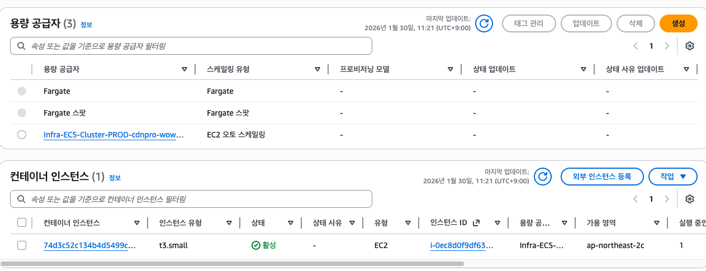

## 문제 상황

ECS 기반 서비스 배포 중, 서비스는 정상적으로 생성되었지만 태스크가 전혀 실행되지 않는 문제가 발생했다.
ECS 콘솔의 이벤트(Event) 탭에는 아래와 같은 메시지가 반복적으로 출력되었다.

```shell
Reason: TaskFailedToStart: EMPTY CAPACITY PROVIDER
```

겉보기에는 ASG(Auto Scaling Group) 인스턴스도 정상 실행 중이었고, ECS Agent 역시 정상적으로 기동된 상태였다.
하지만 실제로는 ECS 클러스터에 실행 가능한 컨테이너 인스턴스가 0개로 인식되고 있었다.

##  1. EC2 ECS Agent 실행 여부 확인

우선 ECS 인스턴스에 접속해 ECS Agent의 상태부터 확인한다.

```shell
sudo systemctl status ecs
```

정상 상태의 경우
```shell
● ecs.service - Amazon ECS agent
   Active: active (running)=
```

Active가 active로 출력되지 않는 경우 ECS Agent가 정상 기동되지 않은 상태이며 이 경우 ECS 클러스터 인스턴스에 등록되지 않는다.

## 2. TaskFailedToStart: EMPTY CAPACITY PROVIDER 의미

ECS도 잘 떠있는데 태스크 실행이 계속 안됐다. 이벤트 탭에는 이런 에러가 떴다.

```shell
Reason: TaskFailedToStart: EMPTY CAPACITY PROVIDER
```

이 에러의 의미는 다음과 같다.

> 서비스/태스크에 할당된 Capacity Provider에, 태스크를 실행할 수 있는 컨테이너 인스턴스가 하나도 없다.



ECS 콘솔 - Cluster - Infrastructure 탭에서 확인할 수 있는 내용은 두 가지이다.
- 설정된 용량 공급자
- 용량 공급자를 통해 클러스터에 등록된 컨테이너 인스턴스

만약 ASG 탭에서는 정상 실행중인 인스턴스들이 보이지만, 클러스터 인프라 탭에서 인스턴스가 보이지 않는다면 다음 원인 중 하나일 가능성이 높다.
- ECS Agent 미실행
- ECS Agent 설정 오류
- **인스턴스 아키텍처 불일치**

## 문제 원인: 아키텍처 불일치 (x86_64 vs arm64)

이번 이슈의 실제 원인은 Task definition의 CPU Architecture와 ASG에 설정한 EC2 인스턴스 아키텍처가 서로 달랐던 것이었다.
Task definition은 `x86-64`였고 ASG EC2 인스턴스 AMI는 `arm64`로 설정된 상태였다. 즉, x86-64이미지를 실행하는 태스크를, arm64 인스턴스 위에서 실행하려고 한 것.

이런 경우 ECS Agent 자체는 정상 실행되고, ASG 인스턴스도 정상 상태로 나타나며, ECS 서비스 배포도 정상적으로 이루어진다.
하지만 실제 태스크 실행시 아키텍처 불일치로 인해 `EMPTY CAPACITY PROVIDER` 에러가 발생한다.

배포 과정에서 명확한 에러가 발생하지 않아 더 디버깅하기 어려웠다. 실제 컨테이너 실행 단계에 들어가서야 아래와 같은 로그가 나타난다.

```shell
exec /usr/local/bin/docker-entrypoint.sh: exec format error
```

에러 로그를 검색해보니 아키텍처 불일치 시 나타나는 에러라는 것을 알게되었다.

## 해결 방법

### 1. ASG AMI를 Task definition에 맞는 이미지로 변경 

해결 방법은 간단하다. Task가 실행될 수 있는 AMI로 EC2 이미지를 변경하면 된다. 최신 ECS Optimized AMI를 조회해 해당 이미지를 사용하면 부수적인 문제를 방지할 수도 있다.

```shell
aws ssm get-parameters \
    --names /aws/service/ecs/optimized-ami/amazon-linux-2/recommended \
    --region ap-northeast-2 \
    --query 'Parameters[0].Value' \
    --output text | jq -r '.image_id'
```

### 2. Task definition을 변경

컨테이너 이미지가 멀티 아키텍처를 지원한다면 Task definition을 수정하는 것도 방법이다. Task definition 설정에서 cpu architecture를 arm64로 선택하면 된다.

## 정리

ECS 환경에서 배포도 정상이고, 인스턴스 상태도 정상인데 `TaskFailedToStart: EMPTY CAPACITY PROVIDER` 에러가 발생하고, 인스턴스 로그에서 `exec /usr/local/bin/docker-entrypoint.sh: exec format error` 에러를 발견한다면 인스턴스 아키텍처 일치부터 확인해보자.
