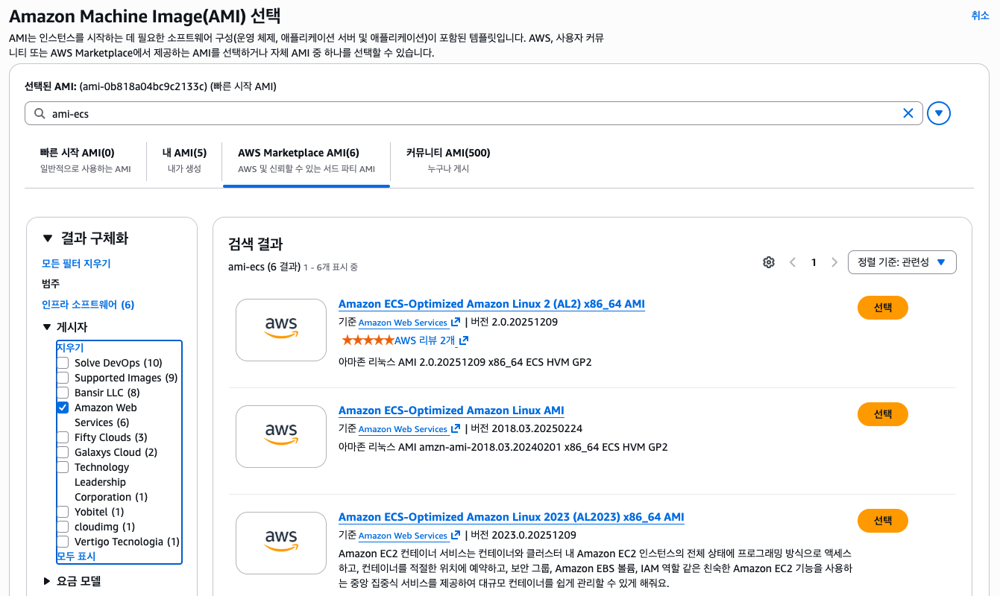
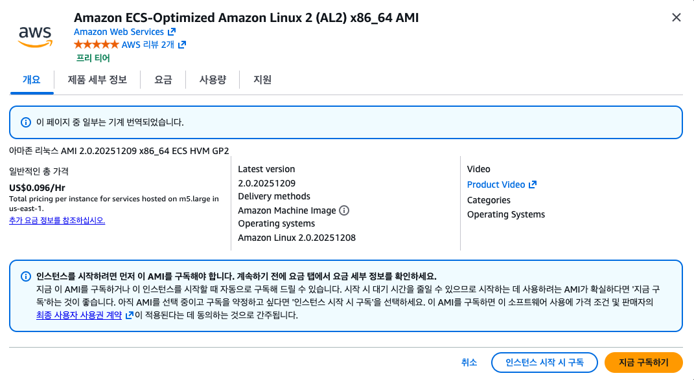
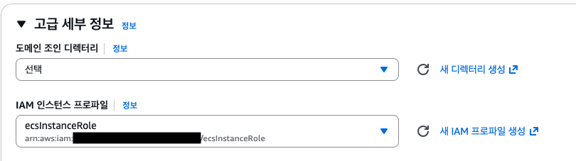
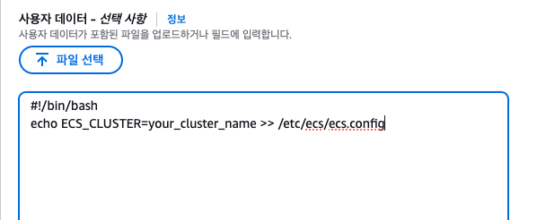
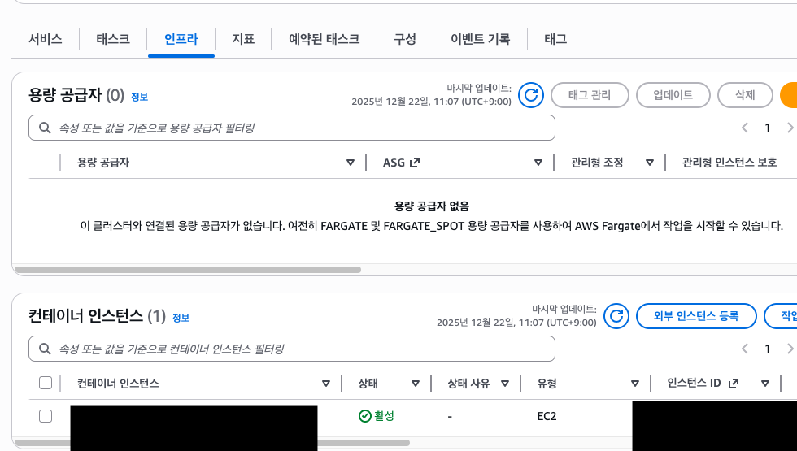
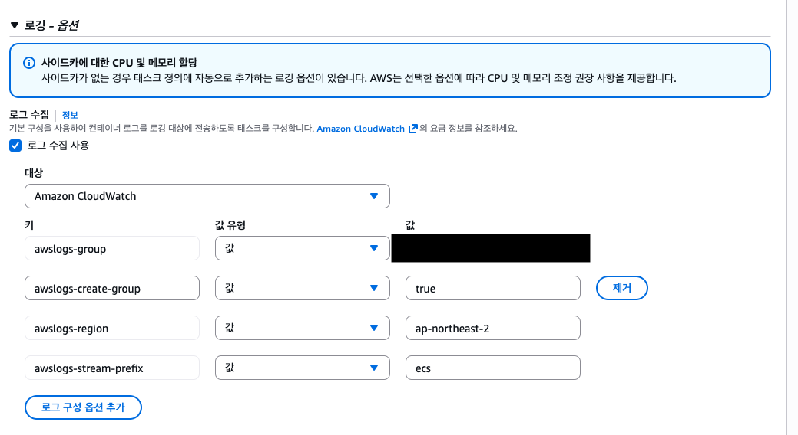

Amazon ECS를 EC2로 사용하려는 이유엔 몇 가지가 있을 수 있다. 다중 태스크를 돌릴 게 아니라 개발용으로 한 개만 실행시킬 거라면 ec2의 인스턴스 패밀리를 낮게 잡아서 실행하는 것이 비용적으로 효율적일 것이다. Fargate는 관리 부담이 적지만 비용이 높고 EC2는 인프라 관리가 필요하지만 비용 제어에 유리하다.

## 컨테이너 선택하기

ECS에는 ECS 권장 사항으로 미리 구성된 Amazon ECS 최적화 AMI를 제공하고 있다. 2025.12.22 날짜로 [공식 문서](https://docs.aws.amazon.com/ko_kr/AmazonECS/latest/developerguide/ecs-optimized_AMI.html)에서 추천하는 이미지는 `Amazon Linux 2023 Amazon ECS`이다. 이 이미지를 사용하면 ECS 에이전트가 이미 설치된 인스턴스를 사용할 수 있으면 최신 보안 업데이트를 지원한다. 
기본 30GB 루트 볼륨으로 구성되어있으며 가용 스토리지는 늘릴 수 있다. 이 스토리지는 도커 이미지 및 메타데이터 저장에 이용된다. 그 외에도 이전 버전들이 여러 개 있으니 공식 문서를 참조해 필요한 이미지를 선택 사용하면 된다.

### Linux 컨테이너 인스턴스를 시작하는 방법

EC2 콘솔을 열고 새로운 인스턴스를 생성하는 페이지로 온다.

검색창에 `ami-ecs`를 입력하고 AWSMarketplace AMIs 탭을 선택한다.



Publisher를 Amazon Web Services로 선택하다.


사용하려는 AMI 이미지를 선택한다.



이미지 자체는 프리티어이며 아래 나타나는 가격 정보는 인스턴스 사용 비용이다. 

고급 세부 정보 탭을 열고 필요한 설정을 추가해야 한다.



- IAM 인스턴스 프로파일: 컨테이너 인스턴스의 IAM 역할을 선택해야 한다. 일반적으로 `ecsInstanceRole`로 저장된 역할이다. 적절한 IAM 권한이 부여되지 않으면 ECS 에이전트가 클러스터에 연결할 수 없다.

> Instance Role: ECS 에이전트에 필요한 역할, ECR pull, CloudWatch 접근
> Task Role: 컨테이너 내부에서 AWS API 접근에 필요한 역할

- 사용자 데이터: EC2 사용자 데이터 스크립트는 인스턴스가 처음 실행될 때 딱 한 번 실행된다. 컨테이너를 따로 구성하지 않으면 ECS 에이전트가 기본 클러스터로 시작되기 때문에 다른 클러스터로 시작하려면 다음 스크립트를 붙여넣어야 한다. `your_cluster_name`에 사용하려는 클러스터 이름을 넣으면 된다.



```shell
#!/bin/bash
echo ECS_CLUSTER=your_cluster_name >> /etc/ecs/ecs.config
```

만약 사용자 스크립트를 생성 중에 입력하지 못했더라도 인스턴스에 접속해 직접 스크립트 파일을 실행할 수 있으니 이것 때문에 인스턴스를 다시 생성할 필요는 없다. 다만 이미 ECS 에이전트가 실행된 이후에 변경 내용을 적용하려면 스크립트 수동 실행 후 에이전트 또한 재시작이 필요하다.

```shell
sudo systemctl restart ecs
```

인스턴스와 ECS 클러스터간 연결이 잘 되면 ECS 클러스터 인프라 탭에서 해당 EC2 인스턴스가 보여야 한다.



## 용량 공급자

EC2 인스턴스를 사용해 ECS를 사용하는 경우 일반적으로 Auto Scailing 그룹을 사용해 EC2를 관리하게 된다. 관리형 스케일링을 사용하면 스케인 인-아웃 작업을 ECS에 위임할 수 있다. 또는 직접 관리할 수도 있다. 하지만 개발 환경에서 단일 인스턴스를 띄운다면 용량 공급자가 필수가 아니다. 상황에 맞게 사용하면 된다.

ECS 콘솔을 이용해 용량 공급자를 생성하는 경우 `EC2ContainerService-<ClusterName>` 접두사가 붙는다. 인스턴스가 스케일 아웃 되려면 max size가 0보다 커야 한다. 이를 0으로 설정해 인스턴스가 실행이 안되는 것은 ECS를 처음 사용하면서 흔히 하는 실수이다. ECS 용량 공급자에서는 오토 스케일링 그룹에 가중치 설정을 할 수 없으며 Fargate는 오토 스케엘링 그룹 용량 공급자를 사용할 수 없다.

## 로그

컨테이너 인스턴스에서 로그를 확인할 수 있다. 컨테이너 에이전트 버전 1.36.0 이상에서 로그는 Linux 기준 `/var/log/ecs/ecs-agent.log`에 위치한다. 로그는 매시간 교체되며 최대 24개 로그가 저장된다. 로그 형식은 원하는 모양으로 지정할 수 있다.
`logfmt`형식을 사용하는 경우 아래와 같이 출력된다.
```shell
level=info time=2019-12-12T23:43:29Z msg="Loading configuration" module=agent.go
level=info time=2019-12-12T23:43:29Z msg="Image excluded from cleanup: amazon/amazon-ecs-agent:latest" module=parse.go
level=info time=2019-12-12T23:43:29Z msg="Image excluded from cleanup: amazon/amazon-ecs-pause:0.1.0" module=parse.go
level=info time=2019-12-12T23:43:29Z msg="Amazon ECS agent Version: 1.36.0, Commit: ca640387" module=agent.go
level=info time=2019-12-12T23:43:29Z msg="Creating root ecs cgroup: /ecs" module=init_linux.go
level=info time=2019-12-12T23:43:29Z msg="Creating cgroup /ecs" module=cgroup_controller_linux.go
level=info time=2019-12-12T23:43:29Z msg="Loading state!" module=statemanager.go
level=info time=2019-12-12T23:43:29Z msg="Event stream ContainerChange start listening..." module=eventstream.go
level=info time=2019-12-12T23:43:29Z msg="Restored cluster 'auto-robc'" module=agent.go
level=info time=2019-12-12T23:43:29Z msg="Restored from checkpoint file. I am running as 'arn:aws:ecs:us-west-2:0123456789:container-instance/auto-robc/3330a8a91d15464ea30662d5840164cd' in cluster 'auto-robc'" module=agent.go         
```

JSON으로 포맷을 바꾸면 아래와 같은 모양이 된다.
```json
{"time": "2019-11-07T22:52:02Z", "level": "info", "msg": "Starting Amazon Elastic Container Service Agent", "module": "engine.go"}
```

컨테이너 로그를 CloudWatch로 보내는 방법은 로그를 모니터링 하기 위한 가장 일반적인 방법이다. 이는 콘솔에서 간단하게 설정할 수 있다. Task 정의 콘솔에서 `awslogs` 로그 드라이버 사용을 활성화하면 된다. 다만 `ecsInstanceRole`에 CloudWatch 관련 역할이 제대로 들어있다는 전제이다.



위 사진은 `로그 수집 사용` 체크를 활성화한 기본 옵션이다. 이렇게만 해도 ECS 콘솔에서 로그를 보는데 무리가 없다.
