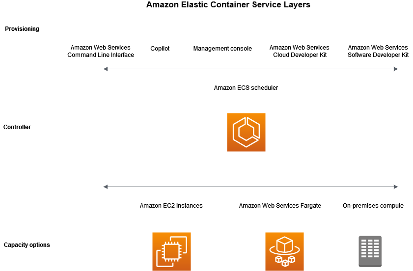
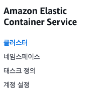
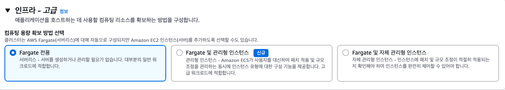
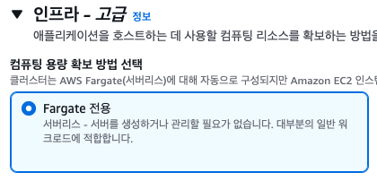
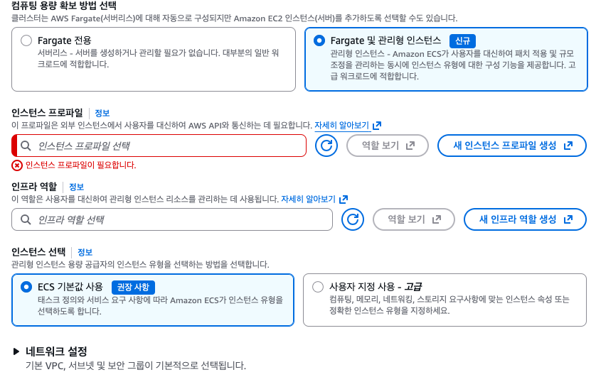
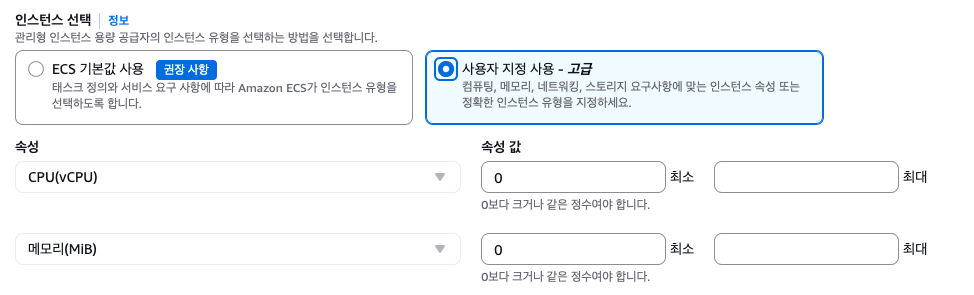
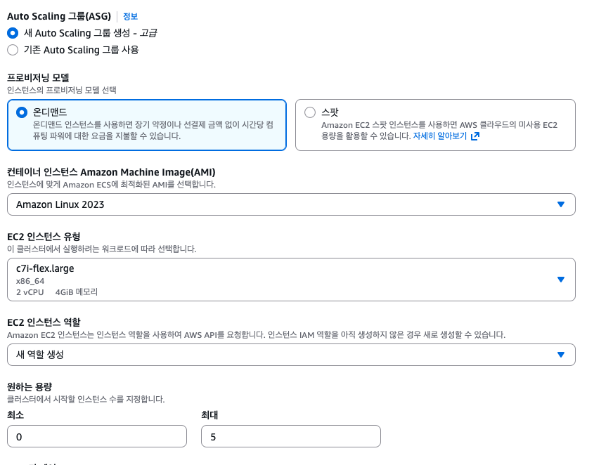
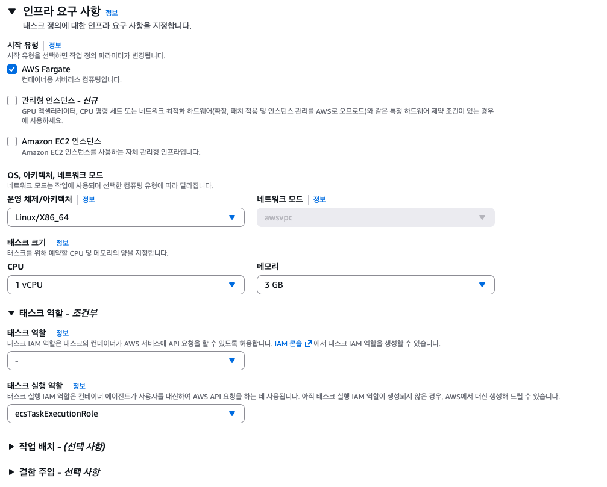
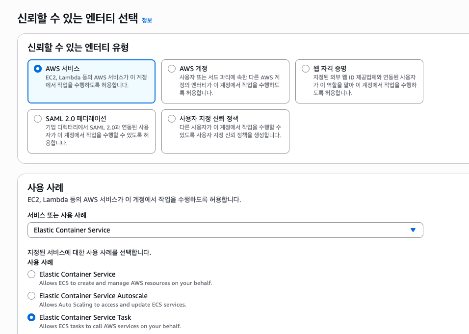
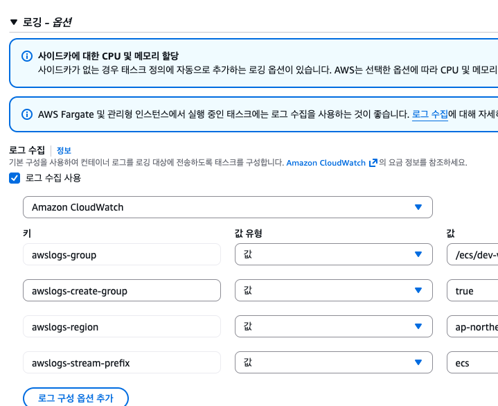

## 1. Amazon ECS란?

**Amazon ECS(Elastic Container Service)** 는 컨테이너 애플리케이션(보통 Docker)을 쉽게 배포하고 관리할 수 있는 **완전 관리형 컨테이너 오케스트레이션 서비스**이다.

컨테이너는 소프트웨어 애플리케이션을 실행하는 데 필요한 모든 요소(코드, 런타임, 시스템 도구, 라이브러리 등)를 포함하는 표준화된 단위이다.  
보통 **Dockerfile**을 기반으로 빌드된 뒤 **이미지(Image)** 형태로 만들어져 **Amazon ECR** 같은 레지스트리에 저장된다.

이후 **Task Definition(작업 정의)** 를 작성하여 ECS에서 컨테이너를 실행할 수 있다.

---

## 2. ECS의 구조와 구성 요소

ECS는 크게 세 가지 계층으로 구성된다.

| 계층 | 설명 |
|------|------|
| **Provisioning (프로비저닝)** | 애플리케이션 및 컨테이너를 배포하고 관리하는 도구 계층 |
| **Controller (컨트롤러)** | 컨테이너에서 실행되는 애플리케이션의 상태를 제어 |
| **Capacity (용량)** | 컨테이너가 실제로 실행되는 인프라 계층 |

### ECS 내부 구성 관계

> Task Definition이 ‘설계도’라면, Cluster는 ‘공장’,  
> Service는 ‘관리자’, Task는 ‘완성품(실행 중인 컨테이너)’이다.

ECS는 Kubernetes 구조와 유사한 오케스트레이션 모델을 따른다. 
- Task = Pod (실행 단위)
- Service = Controller (ReplicaSet, Deployment 같은 관리 계층)

두 개념을 나눔으로써 아래의 장점들이 생긴다.
- 단발성 작업과 장기 실행 서비스 구분 가능
- 배포, 장애 복구 자동화 기능
- 관리 정채 (Service)와 실제 실행(Task)을 분리하여 유연성 확보 가능

또한 Task는 직접 실행하는 단위이지만 Service는 사전에 정의된 설정에 따라 ECS가 자동 관리해주는 단위이다.

```shell
Cluster
└── Service
   ├── Task Definition
   │ └── Container (실제 이미지)
   └── 여러 개의 Task (컨테이너 실행 단위)
```




---

## 3. ECS 주요 기능 개요



ECS 콘솔에는 다음과 같은 주요 메뉴가 있다.

- **Clusters**: 애플리케이션이 실행되는 인프라 관리
    - **Services**: 장기 실행되는 상태 비저장 애플리케이션
- **Task Definitions**: 애플리케이션의 설계도
    - **Tasks**: 실제 실행 중인 작업(컨테이너)

---

## 4. Cluster (클러스터)

클러스터는 ECS의 기본 단위로, 태스크 및 서비스를 실행하기 위한 **논리적 리소스 그룹**이다.



### 클러스터 유형

1. **Amazon ECS Managed Instances (추천)**
    - AWS가 EC2 인스턴스를 자동으로 관리(프로비저닝, 패치, 스케일링)
    - 성능과 비용을 자동 최적화
    - 인프라 관리 부담 최소화

2. **AWS Fargate**
    - 완전 서버리스 환경
    - 인프라 구성 없이 컨테이너 리소스만 정의
    - 변동성이 크거나 간헐적인 워크로드에 적합

3. **Amazon EC2 Instances**
    - 인프라를 직접 관리
    - 커스텀 AMI나 특수 설정 가능
    - 기존 EC2 인프라 활용 또는 세밀한 제어 필요 시 사용

### 클러스터 상태

| 상태 | 설명 |
|------|------|
| ACTIVE | 태스크 실행 준비 완료 상태 |
| PROVISIONING | 용량 공급자 생성 중 |
| DEPROVISIONING | 용량 공급자 삭제 중 |
| FAILED | 리소스 생성 실패 |
| INACTIVE | 삭제된 상태 (일시적으로 조회 가능) |

> 💡 EC2를 직접 사용하는 경우 ECS는 Auto Scaling 그룹의 크기를 자동 추적하지 않는다.

---

## 5. Capacity (용량)

**Capacity**는 컨테이너가 실행되는 실제 인프라를 의미한다.  
ECS에서는 다음 세 가지 옵션을 제공한다.

- **Amazon EC2 인스턴스**
- **AWS Fargate**: 서버리스, 종량제 컴퓨팅 엔진
- **온프레미스 환경**

ECS 스케줄러가 이 인프라 위에서 애플리케이션 배포를 자동 관리한다.

---

## 6. Capacity Provider (용량 공급자)

**Capacity Provider**는 ECS 클러스터가 태스크를 실행할 인프라를 자동 조정하는 도구이다.  
각 클러스터는 한 개 이상의 공급자를 가질 수 있으며, 태스크를 EC2, Fargate, Spot 인스턴스 중 어디에서 실행할지를 결정한다.

- **Fargate 선택 시**: 별도 지정 불필요
- **ECS Managed Instance 선택 시**: AWS가 자동 최적화




---

### Instance Profile

**Instance Profile**은 ECS Managed Instance의 IAM Role을 정의한 JSON 문서이다.  
ECS Agent가 클러스터에 인스턴스를 등록하고 AWS API에 접근할 수 있도록 해준다.  
한 개의 Instance Profile은 여러 클러스터에서 **재사용 가능(1:N)** 하다.

### Infra Role / Infrastructure Role

- **Infra Role**: AWS가 관리형 인스턴스를 관리하기 위해 사용하는 역할
- **Infrastructure Role**: ECS가 Managed Instance 인프라를 제어하기 위한 API 권한 역할




---

### 클러스터 유형 비교

| 구분 | ECS Managed Instances | Fargate | EC2 직접 관리 |
|------|------------------------|----------|----------------|
| 관리 주체 | AWS 자동 관리 | 완전 서버리스 | 사용자 직접 |
| 비용 | 자동 최적화 | 사용량 기반 과금 | 인스턴스 단위 |
| 유연성 | 중간 (추천) | 높음 (간단) | 최고 (복잡) |
| 운영 부담 | 낮음 | 매우 낮음 | 높음 |
| 용도 | 일반적인 워크로드 | 변동·간헐 워크로드 | 특수 환경 |

---

## 7. Task Definition (작업 정의)

Task Definition은 ECS 애플리케이션의 **청사진(설계도)** 이다.  
하나의 JSON 형식 파일로 컨테이너 구성과 리소스 요구사항을 정의한다.

### 주요 항목

- 실행 타입 (Fargate / EC2)
- 사용할 Docker 이미지
- CPU, Memory 요구사항
- 네트워킹 모드
- 로깅 설정
- IAM Role 지정
- 컨테이너 실패 시 동작 정책 등

Task Definition을 기반으로:
- **Task**: 실제 실행 중인 컨테이너 인스턴스. 1회성 실행 단위
- **Service**: Task를 지속 실행·유지·스케일링하는 관리 단위




### 컨테이너 설정


필수 컨테이너는 하나 이상이 설정되어야 한다. 이미지 URI에는 사전에 ECR에 push 했던 이미지를 선택할 수 있다.
포트 매핑 중 80 포트는 배포를 위해 필수로 추가되어야 하는 포트이므로 건드리지 말자.
리소스 할당 제한 및 환경 변수를 설정할 수 있다.

### task role (태스크 역할)

컨테이너 내 애플리케이션이 AWS 서비스에 접근할 때 필요한 권한을 제공한다. 즉, ECS 태스크에서 실행되는 애플리케이션이 S3 파일 업로드 또는 DynamoDB에 데이터 쓰기 등의 AWS 리소스를 호출하는 동작이 있다면 task role에 리소스 호출에 필요한 IAM 권한을 부여해야 한다.

#### 생성하기

1. IAM 콘솔에서 역할 생성
2. '신뢰할 수 있는 엔터티 유형'에서 'AWS 서비스'를 선택하고, 사용 사례에서 'Elastic Container Service' 선택 후 'Elastic Container Service Task' 선택


3. 필요한 role 추가

### 로그

컨테이너 프로세스의 로그를 보고 싶다면 task 생성 옵션 중 '로깅'을 활성화 하면 된다.




### task execution role (태스크 실행 역할)

ECS가 컨테이너를 실행하고 관리하는 데 필요한 권한을 제공한다. 컨테이너 이미지를 pull 하거나 로그를 cloudwatch로 전송하는 등 ECS 작업에 필요한 권한을 부여한다.


---

## 8. ECS 콘솔 작업 순서

1. **클러스터 생성**
    - 인프라 유형 선택 (Managed Instance / Fargate / Custom)
    - 이름 지정

2. **Task Definition 작성**
    - Launch Type 설정 (Fargate / EC2)
    - 컨테이너 이미지 지정 (ECR 또는 Docker Hub)
    - 환경 변수 및 리소스 설정
    - Task Role / Execution Role 지정

3. **Service 생성**
    - Compute 옵션 선택
    - Task Definition 연결
    - Desired count 설정 (실행할 태스크 수)

4. **모니터링 및 배포 관리**
    - Task 상태 및 로그 확인
    - 새 이미지 배포 → Task Definition 새 버전 등록 → 서비스 업데이트

5. **(선택) 배포 자동화**
    - GitHub Actions → ECR → ECS 자동 배포 파이프라인 구성

---

## 9. 요금 체계

ECS 자체는 무료이지만, 사용한 인프라에 따라 비용이 발생한다.

| 방식 | 과금 기준 |
|------|------------|
| **EC2** | EC2 인스턴스, EBS, IPv4 주소 등 관련 리소스 비용 |
| **Fargate** | 컨테이너 실행 시간(vCPU + Memory) 기준 초 단위 과금 (최소 1분) |

---

## 10. 실습: Docker → ECR → ECS 배포

ECS는 Docker 이미지를 기반으로 컨테이너를 실행한다.  
간단한 웹 애플리케이션을 Fargate에 배포해보자.

1. **Dockerfile 작성**  
   Docker 이미지에 사용할 베이스 이미지 및 실행 명령 작성  
   ([Dockerfile 관련 설명](/blog/cloud/aws/docker-multistage-build))

2. **Docker 이미지 빌드**
   ```bash
   docker build -t hello-world .
    ```

3. ECR 리포지토리 생성
    ```bash
   aws ecr create-repository --repository-name hello-repository --region ap-northeast-2
   ```

4. 이미지 태깅
    ```bash
   docker tag hello-world aws_account_id.dkr.ecr.region.amazonaws.com/hello-repository
    ```

5. ECR 로그인
    ```bash
    aws ecr get-login-password --region region \
    | docker login --username AWS --password-stdin aws_account_id.dkr.ecr.region.amazonaws.com    
   ```

6. 이미지 푸시
    ```bash
   docker push aws_account_id.dkr.ecr.region.amazonaws.com/hello-repository
    ```

## 11. AWS Fargate 정리

AWS Fargate는 ECS나 EKS에서 컨테이너를 실행하기 위한 서버리스 컴퓨팅 엔진이다.
서버 관리, 패치, 보안 업데이트 등을 직접 수행할 필요 없이
애플리케이션 코드에만 집중할 수 있게 해준다.

📚 참고

[AWS 공식 문서 - Amazon ECS](https://docs.aws.amazon.com/ecs/)
[AWS 공식 문서 - AWS Fargate](https://docs.aws.amazon.com/fargate/)
