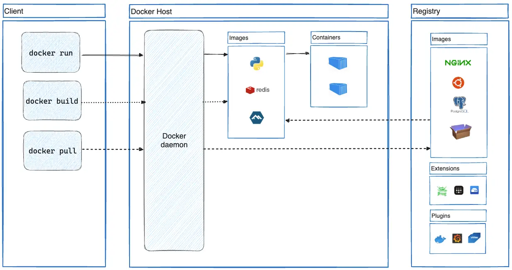

도커는 애플리케이션 개발, 배포를 위한 오픈소스 플랫폼이다. VM과 달리 호스트 OS 커널을 공유하며 격리된 공간을 생성해 그 안에서 앱을 실행하게 해줘 소프트웨어 배포를 빠르게 할 수 있도록 해준다. 도커를 사용하면 개발 환경과 같은 환경에서 앱을 관리할 수 있게되고 개발 환경과 배포 환경 사이에 생기는 간극을 줄여준다. Docker 엔진은 주로 Go로 작성되었으며 Linux 커널의 namespaces, cgroups 등의 기능들을 활용해 컨테이너를 구현한다.

## Docker 구조



도커는 client-server 구조를 사용한다. docker 클라이언트가 docker daemon에 요청을 보내는 식이다. 둘은 REST API로 요청을 주고받는다. 

- Docker daemon(`dockerd`): Docker API 요청을 처리하고 도커 이미지, 컨테이너, 네트워크와 볼륨을 관리한다. 
- Docker client(`docker`): 도커를 사용함에 있어 가장 메인이 되는 요소다. `docker run`과 같은 커맨드를 실행하면 클라이언트는 `dockerd`로 요청을 보낸다. 
- Docker desktop: Mac, Windows, Linux등 운영체제에 설치되어 도커를 쉽게 관리할 수 있게 해주는 애플리케이션이다. 앱 안에서는 Docker daemon과 Docker client, Docker compose, Kubernetes 등이 포함되어있다.
- Docker registries: 도커 이미지 저장소이다. Docker Hub는 퍼블릭 레지스트리로 누구나 사용할 수 있다. 도커는 기본적으로 Docker hub에서 이미지를 찾는다. private registry도 사용할 수 있다. `docker pull` 또는 `docker run` 커맨드를 실행하면 도커는 설정된 레지스트리에서 이미지를 가져온다. 로컬에 저장된 이미지 또한 레지스트리에 올릴 수 있다.


## Dockerfile

도커파일은 도커 이미지를 생성하기 위한 선언형 스크립트다. 기본 규칙만 익혀두면 프로젝트 환경이 바뀌어도 Dockerfile을 필요에 맞게 작성할 수 있다.

### 기본 개념

- Image: 실행 가능한 파일 시스템 스냅샷 (Node.js v22 등)
- Container: 이미지 실행 인스턴스
- Layer: Dockerfile 명령마다 생성되는 파일시스템 레이어
- Volume: 컨테이너 외부 데이터 저장소
- Network: 컨테이너 간 통신

`FROM`문으로 새로운 레이어가 생성된다고 보면 된다. 

### Format

도커파일의 기본 작성 포맷은 아래와 같다.

```dockerfile
INSTRUCTION args
# 주석
```

명령문(instruction)은 대소문자를 구분하지 않지만 편의상 대문자로 쓰는 것이 보편적이다.
도커는 도커파일에 작성된 명령문들을 위에서부터 차례대로 실행한다. 
도커파일은 반드시 `FROM` 명령으로 시작한다. `FROM`은 현재 만드는 컨테이너의 베이스 이미지를 뜻한다.

> `.dockerignore`: 이 파일에 명시한 파일들은 빌드 컨텍스트에 포함되지 않는다. 빌드 속도와 캐시 효율이 좋아진다. (예: `.git`, `node_modules`, 빌드 산출물 등) 

### Instructions

자주 사용되는 명령어 몇 가지만 정리하면 다음과 같다.

| instruction | meaning                       |
| --- |-------------------------------|
| FROM | 베이스 이미지 선언을 통한 새로운 빌드 스테이지 생성 |
|COPY| 파일 복사                         | 
|ADD | local 또는 remote 파일을 추         |
|RUN | build 시 실행                    |
| CMD | 컨테이너 실행 커맨드                   |
| ENV | 환경 변수                         |
| ARG | 빌드에 사용되는 변수 선언                |
|EXPOSE | 포트 설명                         |
|WORKDIR | 워크 디렉토리 변경. 디렉토리가 없다면 생성하여 이동. 이후에 실행되는 명령어는 이동된 위치에서 실행|

> WORKDIR은 node 환경에서 보통 /app 또는 /usr/src/app이 사용된다. 루트가 아닌 워크 디렉토리를 사용하는 이유는 루트 위치에는 OS 레벨 디렉토리가 모여있는데 여기에 앱 파일이 섞이면 구조가 지저분해져 관리가 어려워지기 때문이다. 


### 최소 실행 이미지

- `scratch`: 가장 작지만 라이브러리/쉘이 전혀 없음. Go의 정적 바이너리와 궁합이 좋다.
- `distroless`: 실행에 필요한 런타임만 포함, 쉘 없음. 보안/크기 균형 좋음.
- `alpine`: 매우 작고 쉘/패키지 매니저 제공. node:20 보다 node:20-alpine이 예시 코드에서 많이 보이는 이유이다.

이미지 

## 빌드 인수와 환경변수

```dockerfile
ARG NODE_VERSION=1.24
FROM golang:${GO_VERSION} AS build
ENV CGO_ENABLED=0
# ...
```

- `ARG`는 선언 이후 단계에서만 유효. 필요한 스테이지마다 다시 선언해야 한다.
- `ENV`는 해당 스테이지와 그 이후 스테이지에 지속된다.

## 레이어 캐시와 속도 최적화

- 의존성 설치 단계와 소스 복사 단계를 분리해 캐시 히트를 높인다.
  - 예) `COPY package*.json` → `npm ci` → 그 다음에 `COPY . .`
- 패키지 설치는 한 `RUN`에 묶어 캐시 무효화를 최소화한다.
- `.dockerignore`로 빌드에 불필요한 파일 제외.
- BuildKit의 캐시 마운트 활용

```dockerfile
RUN --mount=type=cache,target=/root/.npm npm ci
```

## 유용한 빌드 옵션

- `docker build --target <stage>`: 특정 스테이지만 빌드해 디버깅
- `docker build --build-arg KEY=VALUE`: `ARG` 값 주입
- `docker build --progress=plain`: 로그를 자세히 출력


# Multi-stage

Multi-stage 빌드는 하나의 Dockerfile 안에서 여러 개의 빌드 단계를 정의해, “빌드에만 필요한 것”과 “실행에 필요한 것”을 분리하는 기법이다. 결과적으로 이미지가 더 작아지고, 보안 표면적이 줄며, 유지보수가 쉬워진다.

### 왜 써야 할까?

- 작아진 이미지: 컴파일러/SDK/툴체인은 최종 이미지에서 제외 → 배포/다운로드가 빨라짐
- 더 안전한 런타임: 불필요한 패키지 제거 → 취약점 표면 축소
- 명확한 책임 분리: build 단계와 run 단계가 파일상으로도 구분됨
- 캐시 친화적: 단계별로 캐시가 분리되어 반복 빌드가 빨라짐

### 사용법

Multi-stage 빌드에서는 여러 개의 `FROM`을 사용한다. 각 `FROM`은 독립된 스테이지가 되며, 스테이지마다 서로 다른 베이스 이미지를 선택할 수 있다. 이전 스테이지의 산출물(artifacts)을 `COPY --from=...`으로 가져오고, 최종 이미지에는 꼭 필요한 파일만 남긴다.

```Dockerfile
# syntax=docker/dockerfile:1
FROM golang:1.24 
WORKDIR /src
COPY <<EOF ./main.go
package main

import "fmt"

func main() {
  fmt.Println("hello, world")
}
EOF
RUN go build -o /bin/hello ./main.go

FROM scratch
COPY --from=0 /bin/hello /bin/hello
CMD ["/bin/hello"]
```

위 파일은 두 개의 스테이지로 나뉜다. 하나의 Dockerfile로 빌드(컴파일)와 실행 이미지를 함께 관리할 수 있다.

`scratch`를 베이스로 하는 두 번째 스테이지의 `COPY --from=0`은 이전 스테이지의 산출물만 복사한다. 첫 번째 스테이지에서 사용한 Go SDK, 빌드 도구 등은 최종 이미지에 포함되지 않는다.

### build stage 이름 붙이기

위 처럼 `FROM`문만 사용하는 경우 각 스테이지에는 숫자 인덱스가 생긴다. 숫자 인덱스 대신 스테이지에 `AS`를 사용해 이름을 붙이면 의도가 더 명확해진다.

``````Dockerfile
# syntax=docker/dockerfile:1
FROM golang:1.24 AS build
WORKDIR /src
COPY <<EOF ./main.go
package main

import "fmt"

func main() {
  fmt.Println("hello, world")
}
EOF
RUN go build -o /bin/hello ./main.go

FROM scratch
COPY --from=build /bin/hello /bin/hello
CMD ["/bin/hello"]
``````

첫 번째 스테이지를 `AS build`로 이름 붙였고, 최종 스테이지에서 `COPY --from=build`로 앞 스테이지를 참조한다.
이름을 붙이면 특정 스테이지만 빌드 또는 디버깅도 가능하다. 예를 들어 위의 `build` 스테이지만 빌드를 하고 싶다면

```shell
docker build --target build .
```

도커파일이 위치한 곳에서 이렇게 명령어를 입력하면 된다.


### 도커 파일 체크리스트

더 효율적으로 이미지를 생성하기 위해 멀티 스테이지를 사용한 도커 파일을 작성하고 아래 사항을 확인해보는 것도 좋은 습관이 될 것 같다.

- 최종 이미지에 빌드 도구가 포함되어 있지 않은가?
- `.dockerignore`가 잘 설정되어 있는가?
- 스테이지 이름이 명확한가? `--target`으로 부분 빌드 가능한가?
- 런타임 이미지가 가능한 한 작고 안전한가?

## 실사용 예

### Node.js (빌더 + 런타임 분리)

개발 의존성과 빌드 산출물을 분리해 최종 이미지를 가볍게 만든다.

```dockerfile
# syntax=docker/dockerfile:1
FROM node:20-alpine AS build
WORKDIR /app
COPY package*.json ./
RUN npm ci
COPY . .
RUN npm run build

FROM node:20-alpine AS runtime
WORKDIR /app
# 필요 최소 파일만 복사
COPY --from=build /app/package*.json ./
RUN npm ci --omit=dev
COPY --from=build /app/dist ./dist
EXPOSE 3000
CMD ["node", "dist/main.js"]
```

위 예시는 node.js로 작성된 프로젝트를 build 스테이지와 runtime 스테이지로 나눠 작성되었다.

만약 이후에 정적 사이트를 Nginx로 서빙하고 싶다면, 두 번째 스테이지를 `nginx:alpine`으로 바꾸고 `COPY --from=build /app/dist /usr/share/nginx/html` 복사하면 된다.
이렇게 필요한 부분만 수정해서 사용하면 되니 도커 이미지의 유지보수가 간편해진다.

## 출처

- [Dockerdocs - multi-stage](https://docs.docker.com/build/building/multi-stage/)
