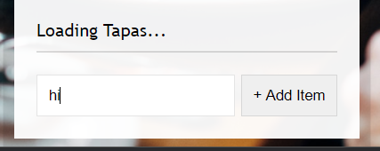

# Day 15 - Local Storage

local storage에 값을 저장해 새로고침을 해도 데이터가 유지되는 페이지를 만든다.

## `submit`에 이벤트 등록


이렇게 생긴 폼이 있을 때, 보통은 button에 `click` 이벤트를 등록할 것이다. 하지만 `click` 대신 `submit`에 이벤트를 걸어주면 `click` 동작 뿐만이 아니라 `Enter`로 들어오는 submit 작업 등 다양한 방식에서 이벤트가 실행되도록 할 수 있다.

`submit`이 실행될 경우 브라우저는 기본적으로 reload 되므로 (서버에 값을 전달한다고 생각하기 때문에),`preventDefault()`를 실행해야한다.

```js
function addItem(e) {
  e.preventDefault();
  console.log(e);
}
```

## item 추가하기

object 형식의 `item`을 사용자 input을 적용해 생성한다. `items`는 전역 변수로 빈 배열로 초기화 되어있다.

```js
const items = [];

function addItem(e) {
  e.preventDefault();
  const text = this.querySelector("[name=item]").value;
  const item = {
    text,
    done: false,
  };
  items.push(item);
  populateList(items, itemsList);
  this.reset();
}
```

`input`을 찾을 때, `document.querySelector`를 쓸 수도 있지만 문서 전체에서 찾기보다는 가장 좁은 범위로부터 시작하는 것이 경제적이기 때문에 `event`객체를 사용해 select 한다.

`reset()`은 `input` 개체에 입력된 값을 지우는 메서드이다.

## template html 생성

리스트가 추가 될 때마다 전체 html이 새로 생성된다. 이런 리스트 추가만 하는 간단한 작업에서는 매번 처음부터 다시 생성해도 매우 빠르게 동작하지만 애니메이션이 들어간다거나 이벤트가 동작하는 텀이 짧은 경우 performance issue가 있을 수 있는데, 이것이 문제가 된다면 React.js 또는 Angular를 사용해야한다. 두 언어는 업데이트 되어야 하는 최소한의 html 부분을 찾아 변경하는 방식으로 동작하기 때문이다.

```js
function populateList(plates = [], platesList) {
  platesList.innerHTML = plates
    .map((plate, i) => {
      return `
            <li>
              <input type="checkbox" data-index=${i} id="item${i}" ${
        plate.done ? "checked" : ""
      }/>
              <label for="item${i}">${plate.text}</label>
            </li>
          `;
    })
    .join("");
}
```

`map`을 사용해 `plates(items)`에 들어있는 모든 `plate(item)`에 대해 `<li>`를 생성한다. 각 item에 대해 생성한 html은 `.join('')` 메서드로 하나의 긴 string이 되어 전체 리스트 컨테이너 엘리먼트 내부 html이 된다.

## LocalStorage 사용하기

새로고침을 해도 값을 유지하려면 어떻게 해야할까? 브라우저 자체에 저장되어야 할 것이다. 새로고침되어도 사라지지 않고 내장되는 데이터가 바로 `LocalStorage`이다.
크롬 개발자도구의 `Application` 탭에서 확인할 수 있다.

지금 유지해야 되는 값은 `itemsList`의 값들이다. 이 값들을 `LocalStorage`에 저장해두고 프로그램이 실행될 때 마다 값을 읽어와서 새로운 페이지에도 추가한다면, 사용자에게는 리스트의 값이 새로고침을 하더라도 계속해서 유지되는 것처럼 보일 것이다.

`LocalStorage`의 메소드는 다음과 같다.

- `localStorage.getItem('key')`
- `localStorage.setItem('key',value)`

각각은 `get`, `set` 이라는 이름에 맞게 동작한다. 데이터를 등록할 때 value는 `string` 처럼 인식하므로 `Object`인 `itemList`를 그대로 넘기면 제대로 값이 들어가지 않는다. `JSON.stringify`를 사용해 string화 시켜 값을 저장한다.

또한 이전에 저장했던 데이터를 불러와야 하기 때문에 `items`에 `localStorage.getItem()`으로 값을 넣는다. 만약 값이 비었을 경우, 빈 Array를 넣게된다.

```js
const items = JSON.parse(localStorage.getItem('items')) || [];

function addItem(e) {
    // something....
    items.push(item);
    populateList(items, itemsList);
    localStorage.setItem('items', JSON.stringify(items);
}
```

## Event Delegation

Event delegation에 대한 내용은 네이버 커넥트재단 웹 프로그래밍 코스를 수강할때 공부했던 내용이다. [이전 블로그](https://studyeong.blogspot.com/2020/03/web-event-delegation.html)

이벤트 위임. 자식 엘리먼트에게 적용되어야 하는 이벤트를 부모 엘리먼트에 위임하는 기법이다. 다양하게 사용될 수 있는데, 예를 들어 자식 엘리먼트가 아-주 많을 경우 각 엘리먼트에 `forEach`로 이벤트 리스너를 넣는것은 뭔가 비효율적이라는 생각이 들지 않는가? 이렇게 하는 대신, 이벤트를 발생 시켜야 하는 엘리먼트들을 모두 감싸고 있는 부모 엘리먼트 하나에만 이벤트 리스너를 등록해두고, 이벤트가 실행되었을 경우 실제로 클릭된 자식 엘리먼트를 찾아내 해당 자식이 이벤트를 실행하도록 하는 기법이다.

이번 예시의 경우에서는, `checkbox`가 `checked`상태가 되면 `item.done` 속성을 바꿔야 하는데, `checkbox` input list 자체에 이벤트를 걸어버리면 사용자가 리스트에 값을 추가하기 전에는 리스트 요소가 없는 상태이기 때문에 제대로 동작하지 않는다. 체크 한 뒤에 새로고침을 하면 이전에 생성되었던 item 에는 이벤트 함수가 적용되어있겠지만 새로 생성한 item에 대해서는 또다시 이벤트 실행이 제대로 되지 않는다.
따라서 items를 감싸는 부모 엘리먼트에 event delegation을 수행한다.

```js
function toggleDone(e) {
  console.log(e.target);
}
itemsList.addEventListener("click", toggleDone);
```


부모에게 이벤트를 위임하고 자식 요소를 클릭하면 위 사진 처럼 이벤트가 두 번 발생하게 된다. 이는 `Event Bubbling`때문이다. 이벤트 버블링은 하위 엘리먼트에서 발생한 동작이 상위로 올라가면서 이벤트를 연쇄적으로 발생 시키는 동작이다. 이것의 반대 동작으로 `Event capturing`도 있다.

```js
function toggleDone(e) {
  if (!e.target.matches("input")) return;
  const el = e.target;
  const idx = el.dataset.index;
  items[idx].done = !items[idx].done;
  localStorage.setItem("items", JSON.stringify(items));
}
```

클릭된 `target`이 `input`이 아닌경우 이벤트를 실행하지 않는다.

## 부가 기능

모든 리스트를 삭제시키는 `Clear All` 버튼과 모든 체크를 선택하는 `Check All` 버튼을 따로 만들었다.

### clear all

```js
function clearAll() {
  items.splice(0, items.length);
  itemsList.innerHTML = "";
  localStorage.clear();
}
```

신기한 점은 `Array.prototype`에 `clear()`가 없다는 점이었다. `localStorage`의 경우는 `clear()`를 사용하면 모든 데이터가 지워진다.

### check all

모든 checkbox가 `checked`가 되도록 하면 된다. 간단하다!

```js
function checkAll() {
  items.forEach((item) => {
    item.done = true;
  });
  populateList(items, itemsList);
  localStorage.setItem("items", JSON.stringify(items));
}
```
