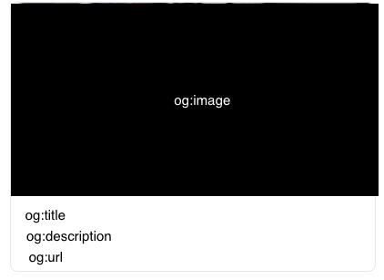

## og (Open Graph) Tag

카카오톡 메세지에 URL만 붙여넣어도 컨텐츠의 이름, 썸네일, 설명이 나타날 때가 있다. head 내부에 meta 태그로 데이터를 넘기면 카카오톡에서 링크를 읽어 미리보기를 띄워주는 것이다. 
링크 공유시 투박한 링크만 뜨는 것 보다 당연히 미리보기가 나타나는 것이 서비스에 좋을 것이다. 태그를 추가함으로써 검색이 더 잘 된다는 말도 있는데 사실인지는 모르겠다.

## 사용법

필요한 태그를 추가하면 된다. [공식 사이트](https://ogp.me/)를 참조하면 쉽게 사용할 수 있다. 태그는 `<head>` 안에 `<meta>` 태그로 넣으면 된다.

```html
<head>
    <meta property="og:title" content="Open Graph protocol">
    <meta property="og:type" content="website">
    <meta property="og:url" content="https://ogp.me/">
    <meta property="og:image" content="https://ogp.me/logo.png">
</head>
```

### Basic Metadata

- `og:title`: 컨텐츠의 제목
- `og:type`: 컨텐츠의 타입 (`video.movie` 등으로 작성이 가능하다. Youtube나 Vimeo의 경우 `video.other`를 사용한다.)
- `og:image`: 썸네일로 보일 이미지 링크
- `og:url`: 컨텐츠의 URL

### Optional Metadata

- `og:description`: 컨텐츠 description 
- `og:local`: 타겟 언어
- `og:site_name`: 사이트의 이름

## 카카오톡에서 사용되는 og 태그



- og:title
- og:url
- og:description
- og:type
- og:image
- og:site_name

[kakao developers](https://developers.kakao.com/tool/debugger/sharing) 사이트에서 채팅창 또는 카카오스토리에 공유할 URL을 넣고 메세지를 미리볼 수 있다. og 태그를 변경한 경우 변경 내용이 곧바로 적용되지 않고 캐싱된 내용이 한동안 출력될 수 있는데 이 사이트에서 캐시 초기화도 할 수 있다.

네이버도 비슷한 서비스를 제공한다! 밴드에 붙여넣었을 때 어떻게 보일지 테스트 할 수 있다.

## 참고하면 좋을 사이트
- [카카오톡 scrap(url 미리보기) 안될때 체크 리스트](https://devtalk.kakao.com/t/scrap-url/116202)
