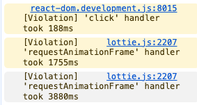

## 문제

버튼을 클릭할 때 마다 이벤트가 발생되는 다중 이벤트 출력 컴포넌트를 만들어야 했는데 Lottie로 전달받은 파일을 그리는데 성능 이슈가 있었다.
최초 애니메이션은 매끄럽게 그려지는데 그 이후의 이벤트부터 느려지더니 세 번째, 네 번째 이벤트 부터는 페이지가 멈추기 시작했다. 


*<N>ms의 lottie 이벤트 핸들러 지연이 발생하고 결국 멈춰버렸다..*

애니메이션 파일 용량이 너무 커서 그런가 하고 ChatGPT에게 파일 분석을 맡겼는데 애니메이션의 레이어 수가 많고 무거운 이펙트가 많다고 하기는 했다. 애니메이션 파일 크기가 81KB였는데 동일 기능을 구현한 타 서비스는 사용자가 애니메이션 파일을 업로드 할 수 있게 해줬고, 파일 크기 제한이 30KB였다. 일단 디자이너분께 이펙트를 몇 개 제거한 30KB 용량의 파일을 재요청 했으나 결과는 같았다.

그러다가 이 글을 발견했다.

[requestAnimationFrame handler took <N>ms problem #1733
](https://github.com/airbnb/lottie-web/issues/1733)

질문 작성자의 문제는 나와 비슷하게 최초 애니메이션은 정상 출력되나 두 번째에 re-built부터 애니메이션이 버벅이는 문제였다. 답변을 보니 생각지못한 해결법이 있었다.

```shell
animationData: JSON.parse(JSON.stringify(LikeAnim))
```

`animationData`를 이렇게 넣으면 해결될 거라고 한다.

실제로 넣어봤더니 진짜 해결이 되었다. 

## 원인

lottie 애니메이션은 복잡한 트리 구조의 JSON 객체로 구성된다. lottie 애니메이션을 로드하면 애니메이션 플레이어가 애니메이션 재생을 위해 JSON 데이터 구조를 내부적으로 수정하게 된다. 그런데 이 애니메이션 단일 객체를 다수의 lottie 애니메이션 컴포넌트 출력에 이용하면 거기가 문제가 발생하는 지점이다. 이전에 생성된 애니메이션 컴포넌트 실행을 위해 애니메이션 객체를 변형했는데 해당 가공된 객체가 다음 애니메이션 컴포넌트에 다시 사용됨으로써 충돌이 발생하는 것이다. 이때 메모리 누수가 함께 터지고 결국 페이지가 다운된다.

## 해결법

컴포넌트당 애니메이션 객체를 따로 주입하면 해결이 되는 것이다. `JSON.parse`, `JSON.stringify`를 사용하면 deep clone을 만들어져 애니메이션을 실행할 때마다 새 animationData 객체를 lottie에 전달하게 된다.

브라우저가 지원한다면 Javascript 함수인 `structuredClone`을 쓰는 것이 더 권장된다. `JSON.parse(JSON.stringify())`는 비용이 꽤 큰 연산이기 때문이다. `structuredClone`은 원본 JSON 객체의 deep copy를 만드는 API이다. 

```typescript jsx
const clonedData = structuredClone(animationData);
return (
    <Lottie
        renderer={"canvas"}
        animationData={clonedData}
        className={className}
        autoplay={true}
        loop={false}
        onComplete={onComplete}
    />)
```

이제 다수의 lottie 애니메이션 컴포넌트들이 독립적으로 화면에 잘 출력된다.

## 참고
- [requestAnimationFrame handler took <N>ms problem #1733
  ](https://github.com/airbnb/lottie-web/issues/1733)
- [MDN: structuredClone()](https://developer.mozilla.org/ko/docs/Web/API/Window/structuredClone)
