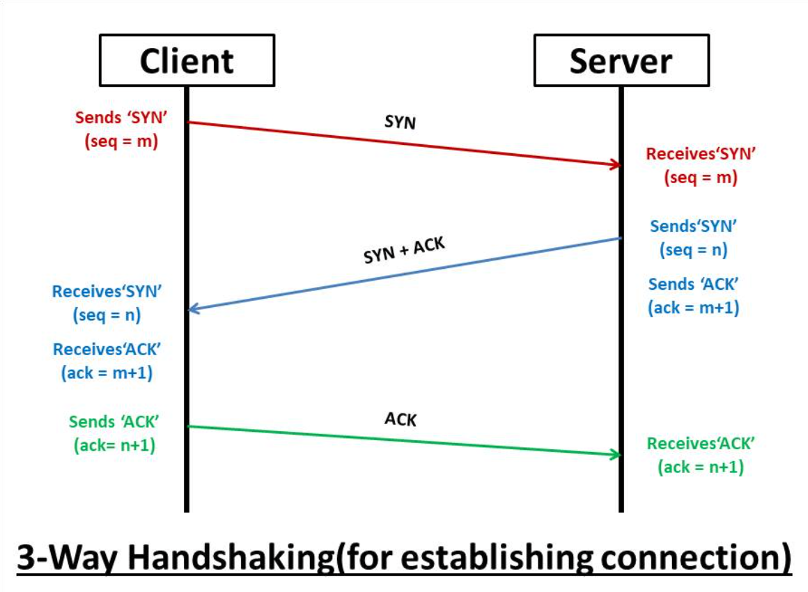
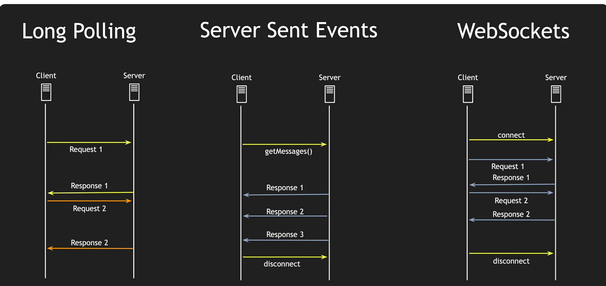

## HTTP 요청의 일반적 흐름

전통적으로 웹페이지가 데이터를 받기 위해서는 서버로 요청을 보내야만 한다. 그렇다면 클라이언트가 서버로 HTTP 요청을 보내면 어떤 일이 일어날까?



클라이언트 → 요청 → 서버 처리 → 응답 → 연결 종료 사이에서 그림처럼 3 handshake가 계속해서 발생한다. 단기적으로 필요한 데이터를 요청한느 경우 경제적이지만 데이터 업데이트를 감지하기 위해 계속해서 http 요청을 보내 데이터를 비교하는 것은 비용이 커질 수 있다. 이렇게 주기적인 요청을 보내는 방법을 polling이라 한다.

## SSE
SSE(server sent events)를 사용하면 웹페이지 요청 없이 서버가 클라이언트에 새로운 데이터를 전송할 수 있다. 또한 http 요청으로 보내지지만 둘의 가장 큰 차이점은 응답을 끝내지 않는다는 점이다.

```shell
클라이언트 → 요청 1번 → 서버가 응답을 계속 흘려보냄 (스트림)
                         data: {...}\n\n
                         data: {...}\n\n
                         data: {...}\n\n  ← 연결 유지
```

SSE는 단방향 연결로 웹소켓과 비슷하게 동작하지만 클라이언트에서 서버 방향으로는 이벤트를 전송할 수 없다. SSE의 또다른 장점은 스펙에 자동 재연결이 내장되어 있다는 점이다. 기본 3초로 브라우저가 서버로 연결이 끊겨도 자동으로 재연결을 시도한다.

## 간단 사용 예제

### 클라이언트 측

SSE는 EventSource 객체를 사용한다. 

```js
const evtSource = new EventSource("ssedemo.php");
```

`event` 필드 없이 전송된 메세지는  `message` 이벤트로 수신된다. 이벤트 핸들러를 추가해 감지할 수 있다.

```js
evtSource.onmessage = function (e) {
  const newElement = document.createElement("li");
  const eventList = document.getElementById("list");

  newElement.textContent = "message: " + e.data;
  eventList.appendChild(newElement);
};
```

이벤트에 이름을 명시했다면 그 이름으로 수신할 수도 있다.

```js
evtSource.addEventListener("ping", function (event) {
  const newElement = document.createElement("li");
  const time = JSON.parse(event.data).time;
  newElement.textContent = "ping at " + time;
  eventList.appendChild(newElement);
});
```

> 현재 HTTP/2를 사용하지 않는 경우 브라우저당, 도메인 당 6개 개수 제한이 있다. HTTP/2를 사용할 때는 기본 값이 100개이다.

### 서버 측

서버는 MIME 타입 `text/event-stream`을 사용해 응답해야 한다. 아래 코드는 NestJS 에서 구현한 코드이다.

```typescript
import { Injectable } from '@nestjs/common';
import { LiveStream } from '../interfaces/LiveStream.interface';
import { finalize, Observable, Subject } from 'rxjs';
import { MediaService } from '../media/media.service';

@Injectable()
export class LiveStreamService {
  constructor(private readonly mediaService: MediaService) {}

  private streamCache = new Map<
    string,
    {
      data: LiveStream;
      subscribers: Set<Subject<LiveStream>>;
      timer: NodeJS.Timeout;
    }
  >();

  subscribe(eventId: string): Observable<LiveStream> {
    const subject = new Subject<LiveStream>();

    if (!this.streamCache.has(eventId)) {
      // 첫 구독자가 생길 때만 서버 polling 시작
      this.startPolling(eventId);
    }

    const entry = this.streamCache.get(eventId)!;
    entry.subscribers.add(subject);

    // 캐시된 최신 데이터 즉시 전송
    subject.next(entry.data);

    return subject.asObservable().pipe(
      finalize(() => {
        // 구독자가 없어지면 polling 중단
        entry.subscribers.delete(subject);
        if (entry.subscribers.size === 0) {
          this.stopPolling(eventId);
        }
      }),
    );
  }

  private startPolling(eventId: string) {
    const fetchAndBroadcast = async () => {
      const data = await this.mediaService.getLiveInfo(eventId);
      const entry = this.streamCache.get(eventId);
      if (!entry) return;

      entry.data = data;
      // 연결된 모든 클라이언트에 동시 push
      entry.subscribers.forEach((sub) => sub.next(data));
    };

    const timer = setInterval(fetchAndBroadcast, 5000);
    this.streamCache.set(eventId, {
      data: null,
      subscribers: new Set(),
      timer,
    });

    fetchAndBroadcast(); // 즉시 1회 실행
  }

  private stopPolling(eventId: string) {
    const entry = this.streamCache.get(eventId);
    if (entry) {
      clearInterval(entry.timer);
      this.streamCache.delete(eventId);
    }
  }
}
```

나는 Map 객체를 두고 key 값을 사용해 데이터를 관리했다. 성능을 더 끌어올리려면 Redis를 두고 다중 서버에서 Redis에 접근해 데이터 업데이트를 확인하는 방식이 좋겠으나 일단 이 정도만 해도 요청 수가 극적으로 줄어들게 된다. 기존에는 클라이언트 1000명이 5초마다 POST를 보냈다면 이제는 클라이언트 1000명은 각각 SSE 연결만 유지하면 되기 때문이다. 

위 코드는 RxJS 없이도 구현이 가능하지만 Node.js Readable Stream으로 타이머, subscribers, 연결 종료를 수동으로 관리해야 한다. 정리 누락이 발생하면 메모리 누수로 이어질 수 있다.

```typescript
  @Get('/live/:eventId/stream')
  @Sse()
  sseLiveStream(
    @Param('eventId') eventId: string,
    @Query('vid') vid: string,
  ): Observable<MessageEvent> {
    this.liveStatisticsService
      .handleLiveHeartbeat({ eventId, vid })
      .catch((err) => this.logger.error(err));

    return this.liveStreamService
      .subscribe(eventId)
      .pipe(map((data) => ({ data: JSON.stringify(data) }) as MessageEvent));
  }
```

NestJS Controller 코드이다. SSE 연결 유지를 사용해 POST로 보내던 Heartbeat polling 요청도 삭제했다. 


이렇게만 보면 http는 연결을 바로 끊어버리는데 비해 sse는 연결을 계속 유지하는데 왜 비용이 덜 들까? 라는 의문이 들기 마련인데 비용 트레이드 오프를 따져볼 수 있는 지점은 HTTP 요청 오버헤드에 있다.
SSE는 최초 1회만 handshake가 발생하고 http 요청 헤더를 전송한 뒤로는 서버에서 데이터만 흘려보낸다. 서버 입장에서 생각하면 열린 소켓 하나를 계속 들고 있는 것이다. 메모리에 연결 객체만 유지하고 데이터가 없을 때는 아무 것도 하지 않는다.

## Websocket
Websocket은 그럼 언제 써야할까? 양방향 통신이 필요한 경우가 가장 적합하다. 채팅이 가장 일반적이다. 또한 SSE와 달리 연결이 끊겼을 때 재연결은 수동으로 처리해야 한다. 

## polling vs sse vs websocket



|Polling|SSE|WebSocket|
|--|--|--|
|방향| 단방향|단방향|양방향|
|프로토콜|HTTP|HTTP|WS|
|재연결|수동|자동|수동|
|적합한 경우|단순 주기 조회|서버 push|채팅, 게임|

## 결과

클라이언트 1000명 기준 서버로 향하던 요청이 초당 200개에서 컨텐츠당 1개로 줄었다. 프로세스에 polling이 있다면 이를 SSE 또는 WebSocket으로 전환할 수 없을지 구조를 뜯어보면 좋을 것 같다. 


## 참고
- [MDN SSE](https://developer.mozilla.org/ko/docs/Web/API/Server-sent_events/Using_server-sent_events)
