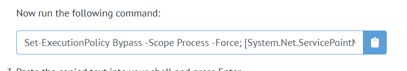
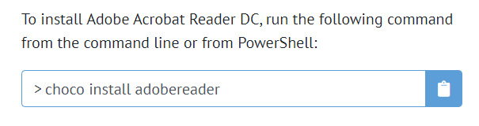
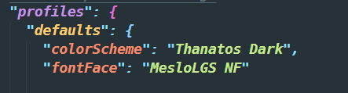

:rotating*light: \_nomadecoders의 윈도우 세팅 강좌 정리 내용*

## WSL : Windows Subsystem for Linux

WSL은 Windows10 2004 업데이트 부터 지원되는 기능이다. 2020년에 나온 업데이트 버젼인데 왜 이름을 이렇게 붙였는지는 모르겠다.
Linux 환경에서 뭔가 설치하는 것은 굉장히 쉽다. 터미널에서 명령어 한줄만 입력하면 알아서 설치가 진행된다. 반면에 Windows는 뭔가 복잡하고 잘 안될 때가 많다. 이런 경우 Linux 명령어를 사용할 수 있게 해주는 것이 WSL이다.

WSL을 사용하기 위한 작업들을 해보자.
먼저 ['chocolately'](https://chocolatey.org/)를 사용해볼 수 있다.

## chocolately 설치 방법

먼저 chocolately 공식 홈페이지의 [다운로드](https://chocolatey.org/install) 링크로 들어간다.

설치 방법이 상세하게 나와있지만 필요한 것은 command문 뿐이다.



command문을 복사하고 Windows에서 `Power Shell`을 _관리자 권한_ 으로 실행하여 복사한 명령어를 입력하면 chocolately가 설치된다.
Powershell을 종료하고 다시한번 관리자 권한으로 실행 후

```
choco
```

커맨드를 입력했을 때 버젼 정보가 출력된다면 정상적으로 설치가 된 것이다.

## 패키지 검색

[패키지 검색 링크](https://chocolatey.org/packages) 여기서 많은 패키지를 볼 수 있다. 대부분 필요한 sw는 여기 모두 올라와 있을 것이다.

`Acrobat Reader` 설치 페이지에 들어와 설치 커맨드를 찾았다. Powershell에서 위 명령어를 입력하기만 하면 Acrobat Reader를 공식 홈페이지에 들어가 설치 파일을 다운 받지 않아도 설치할 수 있다! 이 외에도 Git, Chrome, Python 등 다양한 패키지가 올라와있다.

## Windows Terminal 설치하기

Powershell도 좋지만 커스터마이징이 가능한 리눅스 환경을 조성하기 위해 Windows Terminal을 사용할 수 있다.
choco를 사용해 설치해보자.

```
choco install microsoft-windows-terminal
```

빠르게 설치가 진행된다.

## WSL 설치하기

[WSL MS 설치 링크](https://docs.microsoft.com/en-us/windows/wsl/install-win10) 여기서 확인해 볼 수 있다.

```
dism.exe /online /enable-feature /featurename:Microsoft-Windows-Subsystem-Linux /all /norestart
```

위 커맨드를 admin 권한으로 실행한 Windows Terminal에서 실행하면 금방 설정이 완료된다. 이제 컴퓨터가 WSL을 사용할 수 있는 상태가 된 것이다. 아직 설치가 된 것은 아니고 *enable*만 시킨것이다.

## Ubuntu 설치하기

MS store에서 `Ubuntu 18.04`를 설치했다. 설치 후 컴퓨터를 재부팅 시키자.
설치된 Ubuntu를 실행하면 새로운 unix 사용자 계정을 만들도록 한다. 적당히 만들어주면 설치는 완료된다.

## WSL2 설치

[링크](https://docs.microsoft.com/en-us/windows/wsl/install-win10)
이제 WSL을 설치할 수 있다.

위 링크에서 설치 command를 복사한다. 그리고 Windows Terminal을 관리자 권한으로 실행한다. 명령어를 입력하고 설치가 완료되면 컴퓨터를 재부팅 해야한다.

`wsl 2`를 wsl명령어의 기본 세팅으로 한다.

```
wsl --set-default-version 2
```

여기서 오류가 발생한다면 [업데이트 링크](https://docs.microsoft.com/en-us/windows/wsl/wsl2-kernel) 여기서 커널 업데이트 파일을 설치하고 명령어를 다시 실행하면 해결 될 것이다.

이제 wsl에 우리가 설치한 Ubuntu에 대한 정보를 줘야 한다.

```
wsl --list --verbose
```

이전에 설치한 우분투의 버젼과 이름이 출력될 것이다. 이 정보를 이용해 아래 명령어를 입력한다.

```
wsl --set-version `우분투 이름` `버젼`
```

- 이때 list에 나온 버젼이 1 이더라도 2로 설정하면 자동으로 업데이트 되어 설정된다 \*

여기까지 하면 우분투를 WSL 환경에서 사용할 준비는 끝난 것이다! :rocket:

## 커스터마이징

Windows Terminal을 관리자 권한으로 실행하면 Powershell이 뜰 것이다. 탭 옆의 화살표를 눌러 `설정`으로 들어가면 VS code가 실행되면서 설정 파일이 나타난다. 여기서 터미널의 테마를 설정할 수 있다.
[Terminal Splash](https://terminalsplash.com)에서 다양한 테마를 찾아볼 수 있다. 마음에 드는 테마를 골라 코드를 복사하고 다시 설정 파일로 돌아온다.

코드에서 `scheme`을 찾아 방금 복사한 내용을 `[]` 브라켓 안에 붙여넣는다. 이때 코드가 `name`을 포함하고 있지 않다면 속성을 새로 만들어주고 그렇지 않다면 그대로 둔다.
이름을 복사하고 설정파일 위쪽을 보면 `profiles` 내부에 `defaults` 속성이 있다.

나는 위와 같이 설정했다. `font`는 아래 다른 커스터마이징 작업에서 필요한 속성이다. 설정파일을 저장하고 터미널을 확인하면 테마가 바로 적용되어있는 것을 확인할 수 있다.

## zsh 사용하기

bash를 사용할 수도 있지만 더 예쁜 커스텀과 확장된 기능을 위해 zsh를 많은 개발자들이 사용한다. 그래서 나도 따라 설치해봤다. bash과 zsh의 차이점은 [여기](https://en.wikipedia.org/wiki/Comparison_of_command_shells)서 확인할 수 있다.

zsh를 설치하기 위해 `oh my zsh`를 사용하자. `oh my zsh`는 zsh 설치를 위한 오픈소스 커뮤니티 프레임워크이다. [링크](https://github.com/ohmyzsh/ohmyzsh) 위 깃허브 저장소에서 설치방법을 알려주고 있으니 그대로 따라하면 된다.

zsh의 설정 파일은 `~/.zshrc`이다. `~`는 root를 의미한다. 테마를 바꾼다거나 명령어를 수정할때 저 파일을 수정하면 된다. 예시로 `python`명령어를 입력했을 때 `python3`이 실행되도록 하고 싶다면 위 설정 파일에서 `alias`를 지정하면 된다.

```
alias python=python3.8
```

## zsh 커스터마이징

zsh에도 다양한 테마들이 있다. 그 중 강의에 나온 `Powerlevel10k`를 적용시켰다.
[링크](https://github.com/romkatv/powerlevel10k) Readme.md에서 자세한 설치방법을 알려준다. 주의할 점은 폰트파일을 설치하고 적용해야 제대로 사용 할 수 있다는 것!


커스텀이 끝난 내 터미널.. 너무 예쁘다. 여기서 작업을 안 할 수가 없다.

## vs code 터미널 변경

vs code의 터미널을 실행해보면 여전히 bash를 사용하고 있는것을 볼 수 있다. 열심히 커스텀한 터미널 환경을 사용하도록 설정을 바꿀 수 있다.
vs code의 설정으로 들어가 `Terminal > Integrated > Automation Shell:Windows`를 찾아 `settings.json`으로 들어간다.


그리고 `"terminal.integrated.shell.windows"` 속성을 wsl로 바꿔주면 된다.

```
"terminal.integrated.shell.windows": "C:\\WINDOWS\\System32\\wsl.exe",
```

vs code를 새로 실행하고 terminal을 실행하면 wsl이 실행된다. 여기서도 폰트를 바꿔야 제대로 적용되는데,

터미널의 `Integrated : Font Family` 설정을 위 글꼴로 설정하면 해결된다.

중간 중간 잔오류가 발생하고 실수를 하는 바람에 우분투를 다시 설치하기도 하고 생각보다 오래 걸렸다. 하지만 완성된 터미널을 보면 시간이 아깝지는 않다. :fire:
