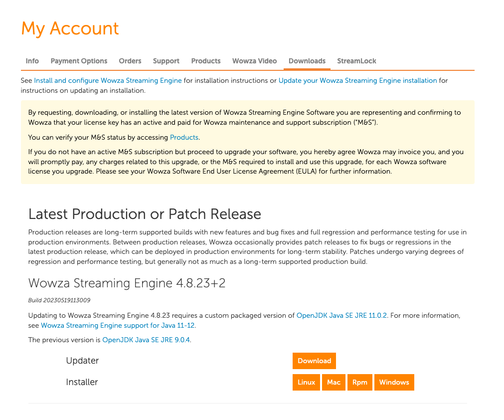

## HLS와 LL-HLS

LL-HLS는 기존의 HLS를 확장한 프로토콜이다. HLS는 미디어를 segment라는 쪼개진 단위로 잘라 전송하는 프로토콜인데 segment duration 만큼의 latency가 발생할 수 밖에 없는 한계점을 가지고있다. HLS가 처음 발표되었을 때 기본 스펙에서는 30초의 latency를 가지고 있었으나 스트리밍 서버 튜닝으로 8~10초대로 latency를 낮추는 것이 가능했다. LL-HLS는 HLS와 달라진 동작 방식으로 latency를 2-8초 대로 단축시킨다. 

### 차이점

두 프로토콜의 차이점을 간단하게 살펴보면 아래와 같다.

- HLS의 segment가 더 작은 단위로 쪼개진다. 이 `mini segment`는 segment가 오래 지속되는 것에 비해 짧은 시간만 존재한다.
- playlist가 `Preload Hints` 정보를 가지고 있으며 이를 통해 다운로드되어야 하는 데이터릐 크기를 미리 알 수 있다. 이를 통해 오버헤드가 줄어든다. 하지만 필수적으로 포함되는 태그는 아니다.
- 각 playlist마다 독립적인 식별자를 가지고있어 캐싱이 쉬워진다.

### LL-HLS vs LL-DASH

LL-HLS와 LL-DASH는 비슷한 프로토콜이지만 동작 방식이 약간 다르다.LL-HLS에서 segment가 mini segment, 혹은 part로 쪼개진다고 표현하는데 비해 LL-DASH는 chunk 혹은 fragment로 나누어진다고 표현한다. LL-DASH에서는 이 chunk들이 HTTP CTE(Chunked Transfer Encoding)으로 전송된다. 그래서 origin은 segment 전체가 인코딩되어 플레이어에 전송할 준비가 될 때까지 기다릴 필요가 없이 첫 번째 chunk가 전송 준비가 끝나는 즉시 전송할 수 있다.
LL-HLS에서 각 part는 독립적으로 읽는 것이 가능하다. 하나의 완전한 segment 단위로도 가능하며 아주 작은 byte 단위의 파일도 읽을 수 있다. 반면 LL-DASH의 장점은 manifest 업데이트에 의존하지 않는다는 점이다. 하지만 LL-HLS는 각 part에 대한 추가정보를 기재할 수 있다는 것이 장점이겠다.
하지만 LL-DASH는 재생되지 않는 디바이스들이 있으니 주의해야 한다.

LL-HLS는 이제 HLS 표준에 합쳐졌다. 기업에서도 안심하고 사용해볼 수 있을 것으로 보인다. 

## Wowza Streaming Engine


Wowza Streaming Engine은 미디어 서버 구축시 흔하게 사용되는 소프트웨어이다. 다양한 스트리밍 프로토콜과 미디어 형식을 지원하며 다양한 서버 옵션 커스터마이징이 가능하다. 가격은 기본 한 달에 195$로 책정되어있다. 

## 설치

소프트웨어를 구매했거나 Trial 계정을 생성했다면 `My Account`에서 다운로드 탭에 접근 할 수 있다.



OS에 맞는 소프트웨어를 설치하면 된다. 나는 MacOS에 설치했다. EC2 같은 서버를 띄워 설치한다면 엔진 소프트웨어가 사용하는 포트를 열어놓아야 한다.

### Ports

아래 포트들을 사용하니 방화벽 설정 등을 미리 해놓고 설치하면 편하다.

| Ports | Description|
|---|---|
|TCP 1935	|RTMP/RTMPE/RTMPT/RTSP-interleaved streaming and WOWZ™ streaming|
|TCP 8086-8088|	Administration|
|UDP 6970-9999|	RTP UDP streaming|
|TCP 80|	HLS, MPEG-DASH, and RTMPT streaming|
|TCP 443 |	SSL/TLS streaming (RTMPS and HTTPS)|
|TCP 554 |	RTSP streaming|

## SSL/TLS 인증서 등록

LL-HLS 재생은 SSL/TLS 포트를 통하지 않고서는 동작하지 않는다. HTTPS 재생이 가능하도록 인증서를 등록해야 한다. WowzaStreamingEngine의 라이센스가 있다면 Wowza StreamLock 인증서를 사용해 쉽게 적용할 수 있다. [공식 문서](https://www.wowza.com/docs/how-to-get-ssl-certificates-from-the-streamlock-service)도 잘 나와있다.

### 인증서 등록하기

Wowza 로그인 후 **Account Management**로 들어가 **StreamLock** 탭으로 들어간다.


가지고 있는 라이센스 키를 선택하고 인증서를 사용할 서버의 IP 주소를 입력 후 아래 `Apply for SSL Certificate` 버튼을 누르면 아래쪽 **My SSL certificates**에서 생성된 인증서를 볼 수 있다. 


`Download certificate`를 누르면 팝업이 나타나며 패스워드를 입력하도록 한다. 이 때 입력한 패스워드는 뒤에서 또 사용되니 잘 기억해두어야 한다.
인증서 생성 시 입력한 IP 주소를 바꾸고 싶다면 `Change` 버튼을 누르면 된다. 생성된 인증서를 다운로드 받아 Wowza Steraming Engine 설치 위치의 `/conf` 디렉토리에 파일을 옮겨놓는다.

파일을 옮겨놓았다면 Wowza Streaming Engine Manager로 들어와 **Server** 탭으로 이동한다.


그리고 **Virtual Host Setup**을 눌러 **Edit**에서 `+Add Host Port...`를 누르면 포트 설정 팝업이 나타난다.


- Name: 인증서 이름
- Type: **Streaming** 선택
- IP Address: * 을 입력하여 모든 트래픽을 허용할 수도 있고 특정 IP 주소를 입력할 수도 있다.
- Port(s): 443
- Enable SSL/StreamLock: enable 필요
  - Keystore Path (StreamLock certificate path): 인증서(.jks 파일) 저장 경로
      - 인증서 이름은 `5ab4321c0d123.streamlock.net` 이러한 형태를 가지고 있다.
      - ```text
        ${com.wowza.wms.context.VHostConfigHome}/conf/[인증서 도메인 이름].jks
        ```
- Keystore Password: 인증서를 만들 때 입력했던 패스워드
- Use WebRTC: WebRTC 스트림을 사용한다면 enable 하면 되지만 LL-HLS 이므로 체크를 해제했다.

### 설정 테스트

아래 명령어로 인증서 설정이 잘 되었는지 확인할 수 있다.

```bash
openssl s_client -connect [ssl-certificate-domain-name]:443
openssl s_client -showcerts -connect [ssl-certificate-domain-name]:443
```

인증서가 출력되면 설정이 잘 된것이고 timeout이 발생하면 설정에 문제가 생긴 것이다. 설정을 다시 한 번 확인해봐야 한다.

## 참고 링크
- [Understanding wowza streaming engine](https://www.wowza.com/docs/understanding-wowza-streaming-engine)
- [Deliver Low-Latency HLS live streams using Wowza Streaming Engine](https://www.wowza.com/docs/deliver-apple-low-latency-hls-live-streams-using-wowza-streaming-engine)
- [How does LL-HLS work](https://www.theoplayer.com/blog/how-does-ll-hls-work)
