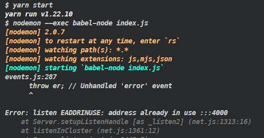

vs code에서 서버를 열고 사용하다보면 창을 reload 한다던가 하여 터미널 창이 지워질 때가 있다. 이 경우 더이상 이 터미널에서 서버 상태 로그를 볼 수 없고 서버를 멈출 수도 없다.



*바로 이런 경우..*

이 경우 cmd로 들어가 강제로 종료시켜야 한다.

## 사용중인 프로세스의 pid 확인

```
$ netstat -ano
```


cmd 창에서 위 명령어를 입력하면 프로세스의 pid를 확인할 수 있다. 강제종료시킬 포트의 pid를 확인한다.
## 강제 종료

```
$ taskkill /f /pid [pid]
```


명령어를 입력하면 강제종료를 시킬 수 있다.
