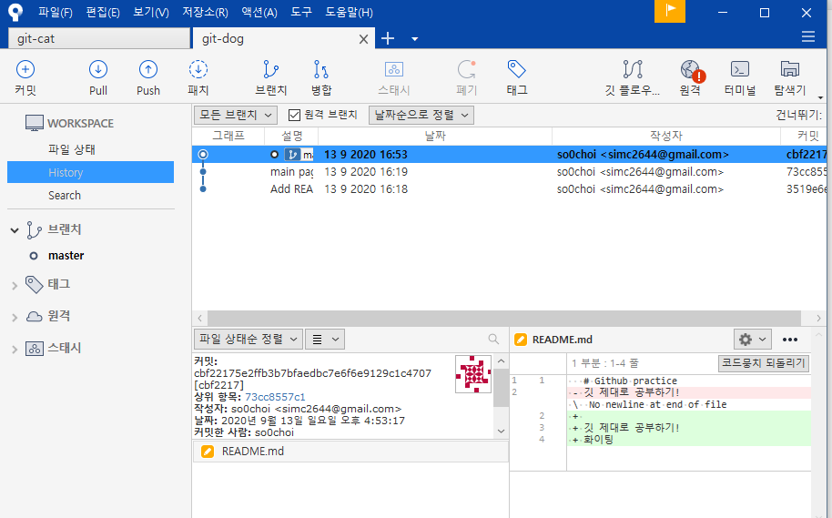

## Git 명령어

git은 CLI 버젼과 GUI 버젼 두 개의 버젼이 있다. 자신에게 편한 것으로 사용하면 될것 같다.

- `git init` : git으로 버젼관리를 시작하는 명령어다. 명령어를 입력하면 프로젝트 폴더 내부에 `.git` 이라는 숨은 폴더가 생성된다.

- `git add file` : 버젼 관리에 추가될 파일들을 선택할 수 있다. `file 이름`을 작성해도 되고 폴더 내부의 모든 파일을 선택하고 싶다면 `.` 만 붙여줘도 된다.

- `git commit -m "message"` : 버젼관리 덩어리라고 생각하면 된다. 메세지를 입력해 어떤 부분을 작성한 코드인지 명시해주면 좋다.

  예를 들어, 로그인 기능을 구현했다면 수정된 파일들을 `add`한 뒤에 `commit` 메세지로는 `Add login feature` 라고 작성할 수 있겠다. `add .` 로 모든 변경 사항을 추가하면 편리하긴 하지만 이후에 나, 혹은 다른 팀원이 어떤 기능을 구현하는데 어떤 코드가 수정되었는지 확인이 용이하게 하기 위해서 메세지를 제대로 작성해두는게 좋다.

- `git remote add origin '레파지토리 주소'` : 로컬에 생성한 로컬 git 저장소에, 원격 git 저장소를 연결하는 명령어이다.
  `origin`은 원격 저장소의 이름이다.
- `git push '원격저장소 이름' 'branch 이름'` : 지정한 원격 저장소에 git의 commit한 파일들을 올리는 명령어이다.
- `git clone` : 다른 원격 저장소를 내 컴퓨터에 받아오는 명령어이다. `clone`을 사용하면 `.git` 폴더가 자동으로 생성된다.
  위치를 지정하지 않을 경우 현재 위치하는 폴더에 레파지토리 이름의 폴더를 새로 생성하고 그 내부에 파일들을 저장한다.
  현재 위치에 바로 파일을 저장하고 싶으면 다음과 같이 위치를 지정해주면 된다.
  `git clone 'git repository url' .`
- `git pull` : `clone`한 저장소의 내용이 변경될 경우 `pull` 명령어를 사용해 변경된 내용을 가져올 수 있다. `push`의 반대되는 단어 `pull`을 사용한다는 것을 생각해보면 이해가 쉽게 되는 것 같다.

### git에서 사용되는 파일의 상태

git에서 `add`를 한다는 것은 add한 파일들의 수정 사항을 이제부터 track 하겠다는 뜻이다. `commit`은 `add`된 파일들에 한해서 진행되는데 `add`한 파일들의 상태를 `stage`되었다고 표현한다.
한 번 `add`한 파일들은 `stage`에 계속 올라가있게 된다. 하지만 내용이 계속해서 쓰여지는 것은 아니고, 파일에 수정이 없다면 `수정없음` 상태로 버젼이 저장된다.

## Git GUI 사용하기

Git GUI로 GIT 자체에서 만든 Desktop도 있는데 그동안 많이 봐왔던 `Sourcetree`를 사용해보기로 했다.

[Sourcetree](https://www.sourcetreeapp.com/) 여기서 설치파일을 다운로드 할 수 있다. 빠르게 설치가 되는데 `bitbucket` 계정이 있어야만 사용할 수 있으므로 설치과정중에 생성하면 된다.



UI가 굉장히 깔끔하다.


탭 이동을 한 번 해야 log를 확인할 수 있었던 Git Desktop과 달리 한 눈에 commit log를 확인할 수 있었다.

Sourcetree도 몇가지 단점이 있는데, 찾아본 결과 인증이 풀릴때마다 새로 인증해야 한다는 점 등이 많이 보였다. 하지만 Jira를 만든 회사에서 만든 git 관리 sw 이므로 사용해보는 것도 나쁘지 않은 것 같다.

## branch

하나의 base를 가지고 새로운 가지를 만드는 작업이다. 한개의 브랜치에서 여러사람이 작업하다보면 충돌이 발생할 수 있기 때문에 위험 부담을 줄이기 위한 작업이다.
이후 나눠진 브랜치를 합치는 과정에서 충돌이 발생해도 나중에 해결 할 수 있으니, 하나의 브랜치에서 모든 작업을 하는 것 보다는 브랜치를 나눠 작업하는 편이 좋다.

### branch 명령어

- `git branch 'branch name'` : 브랜치를 생성한다
- `git checkout 'branch name'` : 브랜치로 HEAD를 이동시킨다.
- `git merge 'branch name'` : 현재 브랜치에 target branch를 병합한다. 이때 conflict가 발생하면 git은 어느 부분에서 소스 코드 충돌이 일어났는지 표시해주므로 직접 파일을 수정해야한다.

## fork

`fork` 또한 `branch` 처럼 협업을 위해 분기점을 나누는 방식이다. fork를 하면 원본 저장소의 내용을 통째로 복사해오지만 원본 저장소의 깃 로그에는 fork한 저장소의 작업 내용은 나타나지 않는다. 따라서 더 자유롭게 작업할 수 있다.

브랜치의 불편한 점은 다수의 사용자가 다수의 브랜치를 만들면 관리하기 힘들다는 점이다. 이럴 경우 포크가 좀 더 유용하게 사용될 수 있는데, 포크의 단점은 원본저장소의 작업 이력을 보기위해서는 따로 주소를 추가해줘야 한다는 점이다.

## 브랜치 관리

- master / dev : 베이스가 되는 브랜치. 직접적인 기능 구현을 하지 않기 때문에 `commit`이 발생하지 않고 `merge`만 하게 된다.
- feat/기능이름 : 큰 프로젝트에서 한 사람이 맡은 기능을 구현할 때 사용하게 되는 브랜치이다.
- release / latest : dev 브랜치에 기능 구현이 모두 merge 된 후에 배포를 위해 `release`혹은 `latest` 브랜치에 머지시키고 이를 배포한다.

## git 히스토리 삭제

1. `.git` 폴더를 삭제해야 한다.

   ```
   rm -rf .git
   ```

2. 새로운 git을 시작한다.

   ```
   git init
   ```

3. git 저장소 연결 후 강제로 push 시킨다.

   ```
   git remote add origin .....
   git push -u --force origin master
   ```

## 추가 명령어

- `rebase` : conflict가 나지 않는 상태로 새로운 commit을 할 수 있다.
- `amend`: 이전에 수행한 커밋에 새롭게 추가한 파일을 추가하는 명령어
- `cherry-pick` : 커밋 하나만 떼서 현재 내 브랜치에 붙이는 명령어
- `reset` : 옛날 커밋으로 되돌리는 기능
- `reverse` : 커밋의 변경사항을 되돌리는 기능. 히스토리는 남아있다.
- `stash` : 변경사항을 잠시 킵 해두는 기능

### 갑자기 Git을 공부하는 이유..

프로젝트 소스 코드는 GitHub에 올려두는 편이고 기본 명령어를 사용해 큰 어려움 없이 사용하고 있었는데, 내가 나의 한계를 느꼈던 때는 협업 프로젝트 버전 관리를 Git으로 했을 때 였다. `commit`, `push` 밖에 몰랐던 나는 버젼이 엉키고 브랜치를 어떻게 관리해야 하는지 알지 못했고 Git을 사용하는 가장 큰 장점들을 잘 써먹지 못해 아쉬움이 많이 남았다. 그래서 Git 사용방법을 제대로 공부하고 정리해놓아야 겠다는 필요성을 느꼈다.

## Reference

[Github 협업 튜토리얼](https://milooy.wordpress.com/2017/06/21/working-together-with-github-tutorial/)
