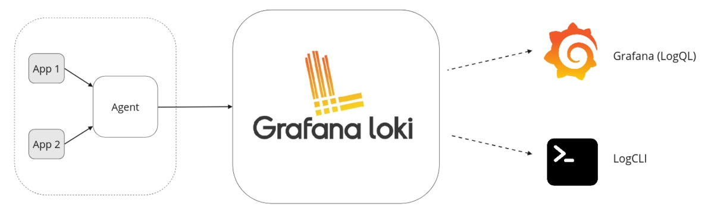
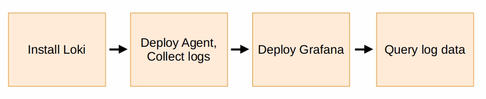
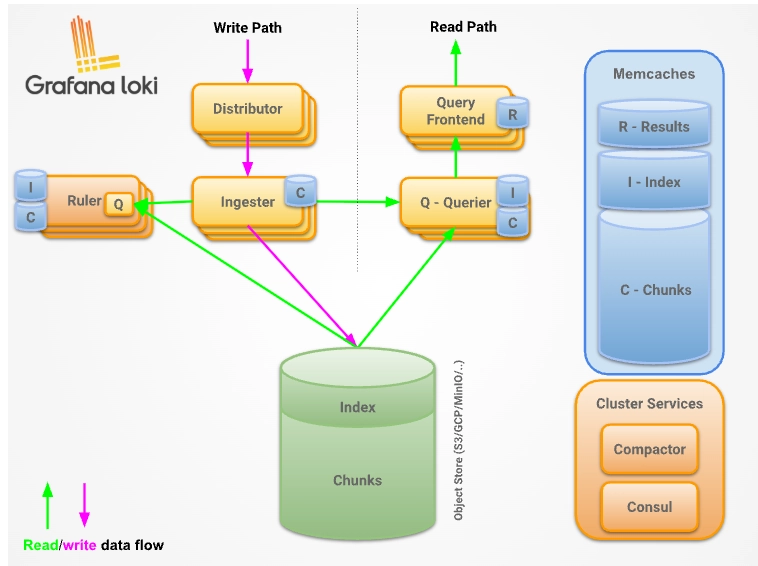
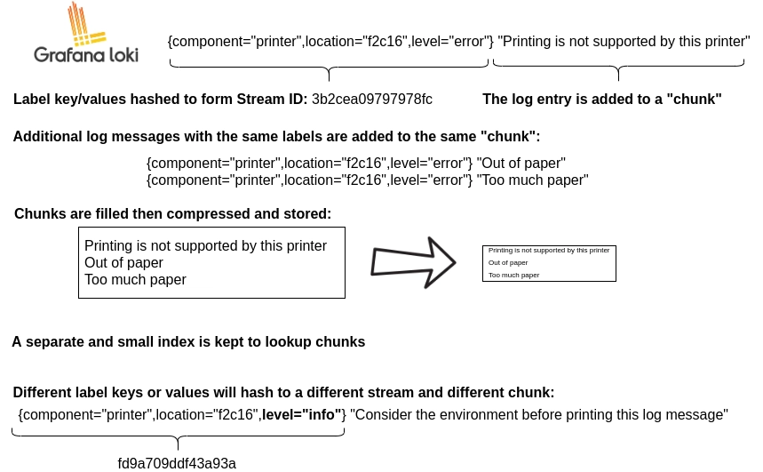

## Loki & Grafana

Grafana Loki는 로그의 수집, 저장, 조회를 위한 오픈소스 로그 관리 시스템이다. 인덱스 크기가 작고 고압축된 청크를 사용해 저장 비용이 낮은 것이 특징이다.

### 내가 생각했던 Loki 도입의 필요성

운영팀은 이미 Zabbix를 사용해 에러 탐지를 수행하고 있다. 하지만 Zabbix 접근은 개발팀에서는 하고 있지 않으며, Zabbix는 주로 운영 관제 및 특정 패턴 기반 로그 감지에 초점이 맞춰져 있어, 개발자가 장애 발생 시 로그를 탐색하고 원인을 분석하기에는 한계가 있다.

Loki + Grafana를 도입할 경우, 개발자는 다양한 서비스의 로그를 하나의 인터페이스에서 통합 조회하고, 특정 requestId, API, 사용자 기준으로 로그를 탐색할 수 있어 장애 원인 분석 시간을 줄일 수 있다.

> Zabbix는 감지 / Loki는 분석

## Loki

Loki는 로그를 저장하고 조회하는 분산 로그 데이터베이스이다.

프로메테우스의 영향을 받았으며 비용 효율적이고 쉽게 적용할 수 있도록 설계되었다. 핵심 특징은 로그 전체 내용을 인덱스하는 것이 아닌 각 로그 스트림에 라벨을 붙인 것을 인덱스해 로그를 쿼리할 때 더 적은 양의 데이터를 탐색해 높은 검색 성능과 비용 효율을 동시에 확보한다는 점이다.

## 언제 사용할까

다음과 같은 상황에서 유용하다.

- 여러 서비스의 로그를 한 곳에서 모아두고 보고 싶을 때
- requestId 기반의 요청 흐름 추적
- 로그 분석을 위한 필터링 및 탐색이 필요할 때
- 비용 효율적인 로그 저장이 필요할 때

로그 스트림은 같은 라벨을 사용하는 로그들의 집합이다. 라벨은 loki가 데이터 저장소에서 로그 스트림을 검색하는 것을 도와준다. 청크된 로그는 Amazon S3 또는 Google Cloud Storage 등의 저장소에 저장될 수 있다.

일반적인 로그 수집은 다음의 구조를 따른다.

일반적인 loki 로깅 스택은 세개의 컴포넌트로 구성된다.

- Agent: Grafana Alloy와 같은 로그 스크레이핑 에이전트이다. 로그에 라벨을 붙여 stream으로 변환시키고 HTTP를 통해 로그 스트림을 Loki로 전송해준다.
- Loki: 메인 로그 서버이다. 로그를 분석하고 저장하며 쿼리를 수행한다. 구성하는 방법은 여러가지가 있다.
- Grafana: 로그 데이터를 쿼리해 시각화해준다. LogCLI를 사용해 직접 커맨드라인에서 로그를 쿼리하는 것도 가능하다.

## Loki Architecture

Loki는 모든 컴포넌트의 코드를 컴파일해 하나의 바이너리 또는 도커 이미지로 만들도록 설계되었다.

데이터를 저장하는 포맷은 두 가지가 있다.

- index: 로그가 어디 저장되어있는지를 나타내는 라벨들이 저장된 테이블
- chunk: 특정 라벨 집합을 위한 로그 컨테이너

label로 설정한 metadata들을 hash한 값을 stream id로써 가지고 있고 로그 내용은 chunk에 저장된다. 같은 label을 가지는 로그들은 같은 chunk에 저장될 것이다. chunk들은 압축되어 저장된다. label 값이 달라지면 당연히 해시값이 달라져 다른 chunk에 저장된다.

## Grafana Alloy

애플리케이션에서 로그 수집을 담당하는 에이전트이다.  로그, 메트릭, 트레이스를 수집할 수 있는 통합 에이전트로 Loki에 로그를 전송해준다.
