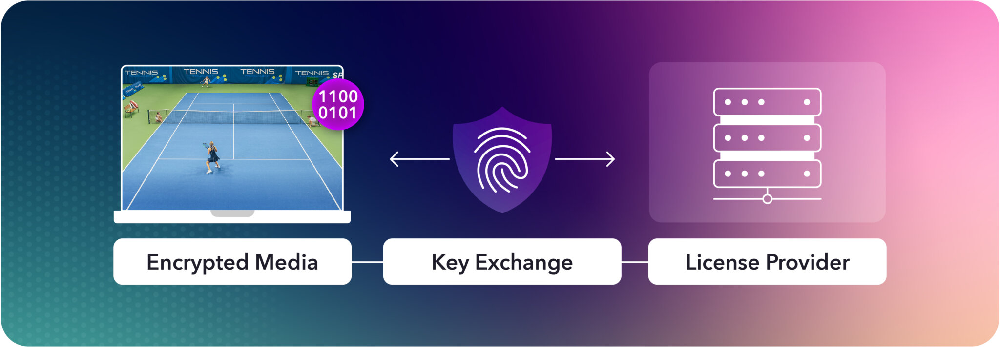

DRM(Digital Rights Manageme)은 보호되는 컨텐츠에 접근 제한을 걸어 인증되지 않은 사용자의 접근을 제한하는 기술이다. DRM 기술을 사용하는 가장 큰 목적은 인증되지 않은 사용자가 디지털 컨텐츠를 무단으로 복제하거나 수정하는 것을 막는 것이다.

DRM 소프트웨어 솔루션은 주로 세 가지 기능을 제공한다.
- Encryption: 컨텐츠를 암호화하여 인증되지 않은 사용자는 컨텐츠를 이용하지 못하도록 한다.
- Licensing: key나 license를 사용해 인증된 사용자인지 검증하여 컨텐츠 접근을 허용하거나 거부한다.
- Authenticaiton: 컨텐츠 접근자의 신원을 확인한다.


## 영상에서 사용되는 DRM 시스템

주요 DRM 시스템은 세 가지가 있다. 각 시스템이 지원하는 플랫폼과 영상 프로토콜이 달라 DRM 제공자라면 모든 시스템을 구현해야 한다.

| DRM | 플랫폼              | 영상 프로토콜 |
|--- |------------------| ---|
|Google Widevine | Chrome / Android | DASH / HLS |
| Apple FairPlay | Safari / iOS| HLS |
|Microsoft PlayReady | Edge / Windows| DASH 중심 |


## 영상 스트리밍에서 DRM 재생 원리


*https://optiview.dolby.com/resources/blog/streaming/what-is-drm-understanding-digital-rights-management/*

영상의 경우 사전에 영상 파일을 암호화 해두고 CDN에 올려둔 뒤 재생하는 순간에 요청자가 재생 권한을 가지고 있는지 DRM 라이선스 서버엣서 확인해 플레이어 안의 CDM(Conent Decryption Module)이 복호화 키를 받아 재생하는 구조이다.

### 재생 흐름

재생 흐름을 간단하게 나타내면 아래와 같다.

```shell
Player
   │
   │ manifest.m3u8      # 1. 플레이어가 manifest 요청
   ▼
CDN
   │
   │ encrypted segment  # 2. manifest 안에 DRM 정보 포함 
   ▼
Player
   │
   │ license request   # 3. 플레이어가 license 서버 요청
   ▼
License Server         # 4. license 서버에서 권한 확인 
   │
   │ decryption key    
   ▼
CDM                    # 5. CDM이 key 받아 복호화
   │
   ▼
Playback               # 6. 영상 재생
```


