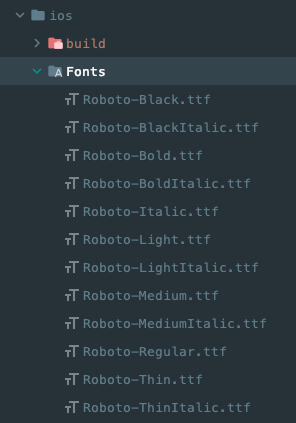
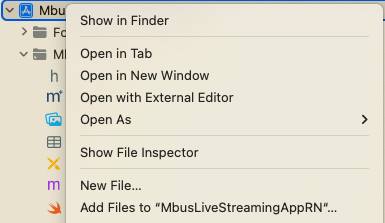
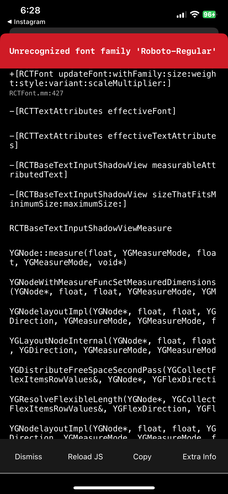
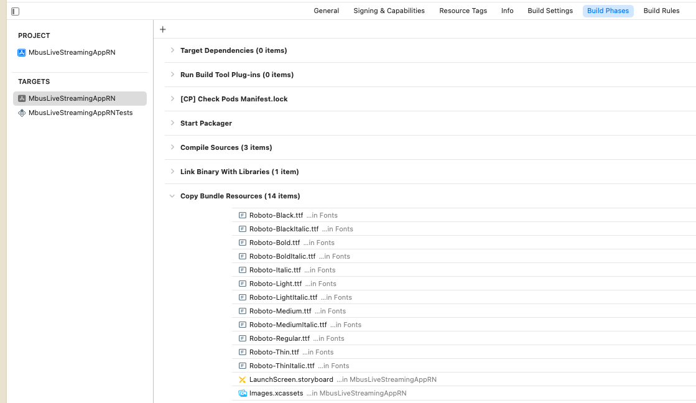
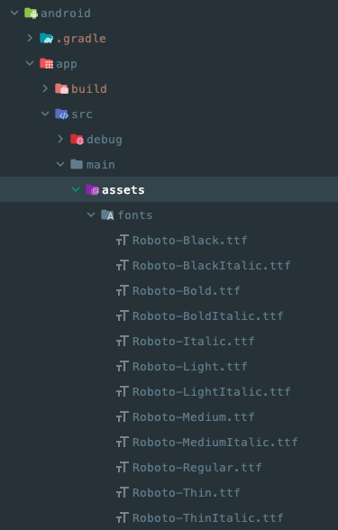

폰트 적용하는데 꽤 어려움을 겪었다. 그래서 내용을 정리 해놓으려 한다. iOS와 Android 각각 적용해야 한다. 구글링을 하다보니 `react-native-asset`을 쓰는 방법도 있는 것 같은데 나는 아래의 방법으로 적용했다. 참고한 블로그들이 정말 도움이 많이 되었다.

## iOS

`ios/Fonts` 폴더를 만들어서 그 안에 폰트 파일을 복사한다.



xcode를 실행하고 왼쪽 상단의 프로젝트명을 오른쪽 클릭하여 `Add Files to "project_name"`을 클릭한다.



방금 생성한 `ios/Fonts`를 선택하고 아래와 같은 옵션으로 `Add` 버튼을 누른다.


왼쪽 상단의 프로젝트명을 누르고 나타나는 창에서 `TARGETS`를 프로젝트명을 선택한다. 위에 나타나는 탭에서 `Info`를 선택하여 `Fonts provided by application` key를 찾아 폰트명으로 항목을 하나씩 추가시킨다. 파일 형식과 소문자, 대문자 모두 똑같이 입력해야 오류가 발생하지 않는다. 일일이 추가하기 귀찮다면 `ios/프로젝트명/Info.plist` 파일에 내용을 추가해도 된다.

```
<key>UIAppFonts</key>
  <array>
	 <string>AntDesign.ttf</string>
      <string>Entypo.ttf</string>
      <string>EvilIcons.ttf</string>
      <string>Feather.ttf</string>
      <string>FontAwesome.ttf</string>
      <string>FontAwesome5_Brands.ttf</string>
      <string>FontAwesome5_Regular.ttf</string>
      <string>FontAwesome5_Solid.ttf</string>
      <string>Foundation.ttf</string>
      <string>Ionicons.ttf</string>
      <string>MaterialIcons.ttf</string>
      <string>MaterialCommunityIcons.ttf</string>
      <string>SimpleLineIcons.ttf</string>
      <string>Octicons.ttf</string>
      <string>Zocial.ttf</string>
      <string>Fontisto.ttf</string>
      <string>Ionicons.ttf</string>
      <string>Roboto-Black.ttf</string>
      <string>Roboto-BlackItalic.ttf</string>
      <string>Roboto-Bold.ttf</string>
      <string>Roboto-BoldItalic.ttf</string>
      <string>Roboto-Italic.ttf</string>
      <string>Roboto-Light.ttf</string>
      <string>Roboto-LightItalic.ttf</string>
      <string>Roboto-Medium.ttf</string>
      <string>Roboto-MediumItalic.ttf</string>
      <string>Roboto-Regular.ttf</string>
      <string>Roboto-Thin.ttf</string>
      <string>Roboto-ThinItalic.ttf</string>
  </array>
```

여기까지 하면 설정이 된다고 하는데 나는 한 번에 잘 되진 않았다. 앱을 빌드하면 아래와 같은 에러가 계속 발생했다.



그래서 구글링을 하여 추가로 진행한 작업이 `Build Phases`의 `Copy Bundle Resources`에 폰트 파일을 추가하는 것이다.



하지만 내 기억에 `react-native-vector-icons`를 적용하면서 폰트를 추가할 때는 `Build Phases`에 아이템이 중복으로 추가되어 다 삭제해서 적용했던 것 같기도 하다. 문제의 원인이 다양하게 있는 것 같으니 에러 메세지를 확인하고 위 두 가지 메뉴에서 이것저것 해보면 해결 할 수 있다. 🥲

## Android

안드로이드는 iOS에 비해 간단하다. 

`android/app/src/main/assets/fonts` 폴더를 만들어 그 안에 적용할 폰트를 넣어주면 된다.



그럼 끝이다! 훨씬 간단하다.

## native-base에 폰트 설정

위 설정을 모두 마치고 `App.tsx` 파일을 수정한다.

```tsx
import {NativeBaseProvider, StatusBar, extendTheme} from 'native-base';

const theme = extendTheme({
    fontConfig: {
        Roboto: {
            100: {
                normal: 'Roboto-Light',
                italic: 'Roboto-LightItalic',
            },
            200: {
                normal: 'Roboto-Light',
                italic: 'Roboto-LightItalic',
            },
            300: {
                normal: 'Roboto-Light',
                italic: 'Roboto-LightItalic',
            },
            400: {
                normal: 'Roboto-Regular',
                italic: 'Roboto-Italic',
            },
            500: {
                normal: 'Roboto-Medium',
            },
            600: {
                normal: 'Roboto-Medium',
                italic: 'Roboto-MediumItalic',
            },
            700: {
                normal: 'Roboto-Bold',
            },
            800: {
                normal: 'Roboto-Bold',
                italic: 'Roboto-BoldItalic',
            },
            900: {
                normal: 'Roboto-Bold',
                italic: 'Roboto-BoldItalic',
            },
        },
    },
    fonts: {
        heading: 'Roboto',
        body: 'Roboto',
        mono: 'Roboto',
    },
};

export default function App() {
    return (
        <NativeBaseProvider theme={theme}>
            <Navigator />
        </NativeBaseProvider>
    );
}
```

폰트 설정만 잘 되었다면 간단하게 적용할 수 있다. `fontConfig`는 `native-base` 문서에 나온 내용을 그대로 쓴 것으로 원하는대로 수정해서 사용하면 된다.

## 참고
- [RN(Reacct Native)에서 커스텀 폰트 사용하기](https://dev-yakuza.posstree.com/ko/react-native/react-native-custom-font/)
- [Unrecognized font family on iOS simulator with React Native](https://stackoverflow.com/questions/42410354/unrecognized-font-family-on-ios-simulator-with-react-native)
